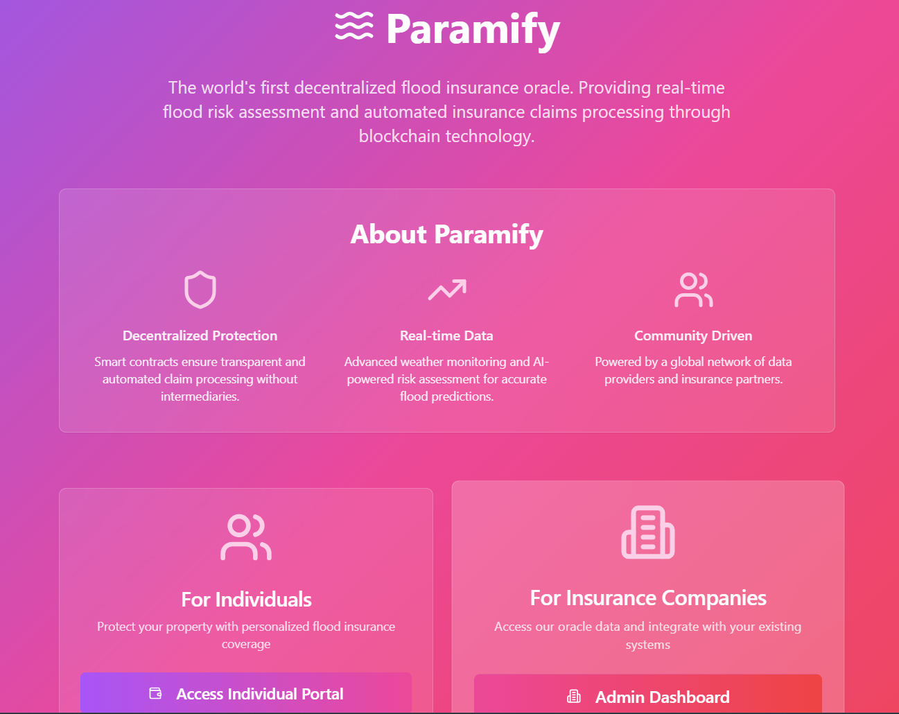

# Paramify Codebase - Complete Export for LLM Analysis
Generated on: 2025-06-29T11:58:57.967Z
Branch: NFT

---

## Project Overview
Paramify is a blockchain-based flood insurance protocol featuring:
- Smart contracts for insurance logic with ERC-721 NFT policy management
- Real-time USGS water level data integration
- Automatic payout triggers when flood thresholds are exceeded
- Soulbound NFT policies with on-chain metadata
- Admin and customer dashboards

---

## File: contracts/Paramify.sol
```solidity
// SPDX-License-Identifier: MIT
pragma solidity ^0.8.0;

import "@openzeppelin/contracts/access/AccessControl.sol";
import "@openzeppelin/contracts/token/ERC721/ERC721.sol";
import "@openzeppelin/contracts/utils/Base64.sol";
import "@openzeppelin/contracts/utils/Strings.sol";
import "@chainlink/contracts/src/v0.8/shared/interfaces/AggregatorV3Interface.sol";

contract Paramify is AccessControl, ERC721 {
    using Strings for uint256;
    
    uint256 private _policyIdCounter;

    error PolicyNFTNotTransferable();

    bytes32 public constant ORACLE_UPDATER_ROLE = keccak256("ORACLE_UPDATER_ROLE");
    bytes32 public constant INSURANCE_ADMIN_ROLE = keccak256("INSURANCE_ADMIN_ROLE");

    AggregatorV3Interface public priceFeed;
    uint256 public insuranceAmount;
    bool public isInitialized;
    
    // Dynamic flood threshold with 12 feet default (12 * 100000000000 = 1200000000000)
    uint256 public floodThreshold = 1200000000000;
    address public owner;

    struct Policy {
        uint256 policyId;
        address policyholder;
        uint256 premium;
        uint256 coverage;
        uint256 purchaseTime;
        bool active;
        bool paidOut;
    }

    mapping(uint256 => Policy) public policies;
    mapping(address => uint256) public activePolicyId;

    // Events
    event InsurancePurchased(address indexed customer, uint256 premium, uint256 coverage, uint256 policyId);
    event PayoutTriggered(address indexed customer, uint256 amount, uint256 policyId);
    event ThresholdChanged(uint256 oldThreshold, uint256 newThreshold);
    event OracleAddressUpdated(address indexed oldOracle, address indexed newOracle);
    event PolicyCreated(uint256 indexed policyId, address indexed policyholder, uint256 coverage, uint256 premium);
    event PolicyStatusChanged(uint256 indexed policyId, bool active, bool paidOut);

    modifier onlyOwner() {
        require(msg.sender == owner, "Unauthorized: Not owner");
        _;
    }

    constructor(address _priceFeedAddress) ERC721("Paramify Insurance NFT", "PINFT") {
        owner = msg.sender;
        _grantRole(DEFAULT_ADMIN_ROLE, msg.sender);
        _grantRole(ORACLE_UPDATER_ROLE, msg.sender);
        _grantRole(INSURANCE_ADMIN_ROLE, msg.sender);
        priceFeed = AggregatorV3Interface(_priceFeedAddress);
        isInitialized = true;
    }

    // Override _update to make NFTs soulbound (non-transferable)
    function _update(address to, uint256 tokenId, address auth) internal override returns (address) {
        address from = _ownerOf(tokenId);
        
        // Allow minting (from == address(0)) but prevent transfers
        if (from != address(0)) {
            revert PolicyNFTNotTransferable();
        }
        
        return super._update(to, tokenId, auth);
    }

    // Override supportsInterface to resolve conflict between AccessControl and ERC721
    function supportsInterface(bytes4 interfaceId) public view override(AccessControl, ERC721) returns (bool) {
        return super.supportsInterface(interfaceId);
    }

    function getLatestPrice() public view returns (int256) {
        (, int256 price, , , ) = priceFeed.latestRoundData();
        return price;
    }

    function setInsuranceAmount(uint256 _amount) public onlyRole(INSURANCE_ADMIN_ROLE) {
        insuranceAmount = _amount;
    }

    function setOracleAddress(address _oracleAddress) public onlyRole(DEFAULT_ADMIN_ROLE) {
        require(_oracleAddress != address(0), "Invalid oracle address");
        address oldOracle = address(priceFeed);
        priceFeed = AggregatorV3Interface(_oracleAddress);
        emit OracleAddressUpdated(oldOracle, _oracleAddress);
    }

    // Threshold management functions
    function setThreshold(uint256 _newThreshold) external onlyOwner {
        require(_newThreshold > 0, "Threshold must be positive");
        require(_newThreshold <= 10000000000000, "Threshold too high"); // Max 100 feet
        uint256 oldThreshold = floodThreshold;
        floodThreshold = _newThreshold;
        emit ThresholdChanged(oldThreshold, _newThreshold);
    }

    function getCurrentThreshold() external view returns (uint256) {
        return floodThreshold;
    }

    function getThresholdInFeet() external view returns (uint256) {
        // Convert contract units back to feet (divide by 100000000000)
        return floodThreshold / 100000000000;
    }

    function buyInsurance(uint256 _coverage) external payable {
        require(msg.value > 0, "Premium must be greater than 0");
        require(_coverage > 0, "Coverage must be greater than 0");
        
        // Check if the customer already has an active policy
        uint256 existingPolicyId = activePolicyId[msg.sender];
        if (existingPolicyId != 0) {
            require(!policies[existingPolicyId].active, "Policy already active");
        }

        uint256 requiredPremium = _coverage / 10;
        require(msg.value >= requiredPremium, "Insufficient premium");

        // Generate unique policy ID
        _policyIdCounter++;
        uint256 newPolicyId = _policyIdCounter;

        // Store the policy
        policies[newPolicyId] = Policy({
            policyId: newPolicyId,
            policyholder: msg.sender,
            premium: msg.value,
            coverage: _coverage,
            purchaseTime: block.timestamp,
            active: true,
            paidOut: false
        });

        // Update active policy mapping
        activePolicyId[msg.sender] = newPolicyId;

        // Mint NFT to the buyer
        _safeMint(msg.sender, newPolicyId);

        emit InsurancePurchased(msg.sender, msg.value, _coverage, newPolicyId);
        emit PolicyCreated(newPolicyId, msg.sender, _coverage, msg.value);
    }

    function triggerPayout() external {
        uint256 policyId = activePolicyId[msg.sender];
        require(policyId != 0, "No policy found");
        
        Policy storage policy = policies[policyId];
        require(policy.active, "No active policy");
        require(!policy.paidOut, "Payout already issued");

        int256 floodLevel = getLatestPrice();
        require(uint256(floodLevel) >= floodThreshold, "Flood level below threshold");

        policy.paidOut = true;
        policy.active = false;

        // Update metadata status
        emit PolicyStatusChanged(policyId, false, true);

        (bool sent, ) = msg.sender.call{value: policy.coverage}("");
        require(sent, "Payout failed");

        emit PayoutTriggered(msg.sender, policy.coverage, policyId);
    }

    // Check if payout conditions are met
    function isPayoutEligible(address _customer) external view returns (bool) {
        uint256 policyId = activePolicyId[_customer];
        if (policyId == 0) return false;
        
        Policy memory policy = policies[policyId];
        if (!policy.active || policy.paidOut) {
            return false;
        }
        int256 floodLevel = getLatestPrice();
        return uint256(floodLevel) >= floodThreshold;
    }

    // Generate NFT metadata
    function tokenURI(uint256 tokenId) public view override returns (string memory) {
        require(tokenId > 0 && tokenId <= _policyIdCounter, "Token does not exist");
        
        Policy memory policy = policies[tokenId];
        
        // Generate SVG image
        string memory svg = _generateSVG(tokenId, policy);
        
        // Generate metadata JSON
        string memory json = _generateMetadataJSON(tokenId, policy, svg);
        
        return string(abi.encodePacked("data:application/json;base64,", json));
    }

    function _generateSVG(uint256 tokenId, Policy memory policy) private pure returns (string memory) {
        string memory status = policy.paidOut ? "Paid Out" : (policy.active ? "Active" : "Inactive");
        string memory statusColor = policy.paidOut ? "#10b981" : (policy.active ? "#667eea" : "#ef4444");
        
        return string(abi.encodePacked(
            '<svg xmlns="http://www.w3.org/2000/svg" viewBox="0 0 350 350">',
            '<rect width="350" height="350" fill="#1a1a2e"/>',
            '<text x="175" y="50" text-anchor="middle" fill="#eee" font-size="24" font-weight="bold">Policy #', tokenId.toString(), '</text>',
            '<rect x="25" y="80" width="300" height="240" rx="10" fill="#16213e" stroke="', statusColor, '" stroke-width="2"/>',
            _generateSVGTexts(policy, status),
            '</svg>'
        ));
    }

    function _generateSVGTexts(Policy memory policy, string memory status) private pure returns (string memory) {
        return string(abi.encodePacked(
            '<text x="175" y="120" text-anchor="middle" fill="#eee" font-size="16">Status: ', status, '</text>',
            '<text x="175" y="160" text-anchor="middle" fill="#eee" font-size="14">Coverage: ', (policy.coverage / 1e18).toString(), ' ETH</text>',
            '<text x="175" y="200" text-anchor="middle" fill="#eee" font-size="14">Premium: ', (policy.premium / 1e18).toString(), ' ETH</text>',
            '<text x="175" y="240" text-anchor="middle" fill="#eee" font-size="14">Holder: ', _truncateAddress(policy.policyholder), '</text>',
            '<text x="175" y="280" text-anchor="middle" fill="#aaa" font-size="12">Paramify Flood Insurance</text>'
        ));
    }

    function _generateMetadataJSON(uint256 tokenId, Policy memory policy, string memory svg) private pure returns (string memory) {
        string memory status = policy.paidOut ? "Paid Out" : (policy.active ? "Active" : "Inactive");
        
        return Base64.encode(bytes(string(abi.encodePacked(
            '{"name": "Paramify Policy #', tokenId.toString(), '",',
            '"description": "NFT representing a Paramify flood insurance policy",',
            '"image": "data:image/svg+xml;base64,', Base64.encode(bytes(svg)), '",',
            '"attributes": [',
                _generateAttributes(tokenId, policy, status),
            ']}'
        ))));
    }

    function _generateAttributes(uint256 tokenId, Policy memory policy, string memory status) private pure returns (string memory) {
        return string(abi.encodePacked(
            '{"trait_type": "Policy ID", "value": "', tokenId.toString(), '"},',
            '{"trait_type": "Status", "value": "', status, '"},',
            '{"trait_type": "Coverage", "value": "', (policy.coverage / 1e18).toString(), ' ETH"},',
            '{"trait_type": "Premium", "value": "', (policy.premium / 1e18).toString(), ' ETH"},',
            '{"trait_type": "Policyholder", "value": "', Strings.toHexString(uint160(policy.policyholder), 20), '"}'
        ));
    }

    // Helper function to truncate address for display
    function _truncateAddress(address addr) private pure returns (string memory) {
        string memory addrStr = Strings.toHexString(uint160(addr), 20);
        bytes memory addrBytes = bytes(addrStr);
        bytes memory result = new bytes(10);
        
        // Copy first 6 characters (0x + 4)
        for (uint i = 0; i < 6; i++) {
            result[i] = addrBytes[i];
        }
        
        // Add ellipsis
        result[6] = '.';
        result[7] = '.';
        
        // Copy last 2 characters
        result[8] = addrBytes[40];
        result[9] = addrBytes[41];
        
        return string(result);
    }

    // Get all policies (for admin dashboard)
    function getAllPolicies() external view returns (Policy[] memory) {
        uint256 totalPolicies = _policyIdCounter;
        Policy[] memory allPolicies = new Policy[](totalPolicies);
        
        for (uint256 i = 1; i <= totalPolicies; i++) {
            allPolicies[i - 1] = policies[i];
        }
        
        return allPolicies;
    }

    // Get policy stats
    function getPolicyStats() external view returns (uint256 total, uint256 active, uint256 paidOut) {
        total = _policyIdCounter;
        
        for (uint256 i = 1; i <= total; i++) {
            if (policies[i].active) {
                active++;
            }
            if (policies[i].paidOut) {
                paidOut++;
            }
        }
    }

    function withdraw() external onlyRole(DEFAULT_ADMIN_ROLE) {
        uint256 balance = address(this).balance;
        require(balance > 0, "No funds to withdraw");
        (bool sent, ) = msg.sender.call{value: balance}("");
        require(sent, "Withdrawal failed");
    }

    function getContractBalance() external view returns (uint256) {
        return address(this).balance;
    }

    // Transfer ownership
    function transferOwnership(address newOwner) external onlyOwner {
        require(newOwner != address(0), "Invalid new owner");
        owner = newOwner;
    }

    receive() external payable {}
}

```

---

## File: contracts/mocks/MockV3Aggregator.sol
```solidity
// SPDX-License-Identifier: MIT
pragma solidity ^0.8.0;

contract MockV3Aggregator {
    uint8 public decimals;
    int256 public latestAnswer;
    uint256 public latestTimestamp;
    uint80 public latestRound;

    constructor(uint8 _decimals, int256 _initialAnswer) {
        decimals = _decimals;
        latestAnswer = _initialAnswer;
        latestTimestamp = block.timestamp;
        latestRound = 1;
    }

    function latestRoundData()
        external
        view
        returns (
            uint80 roundId,
            int256 answer,
            uint256 startedAt,
            uint256 updatedAt,
            uint80 answeredInRound
        )
    {
        return (latestRound, latestAnswer, latestTimestamp, latestTimestamp, latestRound);
    }

    function getRoundData(uint80 /* _roundId */)
        external
        view
        returns (
            uint80 roundId,
            int256 answer,
            uint256 startedAt,
            uint256 updatedAt,
            uint80 answeredInRound
        )
    {
        return (latestRound, latestAnswer, latestTimestamp, latestTimestamp, latestRound);
    }

    function version() external pure returns (uint256) {
        return 3;
    }

    function description() external pure returns (string memory) {
        return "Mock Flood Level Feed";
    }

    function updateAnswer(int256 _answer) external {
        latestAnswer = _answer;
        latestTimestamp = block.timestamp;
        latestRound++;
    }
}

```

---

## File: backend/server.js
```javascript
const express = require('express');
const cors = require('cors');
const axios = require('axios');
const { ethers } = require('ethers');
const cron = require('node-cron');
require('dotenv').config();

const app = express();
const PORT = process.env.PORT || 3001;

// Contract addresses and ABIs
const PARAMIFY_ADDRESS = process.env.PARAMIFY_ADDRESS;
const MOCK_ORACLE_ADDRESS = process.env.MOCK_ORACLE_ADDRESS;

// Paramify ABI (threshold management and policy functions)
const PARAMIFY_ABI = [
  {
    "inputs": [
      {
        "internalType": "uint256",
        "name": "_newThreshold",
        "type": "uint256"
      }
    ],
    "name": "setThreshold",
    "outputs": [],
    "stateMutability": "nonpayable",
    "type": "function"
  },
  {
    "inputs": [],
    "name": "getCurrentThreshold",
    "outputs": [
      {
        "internalType": "uint256",
        "name": "",
        "type": "uint256"
      }
    ],
    "stateMutability": "view",
    "type": "function"
  },
  {
    "inputs": [],
    "name": "getThresholdInFeet",
    "outputs": [
      {
        "internalType": "uint256",
        "name": "",
        "type": "uint256"
      }
    ],
    "stateMutability": "view",
    "type": "function"
  },
  {
    "inputs": [],
    "name": "floodThreshold",
    "outputs": [
      {
        "internalType": "uint256",
        "name": "",
        "type": "uint256"
      }
    ],
    "stateMutability": "view",
    "type": "function"
  },
  {
    "inputs": [],
    "name": "getAllPolicies",
    "outputs": [
      {
        "components": [
          {
            "internalType": "uint256",
            "name": "policyId",
            "type": "uint256"
          },
          {
            "internalType": "address",
            "name": "policyholder",
            "type": "address"
          },
          {
            "internalType": "uint256",
            "name": "premium",
            "type": "uint256"
          },
          {
            "internalType": "uint256",
            "name": "coverage",
            "type": "uint256"
          },
          {
            "internalType": "uint256",
            "name": "purchaseTime",
            "type": "uint256"
          },
          {
            "internalType": "bool",
            "name": "active",
            "type": "bool"
          },
          {
            "internalType": "bool",
            "name": "paidOut",
            "type": "bool"
          }
        ],
        "internalType": "struct Paramify.Policy[]",
        "name": "",
        "type": "tuple[]"
      }
    ],
    "stateMutability": "view",
    "type": "function"
  },
  {
    "inputs": [],
    "name": "getPolicyStats",
    "outputs": [
      {
        "internalType": "uint256",
        "name": "total",
        "type": "uint256"
      },
      {
        "internalType": "uint256",
        "name": "active",
        "type": "uint256"
      },
      {
        "internalType": "uint256",
        "name": "paidOut",
        "type": "uint256"
      }
    ],
    "stateMutability": "view",
    "type": "function"
  },
  {
    "anonymous": false,
    "inputs": [
      {
        "indexed": true,
        "internalType": "uint256",
        "name": "policyId",
        "type": "uint256"
      },
      {
        "indexed": true,
        "internalType": "address",
        "name": "policyholder",
        "type": "address"
      },
      {
        "indexed": false,
        "internalType": "uint256",
        "name": "coverage",
        "type": "uint256"
      },
      {
        "indexed": false,
        "internalType": "uint256",
        "name": "premium",
        "type": "uint256"
      }
    ],
    "name": "PolicyCreated",
    "type": "event"
  },
  {
    "anonymous": false,
    "inputs": [
      {
        "indexed": true,
        "internalType": "uint256",
        "name": "policyId",
        "type": "uint256"
      },
      {
        "indexed": false,
        "internalType": "bool",
        "name": "active",
        "type": "bool"
      },
      {
        "indexed": false,
        "internalType": "bool",
        "name": "paidOut",
        "type": "bool"
      }
    ],
    "name": "PolicyStatusChanged",
    "type": "event"
  }
];

// Mock Oracle ABI (only the functions we need)
const MOCK_ORACLE_ABI = [
  {
    "inputs": [
      {
        "internalType": "int256",
        "name": "_answer",
        "type": "int256"
      }
    ],
    "name": "updateAnswer",
    "outputs": [],
    "stateMutability": "nonpayable",
    "type": "function"
  },
  {
    "inputs": [],
    "name": "latestAnswer",
    "outputs": [
      {
        "internalType": "int256",
        "name": "",
        "type": "int256"
      }
    ],
    "stateMutability": "view",
    "type": "function"
  }
];

// USGS API configuration
const USGS_SITE_ID = '01646500'; // Potomac River Near Wash, DC Little Falls Pump Sta
const USGS_PARAMETER_CODE = '00065'; // Gage height in feet
const USGS_API_URL = `https://waterservices.usgs.gov/nwis/iv/?format=json&sites=${USGS_SITE_ID}&parameterCd=${USGS_PARAMETER_CODE}&siteStatus=all`;

// Middleware
app.use(cors());
app.use(express.json());

// Global variables to store latest data
let latestFloodData = {
  value: null,
  timestamp: null,
  lastUpdate: null,
  status: 'initializing',
  error: null,
  source: 'USGS Water Data',
  siteInfo: {
    name: 'Potomac River Near Wash, DC Little Falls Pump Sta',
    siteId: USGS_SITE_ID
  }
};

// Initialize Ethereum provider and signer
let provider;
let signer;
let mockOracleContract;
let paramifyContract;

async function initializeEthers() {
  try {
    // Connect to local Hardhat node with timeout
    provider = new ethers.JsonRpcProvider('http://127.0.0.1:8545');
    
    // Test connection with timeout
    const network = await Promise.race([
      provider.getNetwork(),
      new Promise((_, reject) => setTimeout(() => reject(new Error('Connection timeout')), 5000))
    ]);
    
    // Use the first Hardhat account (admin account)
    const privateKey = '0xac0974bec39a17e36ba4a6b4d238ff944bacb478cbed5efcae784d7bf4f2ff80';
    signer = new ethers.Wallet(privateKey, provider);
    
    // Initialize contract instances
    mockOracleContract = new ethers.Contract(MOCK_ORACLE_ADDRESS, MOCK_ORACLE_ABI, signer);
    paramifyContract = new ethers.Contract(PARAMIFY_ADDRESS, PARAMIFY_ABI, signer);
    
    console.log('✅ Ethereum provider initialized');
    console.log('Connected to:', await signer.getAddress());
    console.log('Network:', network.name, 'Chain ID:', network.chainId.toString());
  } catch (error) {
    console.warn('⚠️  Could not connect to blockchain immediately:', error.message);
    console.log('📡 Backend will continue running for USGS data fetching');
    console.log('🔄 Blockchain connection will be retried when needed');
    latestFloodData.status = 'partial';
    latestFloodData.error = 'Blockchain connection pending';
  }
}

// Function to fetch USGS data
async function fetchUSGSData() {
  try {
    console.log('🌊 Fetching USGS water level data...');
    
    const response = await axios.get(USGS_API_URL);
    const data = response.data;
    
    // Parse the nested JSON structure
    const timeSeries = data.value.timeSeries[0];
    const latestValue = timeSeries.values[0].value[0];
    
    // Extract the water level value (in feet)
    const waterLevelFeet = parseFloat(latestValue.value);
    const timestamp = latestValue.dateTime;
    
    console.log(`📊 Latest water level: ${waterLevelFeet} ft at ${timestamp}`);
    
    // Update global data
    latestFloodData = {
      value: waterLevelFeet,
      timestamp: timestamp,
      lastUpdate: new Date().toISOString(),
      status: 'active',
      error: null,
      source: 'USGS Water Data',
      siteInfo: {
        name: timeSeries.sourceInfo.siteName,
        siteId: USGS_SITE_ID
      }
    };
    
    return waterLevelFeet;
  } catch (error) {
    console.error('❌ Error fetching USGS data:', error.message);
    latestFloodData.status = 'error';
    latestFloodData.error = error.message;
    throw error;
  }
}

// Function to update the oracle contract
async function updateOracleContract(waterLevel) {
  try {
    // Check if we have a valid contract connection
    if (!mockOracleContract || !signer) {
      console.log('🔄 Attempting to reconnect to blockchain...');
      await initializeEthers();
      
      if (!mockOracleContract) {
        throw new Error('Could not establish blockchain connection');
      }
    }
    
    // Convert water level to the format expected by the contract
    // Backend scales data: feet * 100000000000 = contract units
    const scaledValue = Math.floor(waterLevel * 100000000000);
    
    console.log(`🔄 Updating oracle with scaled value: ${scaledValue} (${waterLevel} feet)`);
    
    // Get current gas price
    const gasPrice = await provider.getFeeData();
    
    // Update the oracle
    const tx = await mockOracleContract.updateAnswer(scaledValue, {
      gasPrice: gasPrice.gasPrice
    });
    
    console.log(`📝 Transaction sent: ${tx.hash}`);
    
    // Wait for confirmation
    const receipt = await tx.wait();
    console.log(`✅ Oracle updated successfully! Block: ${receipt.blockNumber}`);
    
    // Verify the update
    const newValue = await mockOracleContract.latestAnswer();
    console.log(`🔍 Verified oracle value: ${newValue.toString()}`);
    
    return receipt;
  } catch (error) {
    console.error('❌ Error updating oracle:', error.message);
    // Don't throw the error - let the system continue with just USGS data
    latestFloodData.error = `Oracle update failed: ${error.message}`;
    return null;
  }
}

// Main update function
async function updateFloodData() {
  try {
    console.log('\n🚀 Starting flood data update...');
    
    // Fetch latest USGS data
    const waterLevel = await fetchUSGSData();
    
    // Try to update the oracle contract (non-blocking)
    const receipt = await updateOracleContract(waterLevel);
    
    if (receipt) {
      console.log('✅ Flood data update completed successfully!\n');
      latestFloodData.status = 'active';
      latestFloodData.error = null;
    } else {
      console.log('⚠️  USGS data updated, but oracle update failed\n');
      latestFloodData.status = 'partial';
    }
  } catch (error) {
    console.error('❌ Failed to update flood data:', error.message);
    latestFloodData.status = 'error';
    latestFloodData.error = error.message;
  }
}

// API Routes
app.get('/api/health', (req, res) => {
  res.json({ 
    status: 'ok', 
    message: 'Paramify backend service is running',
    timestamp: new Date().toISOString()
  });
});

app.get('/api/flood-data', async (req, res) => {
  try {
    // Include threshold information if contract is available
    let thresholdData = null;
    if (paramifyContract) {
      try {
        const thresholdUnits = await paramifyContract.getCurrentThreshold();
        const thresholdFeet = Number(thresholdUnits) / 100000000000;
        thresholdData = {
          thresholdUnits: thresholdUnits.toString(),
          thresholdFeet: thresholdFeet
        };
      } catch (error) {
        console.warn('Could not fetch threshold data:', error.message);
      }
    }
    
    res.json({
      ...latestFloodData,
      threshold: thresholdData
    });
  } catch (error) {
    res.json(latestFloodData);
  }
});

// Threshold management endpoints
app.get('/api/threshold', async (req, res) => {
  try {
    if (!paramifyContract) {
      return res.status(503).json({ error: 'Blockchain connection not available' });
    }
    
    const thresholdUnits = await paramifyContract.getCurrentThreshold();
    const thresholdFeet = Number(thresholdUnits) / 100000000000;
    
    res.json({
      thresholdFeet: thresholdFeet,
      thresholdUnits: thresholdUnits.toString(),
      lastUpdate: new Date().toISOString()
    });
  } catch (error) {
    console.error('Error fetching threshold:', error);
    res.status(500).json({ error: error.message });
  }
});

app.post('/api/threshold', async (req, res) => {
  try {
    const { thresholdFeet } = req.body;
    
    // Validate input
    if (typeof thresholdFeet !== 'number' || thresholdFeet <= 0) {
      return res.status(400).json({ error: 'Invalid threshold value. Must be a positive number.' });
    }
    
    if (thresholdFeet > 100) {
      return res.status(400).json({ error: 'Threshold too high. Maximum is 100 feet.' });
    }
    
    if (!paramifyContract || !signer) {
      return res.status(503).json({ error: 'Blockchain connection not available' });
    }
    
    // Convert feet to contract units
    const thresholdUnits = Math.floor(thresholdFeet * 100000000000);
    
    console.log(`📊 Setting threshold to ${thresholdFeet} feet (${thresholdUnits} units)`);
    
    // Get current gas price
    const gasPrice = await provider.getFeeData();
    
    // Update the threshold
    const tx = await paramifyContract.setThreshold(thresholdUnits, {
      gasPrice: gasPrice.gasPrice
    });
    
    console.log(`📝 Threshold update transaction sent: ${tx.hash}`);
    
    // Wait for confirmation
    const receipt = await tx.wait();
    console.log(`✅ Threshold updated successfully! Block: ${receipt.blockNumber}`);
    
    // Verify the update
    const newThreshold = await paramifyContract.getCurrentThreshold();
    const newThresholdFeet = Number(newThreshold) / 100000000000;
    
    res.json({
      success: true,
      message: 'Threshold updated successfully',
      thresholdFeet: newThresholdFeet,
      thresholdUnits: newThreshold.toString(),
      transactionHash: tx.hash,
      blockNumber: receipt.blockNumber
    });
  } catch (error) {
    console.error('Error updating threshold:', error);
    
    // Handle specific error cases
    if (error.code === 'CALL_EXCEPTION' && error.reason?.includes('Unauthorized')) {
      return res.status(403).json({ error: 'Unauthorized: Only contract owner can update threshold' });
    }
    
    res.status(500).json({ error: error.message });
  }
});

app.post('/api/manual-update', async (req, res) => {
  try {
    console.log('📌 Manual update requested');
    await updateFloodData();
    res.json({ 
      success: true, 
      message: 'Flood data updated successfully',
      data: latestFloodData
    });
  } catch (error) {
    res.status(500).json({ 
      success: false, 
      error: error.message 
    });
  }
});

app.get('/api/status', async (req, res) => {
  try {
    // Get current oracle value
    let oracleValue = null;
    let thresholdData = null;
    
    if (mockOracleContract) {
      const rawValue = await mockOracleContract.latestAnswer();
      oracleValue = Number(rawValue) / 100000000000; // Convert back to feet
    }
    
    if (paramifyContract) {
      try {
        const thresholdUnits = await paramifyContract.getCurrentThreshold();
        const thresholdFeet = Number(thresholdUnits) / 100000000000;
        thresholdData = {
          thresholdFeet: thresholdFeet,
          thresholdUnits: thresholdUnits.toString()
        };
      } catch (error) {
        console.warn('Could not fetch threshold data:', error.message);
      }
    }
    
    res.json({
      service: 'active',
      lastUpdate: latestFloodData.lastUpdate,
      currentFloodLevel: latestFloodData.value,
      oracleValue: oracleValue,
      dataSource: latestFloodData.source,
      site: latestFloodData.siteInfo,
      updateInterval: '5 minutes',
      nextUpdate: latestFloodData.lastUpdate ? 
        new Date(new Date(latestFloodData.lastUpdate).getTime() + 5 * 60 * 1000).toISOString() : 
        null,
      threshold: thresholdData
    });
  } catch (error) {
    res.status(500).json({ error: error.message });
  }
});

// Policy management endpoints
app.get('/api/policies', async (req, res) => {
  try {
    if (!paramifyContract) {
      return res.status(503).json({ error: 'Blockchain connection not available' });
    }
    
    const policies = await paramifyContract.getAllPolicies();
    
    // Format policies for frontend
    const formattedPolicies = policies.map(policy => ({
      policyId: policy.policyId.toString(),
      policyholder: policy.policyholder,
      premium: ethers.formatEther(policy.premium),
      coverage: ethers.formatEther(policy.coverage),
      purchaseTime: new Date(Number(policy.purchaseTime) * 1000).toISOString(),
      active: policy.active,
      paidOut: policy.paidOut
    }));
    
    res.json({
      success: true,
      policies: formattedPolicies,
      count: formattedPolicies.length
    });
  } catch (error) {
    console.error('Error fetching policies:', error);
    res.status(500).json({ 
      success: false,
      error: error.message,
      message: 'Failed to fetch policies'
    });
  }
});

app.get('/api/policies/stats', async (req, res) => {
  try {
    if (!paramifyContract) {
      return res.status(503).json({ 
        success: false,
        error: 'Blockchain connection not available',
        message: 'Please try again later'
      });
    }
    
    const stats = await paramifyContract.getPolicyStats();
    
    res.json({
      success: true,
      stats: {
        total: Number(stats.total),
        active: Number(stats.active),
        paidOut: Number(stats.paidOut)
      },
      lastUpdated: new Date().toISOString()
    });
  } catch (error) {
    console.error('Error fetching policy stats:', error);
    res.status(500).json({ 
      success: false,
      error: error.message,
      message: 'Failed to fetch policy statistics'
    });
  }
});

// Get single policy by ID
app.get('/api/policies/:id', async (req, res) => {
  try {
    if (!paramifyContract) {
      return res.status(503).json({ 
        success: false,
        error: 'Blockchain connection not available'
      });
    }

    const policyId = req.params.id;
    const policy = await paramifyContract.policies(policyId);

    if (!policy.policyholder || policy.policyholder === ethers.ZeroAddress) {
      return res.status(404).json({
        success: false,
        error: 'Policy not found'
      });
    }

    res.json({
      success: true,
      policy: {
        policyId: policyId,
        policyholder: policy.policyholder,
        premium: ethers.formatEther(policy.premium),
        coverage: ethers.formatEther(policy.coverage),
        purchaseTime: new Date(Number(policy.purchaseTime) * 1000).toISOString(),
        active: policy.active,
        paidOut: policy.paidOut
      }
    });
  } catch (error) {
    console.error('Error fetching policy:', error);
    res.status(500).json({ 
      success: false,
      error: error.message,
      message: 'Failed to fetch policy'
    });
  }
});

// Setup event listeners for policies
async function setupPolicyEventListeners() {
  if (!paramifyContract || !provider) {
    console.log('⏳ Policy event listeners pending blockchain connection...');
    return;
  }

  try {
    // Listen for PolicyCreated events
    paramifyContract.on('PolicyCreated', (policyId, policyholder, coverage, premium, event) => {
      console.log('🎉 New policy created:', {
        policyId: policyId.toString(),
        policyholder,
        coverage: ethers.formatEther(coverage),
        premium: ethers.formatEther(premium)
      });
    });

    // Listen for PolicyStatusChanged events
    paramifyContract.on('PolicyStatusChanged', (policyId, active, paidOut, event) => {
      console.log('📝 Policy status changed:', {
        policyId: policyId.toString(),
        active,
        paidOut
      });
    });

    console.log('✅ Policy event listeners established');
  } catch (error) {
    console.error('❌ Error setting up policy event listeners:', error);
  }
}

// Start the server
async function startServer() {
  try {
    // Start Express server first
    app.listen(PORT, () => {
      console.log(`🚀 Paramify backend server running on port ${PORT}`);
    console.log(`🌐 API endpoints available:`);
    console.log(`   - GET  /api/health`);
    console.log(`   - GET  /api/flood-data`);
    console.log(`   - GET  /api/status`);
    console.log(`   - GET  /api/threshold`);
    console.log(`   - POST /api/threshold`);
    console.log(`   - POST /api/manual-update`);
    console.log(`   - GET  /api/policies`);
    console.log(`   - GET  /api/policies/:id`);
    console.log(`   - GET  /api/policies/stats`);
    });
    
    // Initialize Ethereum connection (non-blocking)
    await initializeEthers();
    
    // Setup policy event listeners
    await setupPolicyEventListeners();
    
    // Perform initial data fetch
    await updateFloodData();
    
    // Schedule updates every 5 minutes
    cron.schedule('*/5 * * * *', async () => {
      console.log('⏰ Scheduled update triggered');
      await updateFloodData();
    });
    
    console.log(`📊 USGS data updates scheduled every 5 minutes`);
    
  } catch (error) {
    console.error('Failed to start server:', error);
    // Don't exit - let the server run even if blockchain connection fails
  }
}

// Handle graceful shutdown
process.on('SIGINT', () => {
  console.log('\n👋 Shutting down gracefully...');
  process.exit(0);
});

// Start the application
startServer();

```

---

## File: backend/package.json
```json
{
  "name": "paramify-backend",
  "version": "1.0.0",
  "description": "Backend service for Paramify flood insurance - fetches USGS data and updates oracle",
  "main": "server.js",
  "scripts": {
    "start": "node server.js",
    "dev": "nodemon server.js",
    "deploy": "node scripts/deployMock.js"
  },
  "dependencies": {
    "express": "^4.18.2",
    "cors": "^2.8.5",
    "axios": "^1.6.2",
    "ethers": "^6.9.0",
    "node-cron": "^3.0.3",
    "dotenv": "^16.3.1"
  },
  "devDependencies": {
    "nodemon": "^3.0.2"
  }
}

```

---

## File: frontend/src/App.tsx
```typescript
import { Toaster } from "@/components/ui/toaster";
import { Toaster as Sonner } from "@/components/ui/sonner";
import { TooltipProvider } from "@/components/ui/tooltip";
import { QueryClient, QueryClientProvider } from "@tanstack/react-query";
import { BrowserRouter, Routes, Route } from "react-router-dom";
import Index from "./pages/Index";
import NotFound from "./pages/NotFound";

const queryClient = new QueryClient();

const App = () => (
  <QueryClientProvider client={queryClient}>
    <TooltipProvider>
      <Toaster />
      <Sonner />
      <BrowserRouter>
        <Routes>
          <Route path="/" element={<Index />} />

          <Route path="*" element={<NotFound />} />
        </Routes>
      </BrowserRouter>
    </TooltipProvider>
  </QueryClientProvider>
);

export default App;

```

---

## File: frontend/src/InsuracleDashboard.tsx
```typescript
import { useState, useEffect } from 'react';
import { ethers } from 'ethers';
import { Waves, Shield, TrendingUp, Wallet, Eye, EyeOff, AlertCircle, CheckCircle, ArrowLeft, Activity, FileText } from 'lucide-react';
import { PARAMIFY_ADDRESS, PARAMIFY_ABI } from './lib/contract';
import { usgsApi, formatTimestamp, getTimeUntilNextUpdate, type ServiceStatus } from './lib/usgsApi';

interface PolicyInfo {
  policyId: string;
  policyholder: string;
  premium: string;
  coverage: string;
  purchaseTime: string;
  active: boolean;
  paidOut: boolean;
}

interface InsuracleDashboardProps {
  setUserType?: (userType: string | null) => void;
}

export default function InsuracleDashboard({ setUserType }: InsuracleDashboardProps) {
  const [walletAddress, setWalletAddress] = useState<string>("");
  const [ethBalance, setEthBalance] = useState<number>(0);
  const [floodLevel, setFloodLevel] = useState<number>(0);
  const [threshold, setThreshold] = useState<number>(1200000000000); // 12 feet default
  const [thresholdInFeet, setThresholdInFeet] = useState<number>(12);
  const [policyAmount, setPolicyAmount] = useState<number>(1);
  const [premium, setPremium] = useState<number>(0.1);
  const [insuranceAmount, setInsuranceAmount] = useState<number>(0);
  const [contractBalance, setContractBalance] = useState<number>(0);
  const [transactionStatus, setTransactionStatus] = useState('');
  const [isLoading, setIsLoading] = useState(false);
  const [hasActivePolicy, setHasActivePolicy] = useState(false);
  const [networkError, setNetworkError] = useState(false);
  const [serviceStatus, setServiceStatus] = useState<ServiceStatus | null>(null);
  const [isBackendConnected, setIsBackendConnected] = useState(false);
  const [nextUpdateCountdown, setNextUpdateCountdown] = useState<string>('');
  const [policyInfo, setPolicyInfo] = useState<PolicyInfo | null>(null);

  // Connect wallet and fetch initial data
  useEffect(() => {
    const fetchData = async () => {
      if (window.ethereum) {
        try {
          const provider = new ethers.BrowserProvider(window.ethereum);
          
          // Check network
          const network = await provider.getNetwork();
          if (network.chainId !== 31337n) { // Hardhat network chainId
            setNetworkError(true);
            setTransactionStatus('Please connect to Hardhat network (localhost:8545, Chain ID: 31337)');
            return;
          } else {
            setNetworkError(false);
          }
          
          const accounts = await provider.send('eth_requestAccounts', []);
          setWalletAddress(accounts[0]);
          const balance = await provider.getBalance(accounts[0]);
          setEthBalance(Number(ethers.formatEther(balance)));
          
          const contract = new ethers.Contract(PARAMIFY_ADDRESS, PARAMIFY_ABI, provider);
          
          // Get contract balance
          try {
            const contractBal = await contract.getContractBalance();
            setContractBalance(Number(ethers.formatEther(contractBal)));
          } catch (e) {
            console.warn('Could not fetch contract balance:', e);
          }
          
          // Get flood level
          try {
            const latestFlood = await contract.getLatestPrice();
            setFloodLevel(Number(latestFlood));
          } catch (e) {
            console.warn('Could not fetch flood level:', e);
          }
          
          // Get current threshold
          try {
            const currentThreshold = await contract.floodThreshold();
            setThreshold(Number(currentThreshold));
            setThresholdInFeet(Number(currentThreshold) / 100000000000);
          } catch (e) {
            console.warn('Could not fetch threshold:', e);
          }
          
          // Check if user has active policy using the new NFT system
          try {
            const activePolicyId = await contract.activePolicyId(accounts[0]);
            if (activePolicyId && activePolicyId > 0) {
              const policy = await contract.policies(activePolicyId);
              if (policy.active) {
                setHasActivePolicy(true);
                setInsuranceAmount(Number(ethers.formatEther(policy.coverage)));
                setPolicyAmount(Number(ethers.formatEther(policy.coverage)));
                setPremium(Number(ethers.formatEther(policy.premium)));
                
                // Set policy info for display
                setPolicyInfo({
                  policyId: activePolicyId.toString(),
                  policyholder: policy.policyholder,
                  premium: ethers.formatEther(policy.premium),
                  coverage: ethers.formatEther(policy.coverage),
                  purchaseTime: new Date(Number(policy.purchaseTime) * 1000).toISOString(),
                  active: policy.active,
                  paidOut: policy.paidOut
                });
              }
            }
          } catch (e) {
            console.warn('Could not fetch policy:', e);
          }
        } catch (e) {
          console.error('Error connecting to wallet:', e);
          setTransactionStatus('Error connecting to wallet. Make sure MetaMask is installed and connected to localhost:8545');
        }
      }
    };
    fetchData();
  }, []);

  useEffect(() => {
    setPremium(0.1 * policyAmount);
  }, [policyAmount]);

  // Fetch USGS service status
  useEffect(() => {
    const fetchServiceStatus = async () => {
      try {
        const status = await usgsApi.getStatus();
        setServiceStatus(status);
        setIsBackendConnected(true);
        
        // Update flood level from USGS data
        if (status.oracleValue !== null) {
          setFloodLevel(status.oracleValue * 100000000000); // Convert feet to contract units
        }
        
        // Update threshold from service status
        if (status.threshold) {
          setThresholdInFeet(status.threshold.thresholdFeet);
          setThreshold(Number(status.threshold.thresholdUnits));
        }
      } catch (error) {
        console.error('Failed to fetch USGS service status:', error);
        setIsBackendConnected(false);
      }
    };

    fetchServiceStatus();
    const interval = setInterval(fetchServiceStatus, 10000); // Check every 10 seconds

    return () => clearInterval(interval);
  }, []);

  // Update countdown timer
  useEffect(() => {
    const updateCountdown = () => {
      if (serviceStatus?.nextUpdate) {
        setNextUpdateCountdown(getTimeUntilNextUpdate(serviceStatus.nextUpdate));
      }
    };

    updateCountdown();
    const interval = setInterval(updateCountdown, 1000);

    return () => clearInterval(interval);
  }, [serviceStatus]);

  // Buy insurance (send tx)
  const handleBuyInsurance = async () => {
    if (!window.ethereum) {
      setTransactionStatus('MetaMask not detected. Please install MetaMask.');
      return;
    }
    
    if (policyAmount <= 0) {
      setTransactionStatus('Please enter a valid policy amount.');
      return;
    }
    
    setIsLoading(true);
    setTransactionStatus('Preparing transaction...');
    
    try {
      const provider = new ethers.BrowserProvider(window.ethereum);
      const signer = await provider.getSigner();
      const contract = new ethers.Contract(PARAMIFY_ADDRESS, PARAMIFY_ABI, signer);
      
      const coverage = ethers.parseEther(policyAmount.toString());
      const calculatedPremium = ethers.parseEther((0.1 * policyAmount).toString());
      
      console.log('Calling buyInsurance with coverage:', coverage.toString(), 'and premium:', calculatedPremium.toString());
      
      setTransactionStatus('Estimating gas...');
      
      // First estimate gas to catch any revert early
      try {
        await contract.buyInsurance.estimateGas(coverage, { value: calculatedPremium });
      } catch (gasError) {
        console.error('Gas estimation failed:', gasError);
        throw new Error(`Transaction would fail: ${gasError.reason || gasError.message || 'Unknown error'}`);
      }
      
      setTransactionStatus('Sending transaction...');
      const tx = await contract.buyInsurance(coverage, { value: calculatedPremium });
      
      setTransactionStatus('Transaction sent. Waiting for confirmation...');
      await tx.wait();
      
      setTransactionStatus('Transaction successful! Policy NFT minted.');
      setHasActivePolicy(true);
      setInsuranceAmount(policyAmount);
      
      // Fetch the new policy info
      const activePolicyId = await contract.activePolicyId(walletAddress);
      if (activePolicyId && activePolicyId > 0) {
        const policy = await contract.policies(activePolicyId);
        setPolicyInfo({
          policyId: activePolicyId.toString(),
          policyholder: policy.policyholder,
          premium: ethers.formatEther(policy.premium),
          coverage: ethers.formatEther(policy.coverage),
          purchaseTime: new Date(Number(policy.purchaseTime) * 1000).toISOString(),
          active: policy.active,
          paidOut: policy.paidOut
        });
      }
      
      // Update balances
      const balance = await provider.getBalance(walletAddress);
      setEthBalance(Number(ethers.formatEther(balance)));
      const contractBal = await contract.getContractBalance();
      setContractBalance(Number(ethers.formatEther(contractBal)));
      
    } catch (e: any) {
      console.error('Transaction error:', e);
      let errorMessage = 'Unknown error';
      
      if (e.reason) {
        errorMessage = e.reason;
      } else if (e.message) {
        if (e.message.includes('user rejected')) {
          errorMessage = 'Transaction rejected by user';
        } else if (e.message.includes('insufficient funds')) {
          errorMessage = 'Insufficient funds for transaction';
        } else {
          errorMessage = e.message;
        }
      }
      
      setTransactionStatus(`Transaction failed: ${errorMessage}`);
    }
    
    setIsLoading(false);
    setTimeout(() => setTransactionStatus(''), 10000);
  };

  // Trigger payout (send tx)
  const handleTriggerPayout = async () => {
    if (!window.ethereum) {
      setTransactionStatus('MetaMask not detected. Please install MetaMask.');
      return;
    }
    
    setIsLoading(true);
    setTransactionStatus('Checking payout conditions...');
    
    try {
      const provider = new ethers.BrowserProvider(window.ethereum);
      const signer = await provider.getSigner();
      const contract = new ethers.Contract(PARAMIFY_ADDRESS, PARAMIFY_ABI, signer);
      
      // Check if conditions are met for payout
      const currentFlood = await contract.getLatestPrice();
      const floodLevelValue = Number(currentFlood) / 1e8;
      
      if (floodLevelValue < 3000) {
        setTransactionStatus('Payout conditions not met. Flood level must exceed threshold.');
        setIsLoading(false);
        setTimeout(() => setTransactionStatus(''), 5000);
        return;
      }
      
      setTransactionStatus('Estimating gas...');
      
      // Estimate gas first
      try {
        await contract.triggerPayout.estimateGas();
      } catch (gasError) {
        console.error('Gas estimation failed:', gasError);
        throw new Error(`Payout would fail: ${gasError.reason || gasError.message || 'Unknown error'}`);
      }
      
      setTransactionStatus('Triggering payout...');
      const tx = await contract.triggerPayout();
      
      setTransactionStatus('Transaction sent. Waiting for confirmation...');
      await tx.wait();
      
      setTransactionStatus('Payout received successfully! Policy NFT updated.');
      setHasActivePolicy(false);
      setInsuranceAmount(0);
      
      // Update policy info to show it's paid out
      if (policyInfo) {
        setPolicyInfo({
          ...policyInfo,
          active: false,
          paidOut: true
        });
      }
      
      // Update balances
      const balance = await provider.getBalance(walletAddress);
      setEthBalance(Number(ethers.formatEther(balance)));
      const contractBal = await contract.getContractBalance();
      setContractBalance(Number(ethers.formatEther(contractBal)));
      
    } catch (e: any) {
      console.error('Payout trigger error:', e);
      let errorMessage = 'Unknown error';
      
      if (e.reason) {
        errorMessage = e.reason;
      } else if (e.message) {
        if (e.message.includes('user rejected')) {
          errorMessage = 'Transaction rejected by user';
        } else if (e.message.includes('No active policy')) {
          errorMessage = 'No active policy found';
        } else if (e.message.includes('Flood level below threshold')) {
          errorMessage = 'Flood level below threshold';
        } else {
          errorMessage = e.message;
        }
      }
      
      setTransactionStatus(`Payout failed: ${errorMessage}`);
    }
    
    setIsLoading(false);
    setTimeout(() => setTransactionStatus(''), 10000);
  };

  return (
    <div className="min-h-screen bg-gradient-to-br from-purple-900 via-blue-900 to-indigo-900 p-4">
      <div className="max-w-2xl mx-auto">
  
        <div className="text-center mb-8">
          <div className="flex items-center justify-between mb-4">
            <button
              onClick={() => setUserType && setUserType(null)}
              className="flex items-center space-x-2 bg-white/10 hover:bg-white/20 border border-white/20 text-white px-4 py-2 rounded-lg transition-all duration-200"
            >
              <ArrowLeft className="h-4 w-4" />
              <span>Back to Home</span>
            </button>
            <div className="flex items-center justify-center">
              <div className="p-3 bg-gradient-to-r from-purple-500 to-blue-500 rounded-full shadow-lg">
                <Waves className="h-8 w-8 text-white" />
              </div>
            </div>
            <div className="w-24"></div> 
          </div>
          <h1 className="text-3xl font-bold text-white mb-2">
            Paramify: Flood Insurance Oracle
          </h1>
          <p className="text-gray-300 text-lg">
            Buy flood insurance and claim payouts if flood levels exceed the threshold.
          </p>
        </div>


        <div className="bg-white/10 backdrop-blur-lg border border-white/20 rounded-2xl p-8 shadow-2xl">
          
          {networkError && (
            <div className="mb-6 bg-red-500/20 border border-red-400/30 rounded-lg p-4">
              <div className="flex items-center">
                <AlertCircle className="h-5 w-5 text-red-400 mr-3" />
                <div>
                  <p className="text-red-200 font-semibold">Wrong Network</p>
                  <p className="text-red-300 text-sm">Please connect to Hardhat network (localhost:8545, Chain ID: 31337)</p>
                </div>
              </div>
            </div>
          )}

          <div className="mb-8">
            <div className="flex items-center justify-between mb-4">
              <div className="flex items-center space-x-3">
                <Wallet className="h-5 w-5 text-purple-300" />
                <span className="text-white font-medium">Connected Wallet</span>
              </div>
            </div>
            <div className="bg-black/20 rounded-lg p-4 mb-4">
              <p className="text-gray-300 font-mono text-sm break-all">
                {walletAddress}
              </p>
            </div>
            <div className="text-center">
              <span className="text-2xl font-bold text-white">Your Balance: {ethBalance.toFixed(1)} ETH</span>
            </div>
          </div>


          <div className="mb-8">
            <h3 className="text-xl font-semibold text-white mb-4 flex items-center">
              <TrendingUp className="mr-2 h-5 w-5 text-blue-300" />
              Flood Level
            </h3>
            <div className="space-y-4">
              <div className={`rounded-lg p-6 ${floodLevel >= threshold ? 'bg-gradient-to-r from-red-500/20 to-orange-500/20 border border-red-400/30' : 'bg-gradient-to-r from-blue-500/20 to-purple-500/20'}`}>
                <div className="text-center">
                  <div className={`text-3xl font-bold mb-2 ${floodLevel >= threshold ? 'text-red-300' : 'text-white'}`}>
                    {(floodLevel / 100000000000).toFixed(2)} ft
                  </div>
                  <div className="text-gray-300">
                    (Threshold: {thresholdInFeet.toFixed(1)} ft)
                  </div>
                  <div className="text-gray-400 text-sm mt-1">
                    = {floodLevel.toFixed(0)} units
                  </div>
                  {floodLevel >= threshold && (
                    <div className="mt-2 text-red-300 font-semibold">⚠️ THRESHOLD EXCEEDED</div>
                  )}
                </div>
              </div>
            </div>
          </div>

          {/* USGS Data Integration Status */}
          <div className="mb-8">
            <h3 className="text-xl font-semibold text-white mb-4 flex items-center">
              <Activity className="mr-2 h-5 w-5 text-green-300" />
              Live Data Source
            </h3>
            <div className="bg-black/20 rounded-lg p-4">
              <div className="flex items-center justify-between mb-4">
                <div className="flex items-center space-x-2">
                  <div className={`w-3 h-3 rounded-full ${isBackendConnected ? 'bg-green-400 animate-pulse' : 'bg-red-400'}`}></div>
                  <span className={`text-sm font-medium ${isBackendConnected ? 'text-green-300' : 'text-red-300'}`}>
                    {isBackendConnected ? 'Connected to USGS Service' : 'USGS Service Disconnected'}
                  </span>
                </div>
              </div>
              
              {serviceStatus && (
                <div className="space-y-3">
                  <div className="grid grid-cols-2 gap-4">
                    <div className="bg-black/30 rounded-lg p-3">
                      <p className="text-gray-400 text-xs mb-1">USGS Water Level</p>
                      <p className="text-white font-bold">{serviceStatus.currentFloodLevel?.toFixed(2) || 'N/A'} ft</p>
                      <p className="text-gray-400 text-xs mt-1">= {((serviceStatus.currentFloodLevel || 0) * 100000000000).toFixed(0)} units</p>
                    </div>
                    <div className="bg-black/30 rounded-lg p-3">
                      <p className="text-gray-400 text-xs mb-1">Next Update In</p>
                      <p className="text-white font-bold">{nextUpdateCountdown}</p>
                      <p className="text-gray-400 text-xs mt-1">Every 5 minutes</p>
                    </div>
                  </div>
                  
                  <div className="bg-black/30 rounded-lg p-3">
                    <p className="text-gray-400 text-xs mb-1">Data Source</p>
                    <p className="text-white text-sm font-medium">{serviceStatus.site.name}</p>
                    <p className="text-gray-400 text-xs">Site ID: {serviceStatus.site.siteId}</p>
                  </div>
                  
                  <div className="bg-black/30 rounded-lg p-3">
                    <p className="text-gray-400 text-xs mb-1">Last Updated</p>
                    <p className="text-white text-sm">{formatTimestamp(serviceStatus.lastUpdate)}</p>
                  </div>
                </div>
              )}
              
              {!isBackendConnected && (
                <div className="mt-4 bg-yellow-500/20 border border-yellow-400/30 rounded-lg p-3">
                  <p className="text-yellow-200 text-sm">
                    ⚠️ Real-time USGS data is currently unavailable. Showing last known values.
                  </p>
                </div>
              )}
            </div>
          </div>
  
          <div className="mb-8">
            <h3 className="text-xl font-semibold text-white mb-4 flex items-center">
              <Shield className="mr-2 h-5 w-5 text-purple-300" />
              Insurance Policy
            </h3>
            <div className="space-y-4">
              {hasActivePolicy ? (
                <div className="bg-green-500/20 border border-green-400/30 rounded-lg p-6">
                  <div className="flex items-center justify-between mb-4">
                    <h4 className="text-green-200 font-semibold text-lg flex items-center">
                      <FileText className="h-5 w-5 mr-2" />
                      Insurance Policy NFT
                    </h4>
                    {policyInfo && (
                      <span className="bg-green-500/30 text-green-200 px-3 py-1 rounded-full text-sm font-semibold">
                        #{policyInfo.policyId}
                      </span>
                    )}
                  </div>
                  <div className="space-y-2">
                    <p className="text-white"><span className="text-green-300">Premium:</span> {premium.toFixed(3)} ETH</p>
                    <p className="text-white"><span className="text-green-300">Coverage:</span> {policyAmount.toFixed(2)} ETH</p>
                    <p className="text-white"><span className="text-green-300">Status:</span> Active</p>
                    {policyInfo && (
                      <>
                        <p className="text-white"><span className="text-green-300">Purchase Date:</span> {new Date(policyInfo.purchaseTime).toLocaleDateString()}</p>
                        <div className="mt-4 pt-4 border-t border-green-400/20">
                          <p className="text-green-200 text-sm mb-2">🎨 Your policy is represented as an NFT on the blockchain</p>
                          <p className="text-green-300/70 text-xs">This NFT serves as immutable proof of your insurance coverage and cannot be transferred.</p>
                        </div>
                      </>
                    )}
                    {floodLevel >= threshold && (
                      <div className="mt-4">
                        <button
                          onClick={handleTriggerPayout}
                          disabled={isLoading}
                          className="w-full bg-gradient-to-r from-red-500 to-red-600 hover:from-red-600 hover:to-red-700 disabled:from-gray-500 disabled:to-gray-600 text-white font-bold py-3 px-6 rounded-lg transition-all duration-200 shadow-lg hover:shadow-xl transform hover:scale-[1.02] disabled:transform-none"
                        >
                          {isLoading ? (
                            <div className="flex items-center justify-center">
                              <div className="animate-spin rounded-full h-4 w-4 border-b-2 border-white mr-2"></div>
                              Claiming...
                            </div>
                          ) : (
                            '💰 Claim Insurance Payout'
                          )}
                        </button>
                        <p className="text-red-300 text-sm mt-2">⚠️ Emergency conditions met - claim your payout!</p>
                      </div>
                    )}
                  </div>
                </div>
              ) : policyInfo && policyInfo.paidOut ? (
                <div className="bg-blue-500/20 border border-blue-400/30 rounded-lg p-6">
                  <div className="flex items-center justify-between mb-4">
                    <h4 className="text-blue-200 font-semibold text-lg flex items-center">
                      <FileText className="h-5 w-5 mr-2" />
                      Policy NFT - Paid Out
                    </h4>
                    <span className="bg-blue-500/30 text-blue-200 px-3 py-1 rounded-full text-sm font-semibold">
                      #{policyInfo.policyId}
                    </span>
                  </div>
                  <div className="space-y-2">
                    <p className="text-white"><span className="text-blue-300">Premium Paid:</span> {parseFloat(policyInfo.premium).toFixed(3)} ETH</p>
                    <p className="text-white"><span className="text-blue-300">Coverage Amount:</span> {parseFloat(policyInfo.coverage).toFixed(2)} ETH</p>
                    <p className="text-white"><span className="text-blue-300">Status:</span> Paid Out ✓</p>
                    <p className="text-white"><span className="text-blue-300">Purchase Date:</span> {new Date(policyInfo.purchaseTime).toLocaleDateString()}</p>
                    <div className="mt-4 pt-4 border-t border-blue-400/20">
                      <p className="text-blue-200 text-sm">💰 This policy has been successfully paid out</p>
                      <p className="text-blue-300/70 text-xs mt-1">The NFT metadata has been updated to reflect the payout status.</p>
                    </div>
                  </div>
                </div>
              ) : (
                <div className="bg-yellow-500/20 border border-yellow-400/30 rounded-lg p-4">
                  <p className="text-yellow-200 font-medium">No active policy</p>
                  <p className="text-yellow-300/70 text-sm mt-1">Purchase insurance to receive a policy NFT</p>
                </div>
              )}
              
              {!hasActivePolicy && (
                <>
                  <div className="space-y-3">
                    <label className="block text-white font-medium">Policy Amount</label>
                    <input
                      type="number"
                      value={policyAmount}
                      onChange={(e) => setPolicyAmount(Number(e.target.value))}
                      className="w-full bg-black/30 border border-white/20 rounded-lg px-4 py-3 text-white placeholder-gray-400 focus:outline-none focus:ring-2 focus:ring-purple-500 focus:border-transparent"
                      placeholder="Enter amount"
                    />
                  </div>
                  
                  <div className="bg-black/20 rounded-lg p-4">
                    <p className="text-gray-300">Premium: <span className="text-white font-bold">{premium.toFixed(4)} ETH</span></p>
                  </div>
                  
                  <button
                    onClick={handleBuyInsurance}
                    disabled={isLoading}
                    className="w-full bg-gradient-to-r from-green-500 to-emerald-600 hover:from-green-600 hover:to-emerald-700 disabled:from-gray-500 disabled:to-gray-600 text-white font-bold py-4 px-6 rounded-lg transition-all duration-200 shadow-lg hover:shadow-xl transform hover:scale-[1.02] disabled:transform-none"
                  >
                    {isLoading ? (
                      <div className="flex items-center justify-center">
                        <div className="animate-spin rounded-full h-5 w-5 border-b-2 border-white mr-2"></div>
                        Processing...
                      </div>
                    ) : (
                      <>
                        <Shield className="inline mr-2 h-5 w-5" />
                        Buy Insurance
                      </>
                    )}
                  </button>
                </>
              )}
            </div>
          </div>

   
          <div className="mb-8">
            <h3 className="text-xl font-semibold text-white mb-4">Contract Info</h3>
            <div className="grid grid-cols-2 gap-4">
              <div className="bg-black/20 rounded-lg p-4">
                <p className="text-gray-300 text-sm">Insurance Amount</p>
                <p className="text-white font-bold text-lg">{insuranceAmount.toFixed(1)} ETH</p>
              </div>
              <div className="bg-black/20 rounded-lg p-4">
                <p className="text-gray-300 text-sm">Contract Balance</p>
                <p className="text-white font-bold text-lg">{contractBalance.toFixed(1)} ETH</p>
              </div>
            </div>
          </div>

          {transactionStatus && (
            <div className="mt-6">
              <div className={`flex items-center p-4 rounded-lg ${
                transactionStatus.includes('successful') || transactionStatus.includes('received') 
                  ? 'bg-green-500/20 border border-green-400/30' 
                  : transactionStatus.includes('failed') || transactionStatus.includes('Error') || transactionStatus.includes('Wrong')
                  ? 'bg-red-500/20 border border-red-400/30'
                  : 'bg-blue-500/20 border border-blue-400/30'
              }`}>
                {transactionStatus.includes('successful') || transactionStatus.includes('received') ? (
                  <CheckCircle className="h-5 w-5 text-green-400 mr-3" />
                ) : transactionStatus.includes('failed') || transactionStatus.includes('Error') || transactionStatus.includes('Wrong') ? (
                  <AlertCircle className="h-5 w-5 text-red-400 mr-3" />
                ) : (
                  <AlertCircle className="h-5 w-5 text-blue-400 mr-3" />
                )}
                <span className={`font-medium ${
                  transactionStatus.includes('successful') || transactionStatus.includes('received') ? 'text-green-200' 
                  : transactionStatus.includes('failed') || transactionStatus.includes('Error') || transactionStatus.includes('Wrong') ? 'text-red-200'
                  : 'text-blue-200'
                }`}>
                  {transactionStatus}
                </span>
              </div>
            </div>
          )}
        </div>

        <div className="text-center mt-8">
          <p className="text-gray-400 text-sm">
            Powered by blockchain technology and smart contracts
          </p>
        </div>
      </div>
    </div>
  );
}

```

---

## File: frontend/src/InsuracleDashboardAdmin.tsx
```typescript
import { useState, useEffect } from 'react';
import { ethers } from 'ethers';
import { Waves, Shield, TrendingUp, Wallet, AlertCircle, CheckCircle, ArrowLeft, RefreshCw, Activity, FileText, BarChart3 } from 'lucide-react';
import { PARAMIFY_ADDRESS, PARAMIFY_ABI, MOCK_ORACLE_ADDRESS, MOCK_ORACLE_ABI } from './lib/contract';
import { usgsApi, formatTimestamp, getTimeUntilNextUpdate, type ServiceStatus } from './lib/usgsApi';

interface Policy {
  policyId: string;
  policyholder: string;
  premium: string;
  coverage: string;
  purchaseTime: string;
  active: boolean;
  paidOut: boolean;
}

interface PolicyStats {
  total: number;
  active: number;
  paidOut: number;
}

interface ParamifyDashboardProps {
  setUserType?: (userType: string | null) => void;
}

export default function InsuracleDashboardAdmin({ setUserType }: ParamifyDashboardProps) {
  const [walletAddress, setWalletAddress] = useState<string>("");
  const [ethBalance, setEthBalance] = useState<number>(0);
  const [floodLevel, setFloodLevel] = useState<number>(0);
  const [threshold, setThreshold] = useState<number>(1200000000000); // 12 feet default
  const [thresholdInFeet, setThresholdInFeet] = useState<number>(12);
  const [newThresholdFeet, setNewThresholdFeet] = useState<string>("");
  const [coverageAmount, setCoverageAmount] = useState<string>("");
  const [premium, setPremium] = useState<number>(0);
  const [insuranceAmount, setInsuranceAmount] = useState<number>(0);
  const [contractBalance, setContractBalance] = useState<number>(0);
  const [fundAmount, setFundAmount] = useState<string>("");
  const [transactionStatus, setTransactionStatus] = useState('');
  const [isLoading, setIsLoading] = useState(false);
  const [isUpdatingThreshold, setIsUpdatingThreshold] = useState(false);
  const [isFunding, setIsFunding] = useState(false);
  const [hasActivePolicy, setHasActivePolicy] = useState(false);
  const [isAdmin, setIsAdmin] = useState(false);
  const [walletChecked, setWalletChecked] = useState(false);
  const [serviceStatus, setServiceStatus] = useState<ServiceStatus | null>(null);
  const [isBackendConnected, setIsBackendConnected] = useState(false);
  const [nextUpdateCountdown, setNextUpdateCountdown] = useState<string>('');
  const [policies, setPolicies] = useState<Policy[]>([]);
  const [policyStats, setPolicyStats] = useState<PolicyStats>({ total: 0, active: 0, paidOut: 0 });
  const [isLoadingPolicies, setIsLoadingPolicies] = useState(false);

  const handleConnectWallet = async () => {
    if (!window.ethereum) {
      setTransactionStatus('MetaMask not detected. Please install MetaMask.');
      return;
    }
    try {
      const accounts = await window.ethereum.request({ method: 'eth_requestAccounts' });
      if (!accounts || accounts.length === 0) {
        setTransactionStatus('Please connect your wallet to use the admin dashboard.');
        setIsAdmin(false);
        setWalletChecked(true);
        return;
      }
      setWalletAddress(accounts[0]);
      const adminAddress = '0xf39Fd6e51aad88F6F4ce6aB8827279cffFb92266'.toLowerCase();
      if (accounts[0].toLowerCase() === adminAddress) {
        setIsAdmin(true);
        setTransactionStatus('');
      } else {
        setIsAdmin(false);
        setTransactionStatus('You must be connected as the admin to access this dashboard.');
      }
      setWalletChecked(true);
    } catch (e) {
      setTransactionStatus('Error checking wallet connection.');
      setIsAdmin(false);
      setWalletChecked(true);
      return;
    }
  };

  useEffect(() => {
    // Listen for account changes in MetaMask
    if (window.ethereum && window.ethereum.on) {
      const handleAccountsChanged = (accounts: string[]) => {
        if (!accounts || accounts.length === 0) {
          setIsAdmin(false);
          setTransactionStatus('Please connect your wallet to use the admin dashboard.');
          setWalletChecked(false);
        } else {
          setWalletAddress(accounts[0]);
          const adminAddress = '0xf39Fd6e51aad88F6F4ce6aB8827279cffFb92266'.toLowerCase();
          if (accounts[0].toLowerCase() === adminAddress) {
            setIsAdmin(true);
            setTransactionStatus('');
          } else {
            setIsAdmin(false);
            setTransactionStatus('You must be connected as the admin to access this dashboard.');
          }
          setWalletChecked(true);
        }
      };
      window.ethereum.on('accountsChanged', handleAccountsChanged);
      return () => {
        window.ethereum.removeListener('accountsChanged', handleAccountsChanged);
      };
    }
  }, []);

  useEffect(() => {
    const fetchData = async () => {
      if (window.ethereum) {
        try {
          // Ensure we're on the correct network
          await switchToLocalNetwork();
          
          const provider = new ethers.BrowserProvider(window.ethereum);
          const network = await provider.getNetwork();
          console.log('Connected to network:', network.chainId);
          
          const accounts = await provider.send('eth_requestAccounts', []);
          setWalletAddress(accounts[0]);
          const balance = await provider.getBalance(accounts[0]);
          setEthBalance(Number(ethers.formatEther(balance)));
          
          const contract = new ethers.Contract(PARAMIFY_ADDRESS, PARAMIFY_ABI, provider);
          try {
            const contractBal = await contract.getContractBalance();
            setContractBalance(Number(ethers.formatEther(contractBal)));
            const latestFlood = await contract.getLatestPrice();
            setFloodLevel(Number(latestFlood));
            
            // Fetch current threshold
            try {
              const currentThreshold = await contract.floodThreshold();
              setThreshold(Number(currentThreshold));
              setThresholdInFeet(Number(currentThreshold) / 100000000000);
            } catch (e) {
              console.log('Could not fetch threshold:', e);
            }
          } catch (e) {
            console.log('Contract calls failed, contract may not be deployed yet:', e);
          }
        } catch (e) {
          console.error('Failed to connect to network:', e);
          setTransactionStatus('Please connect to Hardhat Local network (Chain ID: 31337)');
        }
      }
    };
    fetchData();
  }, []);

  useEffect(() => {
    const fetchAdminStatus = async () => {
      if (window.ethereum) {
        try {
          await switchToLocalNetwork();
          const provider = new ethers.BrowserProvider(window.ethereum);
          const accounts = await provider.send('eth_requestAccounts', []);
          const contract = new ethers.Contract(PARAMIFY_ADDRESS, PARAMIFY_ABI, provider);
          // Assume contract has a public 'hasRole' method and ADMIN_ROLE constant
          const ADMIN_ROLE = ethers.id('ADMIN_ROLE');
          const isAdmin = await contract.hasRole(ADMIN_ROLE, accounts[0]);
          setIsAdmin(isAdmin);
        } catch (e) {
          setIsAdmin(false);
        }
      }
    };
    fetchAdminStatus();
  }, []);

  // Fetch USGS service status
  useEffect(() => {
    const fetchServiceStatus = async () => {
      try {
        const status = await usgsApi.getStatus();
        setServiceStatus(status);
        setIsBackendConnected(true);
        
        // Update flood level from USGS data
        if (status.oracleValue !== null) {
          setFloodLevel(status.oracleValue * 100000000000); // Convert feet to contract units
        }
        
        // Update threshold from service status
        if (status.threshold) {
          setThresholdInFeet(status.threshold.thresholdFeet);
          setThreshold(Number(status.threshold.thresholdUnits));
        }
      } catch (error) {
        console.error('Failed to fetch USGS service status:', error);
        setIsBackendConnected(false);
      }
    };

    fetchServiceStatus();
    const interval = setInterval(fetchServiceStatus, 10000); // Check every 10 seconds

    return () => clearInterval(interval);
  }, []);

  // Update countdown timer
  useEffect(() => {
    const updateCountdown = () => {
      if (serviceStatus?.nextUpdate) {
        setNextUpdateCountdown(getTimeUntilNextUpdate(serviceStatus.nextUpdate));
      }
    };

    updateCountdown();
    const interval = setInterval(updateCountdown, 1000);

    return () => clearInterval(interval);
  }, [serviceStatus]);

  // Fetch policies
  const fetchPolicies = async () => {
    setIsLoadingPolicies(true);
    try {
      const response = await fetch('http://localhost:3001/api/policies');
      const data = await response.json();
      if (data.success) {
        setPolicies(data.policies);
      }
    } catch (error) {
      console.error('Failed to fetch policies:', error);
    }
    setIsLoadingPolicies(false);
  };

  // Fetch policy stats
  const fetchPolicyStats = async () => {
    try {
      const response = await fetch('http://localhost:3001/api/policies/stats');
      const data = await response.json();
      if (data.success) {
        setPolicyStats(data.stats);
      }
    } catch (error) {
      console.error('Failed to fetch policy stats:', error);
    }
  };

  // Fetch policies and stats on mount and when backend connects
  useEffect(() => {
    if (isBackendConnected) {
      fetchPolicies();
      fetchPolicyStats();
      
      // Refresh every 10 seconds
      const interval = setInterval(() => {
        fetchPolicies();
        fetchPolicyStats();
      }, 10000);
      
      return () => clearInterval(interval);
    }
  }, [isBackendConnected]);

  const handleManualUSGSUpdate = async () => {
    try {
      setTransactionStatus('Triggering USGS data update...');
      const result = await usgsApi.triggerManualUpdate();
      if (result.success) {
        setTransactionStatus('USGS data updated successfully!');
        // Refresh service status
        const status = await usgsApi.getStatus();
        setServiceStatus(status);
      }
    } catch (error) {
      console.error('Failed to trigger manual update:', error);
      setTransactionStatus('Failed to update USGS data');
    }
    setTimeout(() => setTransactionStatus(''), 5000);
  };

  const calculatePremium = (coverage: number) => coverage * 0.1;

  const handleCoverageChange = (value: string) => {
    setCoverageAmount(value);
    const coverage = parseFloat(value) || 0;
    setPremium(calculatePremium(coverage));
  };

  const handleUpdateThreshold = async () => {
    if (!newThresholdFeet) return;
    
    const thresholdValue = parseFloat(newThresholdFeet);
    if (isNaN(thresholdValue) || thresholdValue <= 0) {
      setTransactionStatus('Invalid threshold value. Must be a positive number.');
      setTimeout(() => setTransactionStatus(''), 5000);
      return;
    }
    
    if (thresholdValue > 100) {
      setTransactionStatus('Threshold too high. Maximum is 100 feet.');
      setTimeout(() => setTransactionStatus(''), 5000);
      return;
    }
    
    setIsUpdatingThreshold(true);
    setTransactionStatus('Updating threshold...');
    
    try {
      const response = await fetch('http://localhost:3001/api/threshold', {
        method: 'POST',
        headers: {
          'Content-Type': 'application/json',
        },
        body: JSON.stringify({ thresholdFeet: thresholdValue })
      });
      
      const data = await response.json();
      
      if (response.ok && data.success) {
        setTransactionStatus('Threshold updated successfully!');
        setThresholdInFeet(data.thresholdFeet);
        setThreshold(Number(data.thresholdUnits));
        setNewThresholdFeet(""); // Clear input
        
        // Refresh service status
        const status = await usgsApi.getStatus();
        setServiceStatus(status);
      } else {
        throw new Error(data.error || 'Failed to update threshold');
      }
    } catch (e: any) {
      console.error('Threshold update error:', e);
      setTransactionStatus(`Threshold update failed! ${e.message || 'Unknown error'}`);
    }
    
    setIsUpdatingThreshold(false);
    setTimeout(() => setTransactionStatus(''), 5000);
  };

  const handleBuyInsurance = async () => {
    if (!window.ethereum || !coverageAmount) return;
    setIsLoading(true);
    setTransactionStatus('Processing insurance purchase...');
    try {
      const provider = new ethers.BrowserProvider(window.ethereum);
      const signer = await provider.getSigner();
      const contract = new ethers.Contract(PARAMIFY_ADDRESS, PARAMIFY_ABI, signer);
      const coverage = ethers.parseEther(coverageAmount);
      const calculatedPremium = ethers.parseEther(premium.toString());
      const tx = await contract.buyInsurance(coverage, { value: calculatedPremium });
      await tx.wait();
      setTransactionStatus('Insurance purchased successfully!');
      setHasActivePolicy(true);
      setInsuranceAmount(parseFloat(coverageAmount));
      const balance = await provider.getBalance(walletAddress);
      setEthBalance(Number(ethers.formatEther(balance)));
      const contractBal = await contract.getContractBalance();
      setContractBalance(Number(ethers.formatEther(contractBal)));
    } catch (e: any) {
      console.error('Insurance purchase error:', e);
      setTransactionStatus(`Insurance purchase failed! ${e.reason || e.message || 'Unknown error'}`);
    }
    setIsLoading(false);
    setTimeout(() => setTransactionStatus(''), 5000);
  };

  const handleFundContract = async () => {
    if (!window.ethereum || !fundAmount) return;
    setIsFunding(true);
    setTransactionStatus('Funding contract...');
    try {
      // Ensure we're on the correct network first
      await switchToLocalNetwork();
      
      const provider = new ethers.BrowserProvider(window.ethereum);
      const signer = await provider.getSigner();
      
      // Check network
      const network = await provider.getNetwork();
      if (network.chainId !== 31337n) {
        throw new Error('Please switch to Hardhat Local network (Chain ID: 31337)');
      }
      
      // Check if the contract exists at the address
      const code = await provider.getCode(PARAMIFY_ADDRESS);
      if (code === '0x') {
        throw new Error('Contract not found at address. Please ensure the contract is deployed.');
      }
      
      // Estimate gas first
      const gasEstimate = await provider.estimateGas({
        to: PARAMIFY_ADDRESS,
        value: ethers.parseEther(fundAmount),
        from: await signer.getAddress()
      });
      
      // Send transaction with estimated gas
      const tx = await signer.sendTransaction({ 
        to: PARAMIFY_ADDRESS, 
        value: ethers.parseEther(fundAmount),
        gasLimit: gasEstimate * 120n / 100n // Add 20% buffer
      });
      
      await tx.wait();
      setTransactionStatus('Contract funded successfully!');
      
      const contract = new ethers.Contract(PARAMIFY_ADDRESS, PARAMIFY_ABI, provider);
      const contractBal = await contract.getContractBalance();
      setContractBalance(Number(ethers.formatEther(contractBal)));
      const balance = await provider.getBalance(walletAddress);
      setEthBalance(Number(ethers.formatEther(balance)));
      setFundAmount(""); // Clear the input after successful funding
    } catch (e: any) {
      console.error('Funding error:', e);
      let errorMessage = 'Unknown error';
      if (e.message) {
        errorMessage = e.message;
      } else if (e.reason) {
        errorMessage = e.reason;
      } else if (e.code === 'CALL_EXCEPTION') {
        errorMessage = 'Transaction failed - contract may not be deployed or network issue';
      } else if (e.code === 'UNKNOWN_ERROR' && e.message?.includes('404')) {
        errorMessage = 'Network connection failed. Please ensure you are connected to Hardhat Local network';
      }
      setTransactionStatus(`Funding failed! ${errorMessage}`);
    }
    setIsFunding(false);
    setTimeout(() => setTransactionStatus(''), 5000);
  };

  const handleTriggerPayout = async () => {
    if (!window.ethereum) return;
    setIsLoading(true);
    setTransactionStatus('Triggering payout...');
    try {
      const provider = new ethers.BrowserProvider(window.ethereum);
      const signer = await provider.getSigner();
      const contract = new ethers.Contract(PARAMIFY_ADDRESS, PARAMIFY_ABI, signer);
      const tx = await contract.triggerPayout();
      await tx.wait();
      setTransactionStatus('Payout triggered successfully!');
      setHasActivePolicy(false);
      setInsuranceAmount(0);
      // Update balances
      const balance = await provider.getBalance(walletAddress);
      setEthBalance(Number(ethers.formatEther(balance)));
      const contractBal = await contract.getContractBalance();
      setContractBalance(Number(ethers.formatEther(contractBal)));
    } catch (e: any) {
      console.error('Payout trigger error:', e);
      setTransactionStatus(`Payout failed! ${e.reason || e.message || 'Unknown error'}`);
    }
    setIsLoading(false);
    setTimeout(() => setTransactionStatus(''), 5000);
  };

  const addLocalNetwork = async () => {
    if (!window.ethereum) return;
    
    // Detect if we're in Codespaces
    const isCodespaces = window.location.hostname.includes('app.github.dev') || 
                        window.location.hostname.includes('github.dev');
    
    const rpcUrl = isCodespaces 
      ? 'https://expert-couscous-4j6674wqj9jr2q7xx-8545.app.github.dev'
      : 'http://localhost:8545';
    
    try {
      await window.ethereum.request({
        method: 'wallet_addEthereumChain',
        params: [{
          chainId: '0x7a69', // 31337 in hex
          chainName: 'Hardhat Local',
          nativeCurrency: {
            name: 'ETH',
            symbol: 'ETH',
            decimals: 18
          },
          rpcUrls: [rpcUrl],
          blockExplorerUrls: null
        }]
      });
      setTransactionStatus(`Network added with RPC: ${rpcUrl}`);
    } catch (error) {
      console.error('Failed to add network:', error);
      setTransactionStatus(`Failed to add network. RPC URL: ${rpcUrl}`);
    }
  };

  const switchToLocalNetwork = async () => {
    if (!window.ethereum) return;
    
    try {
      await window.ethereum.request({
        method: 'wallet_switchEthereumChain',
        params: [{ chainId: '0x7a69' }]
      });
    } catch (error) {
      if (error.code === 4902) {
        // Network not added yet, add it
        await addLocalNetwork();
      } else {
        console.error('Failed to switch network:', error);
      }
    }
  };

  const roleStatuses = [
    { name: 'Admin', status: true },
    { name: 'Oracle Updater', status: true },
    { name: 'Insurance Admin', status: true }
  ];

  // Only show admin dashboard if isAdmin is true
  if (!walletChecked) {
    return (
      <div className="min-h-screen flex items-center justify-center bg-gradient-to-br from-purple-900 via-blue-900 to-indigo-900">
        <div className="bg-black/70 p-8 rounded-lg shadow-lg text-center">
          <h2 className="text-2xl font-bold text-white mb-4">Admin Dashboard</h2>
          <p className="text-white/80 mb-2">Please connect your wallet to continue.</p>
          <button
            onClick={handleConnectWallet}
            className="mt-4 px-6 py-2 bg-gradient-to-r from-purple-500 to-blue-500 text-white rounded-lg font-semibold hover:from-purple-600 hover:to-blue-600 transition-all"
          >
            Connect Wallet
          </button>
          {transactionStatus && (
            <div className="mt-4 text-red-400">{transactionStatus}</div>
          )}
        </div>
      </div>
    );
  }
  if (!isAdmin) {
    return (
      <div className="min-h-screen flex items-center justify-center bg-gradient-to-br from-purple-900 via-blue-900 to-indigo-900">
        <div className="bg-black/70 p-8 rounded-lg shadow-lg text-center">
          <h2 className="text-2xl font-bold text-white mb-4">Access Denied</h2>
          <p className="text-white/80 mb-2">You must be connected as the admin to access this dashboard.</p>
          <p className="text-white/60 text-sm mb-4">Admin address: 0xf39Fd6e51aad88F6F4ce6aB8827279cffFb92266</p>
          <button
            onClick={() => setUserType && setUserType(null)}
            className="mt-4 px-6 py-2 bg-gradient-to-r from-purple-500 to-blue-500 text-white rounded-lg font-semibold hover:from-purple-600 hover:to-blue-600 transition-all"
          >
            Return Home
          </button>
        </div>
      </div>
    );
  }

  return (
    <div className="min-h-screen bg-gradient-to-br from-purple-900 via-blue-900 to-indigo-900 p-4">
      <div className="max-w-2xl mx-auto">
        <div className="text-center mb-8">
          <div className="flex items-center justify-between mb-4">
            <button
              onClick={() => setUserType && setUserType(null)}
              className="flex items-center space-x-2 bg-white/10 hover:bg-white/20 border border-white/20 text-white px-4 py-2 rounded-lg transition-all duration-200"
            >
              <ArrowLeft className="h-4 w-4" />
              <span>Back to Home</span>
            </button>
            <div className="flex items-center justify-center">
              <div className="p-3 bg-gradient-to-r from-purple-500 to-blue-500 rounded-full shadow-lg">
                <Waves className="h-8 w-8 text-white" />
              </div>
            </div>
            <div className="flex items-center space-x-2">
              <div className="bg-gradient-to-r from-yellow-500 to-orange-500 text-white px-3 py-1 rounded-full text-sm font-semibold">
                👑 ADMIN
              </div>
            </div>
          </div>
          <div className="mb-4">
            <p className="text-gray-300 text-sm mb-2">Paramify Logo</p>
            <h1 className="text-3xl font-bold text-white mb-2">
              Paramify: Flood Insurance Oracle
            </h1>
            <p className="text-gray-300 text-lg">
              Buy flood insurance and claim payouts if flood levels exceed the threshold.
            </p>
          </div>
        </div>


        <div className="bg-white/10 backdrop-blur-lg border border-white/20 rounded-2xl p-8 shadow-2xl">
          {/* Network connection status */}
          <div className="mb-6">
            <div className="flex items-center justify-between bg-black/20 rounded-lg p-4">
              <div className="flex flex-col">
                <span className="text-white font-medium">Network Status</span>
                <span className="text-gray-400 text-xs mt-1">
                  RPC: {window.location.hostname.includes('app.github.dev') || window.location.hostname.includes('github.dev') 
                    ? 'Codespaces URL' 
                    : 'localhost:8545'}
                </span>
              </div>
              <button
                onClick={switchToLocalNetwork}
                className="bg-blue-500 hover:bg-blue-600 text-white px-4 py-2 rounded-lg text-sm transition-all duration-200"
              >
                Connect to Hardhat Local
              </button>
            </div>
          </div>

          <div className="mb-8">
            <div className="flex items-center justify-between mb-4">
              <div className="flex items-center space-x-3">
                <Wallet className="h-5 w-5 text-purple-300" />
                <span className="text-white font-medium">Connected Wallet</span>
              </div>
            </div>
            <div className="bg-black/20 rounded-lg p-4 mb-4">
              <p className="text-gray-300 font-mono text-sm">
                Connected: {walletAddress}
              </p>
            </div>
            <div className="text-center">
              <span className="text-2xl font-bold text-white">Your Balance: {ethBalance.toFixed(3)} ETH</span>
            </div>
          </div>

          <div className="mb-8">
            <h3 className="text-xl font-semibold text-white mb-4 flex items-center">
              <TrendingUp className="mr-2 h-5 w-5 text-blue-300" />
              Flood Level
            </h3>
            <div className="space-y-4">
              <div className={`rounded-lg p-6 ${floodLevel >= threshold ? 'bg-gradient-to-r from-red-500/20 to-orange-500/20 border border-red-400/30' : 'bg-gradient-to-r from-blue-500/20 to-purple-500/20'}`}>
                <div className="text-center">
                  <div className={`text-3xl font-bold mb-2 ${floodLevel >= threshold ? 'text-red-300' : 'text-white'}`}>
                    {(floodLevel / 100000000000).toFixed(2)} ft
                  </div>
                  <div className="text-gray-300">
                    (Threshold: {thresholdInFeet.toFixed(1)} ft)
                  </div>
                  <div className="text-gray-400 text-sm mt-1">
                    = {floodLevel.toFixed(0)} units
                  </div>
                  {floodLevel >= threshold && (
                    <div className="mt-2 text-red-300 font-semibold">⚠️ THRESHOLD EXCEEDED</div>
                  )}
                </div>
              </div>
              {isAdmin && (
                <div className="bg-black/20 rounded-lg p-4 mt-2">
                  <h4 className="text-white font-medium mb-3 flex items-center">
                    <Shield className="h-4 w-4 mr-2 text-yellow-300" />
                    Threshold Management
                  </h4>
                  <div className="bg-black/30 rounded-lg p-3 mb-3">
                    <p className="text-gray-400 text-xs mb-1">Current Threshold</p>
                    <p className="text-white font-bold">{thresholdInFeet.toFixed(1)} feet</p>
                    <p className="text-gray-400 text-xs mt-1">= {threshold.toFixed(0)} units</p>
                  </div>
                  <div className="space-y-3">
                    <input
                      type="number"
                      value={newThresholdFeet}
                      onChange={(e) => setNewThresholdFeet(e.target.value)}
                      className="w-full bg-black/30 border border-white/20 rounded-lg px-4 py-3 text-white placeholder-gray-400 focus:outline-none focus:ring-2 focus:ring-yellow-500 focus:border-transparent"
                      placeholder="New threshold (feet)"
                      step="0.1"
                      min="0"
                      max="100"
                    />
                    <button
                      onClick={handleUpdateThreshold}
                      disabled={isUpdatingThreshold || !newThresholdFeet}
                      className="w-full bg-gradient-to-r from-yellow-500 to-orange-600 hover:from-yellow-600 hover:to-orange-700 disabled:from-gray-500 disabled:to-gray-600 text-white font-bold py-3 px-6 rounded-lg transition-all duration-200 shadow-lg hover:shadow-xl transform hover:scale-[1.02] disabled:transform-none"
                    >
                      {isUpdatingThreshold ? (
                        <div className="flex items-center justify-center">
                          <div className="animate-spin rounded-full h-4 w-4 border-b-2 border-white mr-2"></div>
                          Updating...
                        </div>
                      ) : (
                        'Update Threshold'
                      )}
                    </button>
                  </div>
                </div>
              )}
            </div>
          </div>

          {/* USGS Data Integration Status */}
          <div className="mb-8">
            <h3 className="text-xl font-semibold text-white mb-4 flex items-center">
              <Activity className="mr-2 h-5 w-5 text-green-300" />
              USGS Real-Time Data
            </h3>
            <div className="bg-black/20 rounded-lg p-4">
              <div className="flex items-center justify-between mb-4">
                <div className="flex items-center space-x-2">
                  <div className={`w-3 h-3 rounded-full ${isBackendConnected ? 'bg-green-400 animate-pulse' : 'bg-red-400'}`}></div>
                  <span className={`text-sm font-medium ${isBackendConnected ? 'text-green-300' : 'text-red-300'}`}>
                    {isBackendConnected ? 'Connected to USGS Service' : 'USGS Service Disconnected'}
                  </span>
                </div>
                <button
                  onClick={handleManualUSGSUpdate}
                  disabled={!isBackendConnected}
                  className="flex items-center space-x-2 bg-blue-500 hover:bg-blue-600 disabled:bg-gray-500 disabled:cursor-not-allowed text-white px-3 py-1 rounded-lg text-sm transition-all duration-200"
                >
                  <RefreshCw className="h-4 w-4" />
                  <span>Manual Update</span>
                </button>
              </div>
              
              {serviceStatus && (
                <div className="space-y-3">
                  <div className="grid grid-cols-2 gap-4">
                    <div className="bg-black/30 rounded-lg p-3">
                      <p className="text-gray-400 text-xs mb-1">USGS Water Level</p>
                      <p className="text-white font-bold">{serviceStatus.currentFloodLevel?.toFixed(2) || 'N/A'} ft</p>
                      <p className="text-gray-400 text-xs mt-1">= {((serviceStatus.currentFloodLevel || 0) * 100000000000).toFixed(0)} units</p>
                    </div>
                    <div className="bg-black/30 rounded-lg p-3">
                      <p className="text-gray-400 text-xs mb-1">Next Update In</p>
                      <p className="text-white font-bold">{nextUpdateCountdown}</p>
                      <p className="text-gray-400 text-xs mt-1">Every 5 minutes</p>
                    </div>
                  </div>
                  
                  <div className="bg-black/30 rounded-lg p-3">
                    <p className="text-gray-400 text-xs mb-1">Data Source</p>
                    <p className="text-white text-sm font-medium">{serviceStatus.site.name}</p>
                    <p className="text-gray-400 text-xs">Site ID: {serviceStatus.site.siteId}</p>
                  </div>
                  
                  <div className="bg-black/30 rounded-lg p-3">
                    <p className="text-gray-400 text-xs mb-1">Last Updated</p>
                    <p className="text-white text-sm">{formatTimestamp(serviceStatus.lastUpdate)}</p>
                  </div>
                </div>
              )}
              
              {!isBackendConnected && (
                <div className="mt-4 bg-yellow-500/20 border border-yellow-400/30 rounded-lg p-3">
                  <p className="text-yellow-200 text-sm">
                    ⚠️ USGS service not running. Start the backend server to enable automatic updates.
                  </p>
                  <p className="text-yellow-200/70 text-xs mt-1">
                    Run: cd backend && npm start
                  </p>
                </div>
              )}
            </div>
          </div>

          <div className="mb-8">
            <h3 className="text-xl font-semibold text-white mb-4 flex items-center">
              <Shield className="mr-2 h-5 w-5 text-purple-300" />
              Insurance Policy
            </h3>
            <div className="space-y-4">
              {hasActivePolicy ? (
                <div className="bg-green-500/20 border border-green-400/30 rounded-lg p-6">
                  <h4 className="text-green-200 font-semibold text-lg mb-4">✓ Active Insurance Policy</h4>
                  <div className="space-y-2">
                    <p className="text-white"><span className="text-green-300">Coverage:</span> {insuranceAmount.toFixed(1)} ETH</p>
                    <p className="text-white"><span className="text-green-300">Status:</span> Active</p>
                    {floodLevel >= threshold && (
                      <div className="mt-4">
                        <button
                          onClick={handleTriggerPayout}
                          disabled={isLoading}
                          className="w-full bg-gradient-to-r from-red-500 to-red-600 hover:from-red-600 hover:to-red-700 disabled:from-gray-500 disabled:to-gray-600 text-white font-bold py-3 px-6 rounded-lg transition-all duration-200 shadow-lg hover:shadow-xl transform hover:scale-[1.02] disabled:transform-none"
                        >
                          {isLoading ? (
                            <div className="flex items-center justify-center">
                              <div className="animate-spin rounded-full h-4 w-4 border-b-2 border-white mr-2"></div>
                              Triggering...
                            </div>
                          ) : (
                            '🚨 Trigger Emergency Payout'
                          )}
                        </button>
                        <p className="text-red-300 text-sm mt-2">⚠️ Flood threshold exceeded - payout available</p>
                      </div>
                    )}
                  </div>
                </div>
              ) : (
                <div className="bg-yellow-500/20 border border-yellow-400/30 rounded-lg p-4">
                  <p className="text-yellow-200 font-medium">No active policy</p>
                </div>
              )}
              
              {!hasActivePolicy && (
                <div className="bg-black/20 rounded-lg p-4">
                  <div className="space-y-3">
                    <input
                      type="number"
                      value={coverageAmount}
                      onChange={(e) => handleCoverageChange(e.target.value)}
                      className="w-full bg-black/30 border border-white/20 rounded-lg px-4 py-3 text-white placeholder-gray-400 focus:outline-none focus:ring-2 focus:ring-green-500 focus:border-transparent"
                      placeholder="Coverage amount (ETH)"
                    />
                    <div className="bg-black/30 rounded-lg p-3">
                      <p className="text-gray-300">Premium: <span className="text-white font-bold">{premium.toFixed(1)} ETH</span></p>
                    </div>
                    <button
                      onClick={handleBuyInsurance}
                      disabled={isLoading || !coverageAmount || parseFloat(coverageAmount) <= 0}
                      className="w-full bg-gradient-to-r from-green-500 to-emerald-600 hover:from-green-600 hover:to-emerald-700 disabled:from-gray-500 disabled:to-gray-600 text-white font-bold py-3 px-6 rounded-lg transition-all duration-200 shadow-lg hover:shadow-xl transform hover:scale-[1.02] disabled:transform-none"
                    >
                      {isLoading ? (
                        <div className="flex items-center justify-center">
                          <div className="animate-spin rounded-full h-5 w-5 border-b-2 border-white mr-2"></div>
                          Processing...
                        </div>
                      ) : (
                        <>
                          <Shield className="inline mr-2 h-5 w-5" />
                          Buy Insurance
                        </>
                      )}
                    </button>
                  </div>
                </div>
              )}
            </div>
          </div>

 
          <div className="mb-8">
            <h3 className="text-xl font-semibold text-white mb-4">Contract Info</h3>
            <div className="grid grid-cols-2 gap-4 mb-4">
              <div className="bg-black/20 rounded-lg p-4">
                <p className="text-gray-300 text-sm">Insurance Amount</p>
                <p className="text-white font-bold text-lg">{insuranceAmount} units</p>
              </div>
              <div className="bg-black/20 rounded-lg p-4">
                <p className="text-gray-300 text-sm">Contract Balance</p>
                <p className="text-white font-bold text-lg">{contractBalance.toFixed(1)} ETH</p>
              </div>
            </div>
          </div>

   
          {isAdmin && (
            <>
              <div className="bg-black/20 rounded-lg p-4 mb-8">
                <div className="space-y-3">
                  <input
                    type="number"
                    value={fundAmount}
                    onChange={(e) => setFundAmount(e.target.value)}
                    className="w-full bg-black/30 border border-white/20 rounded-lg px-4 py-3 text-white placeholder-gray-400 focus:outline-none focus:ring-2 focus:ring-yellow-500 focus:border-transparent"
                    placeholder="Fund amount (ETH)"
                  />
                  <button
                    onClick={handleFundContract}
                    disabled={isFunding || !fundAmount || parseFloat(fundAmount) <= 0}
                    className="w-full bg-gradient-to-r from-yellow-500 to-orange-600 hover:from-yellow-600 hover:to-orange-700 disabled:from-gray-500 disabled:to-gray-600 text-white font-bold py-3 px-6 rounded-lg transition-all duration-200 shadow-lg hover:shadow-xl transform hover:scale-[1.02] disabled:transform-none"
                  >
                    {isFunding ? (
                      <div className="flex items-center justify-center">
                        <div className="animate-spin rounded-full h-4 w-4 border-b-2 border-white mr-2"></div>
                        Funding...
                      </div>
                    ) : (
                      'Fund Contract'
                    )}
                  </button>
                </div>
              </div>
            </>
          )}

          {/* Policy Management Section */}
          <div className="mb-8">
            <h3 className="text-xl font-semibold text-white mb-4 flex items-center">
              <FileText className="mr-2 h-5 w-5 text-indigo-300" />
              Policy Management
            </h3>
            
            {/* Policy Statistics */}
            <div className="bg-black/20 rounded-lg p-4 mb-4">
              <div className="flex items-center justify-between mb-4">
                <h4 className="text-white font-medium flex items-center">
                  <BarChart3 className="h-4 w-4 mr-2 text-purple-300" />
                  Policy Statistics
                </h4>
                <button
                  onClick={() => {
                    fetchPolicies();
                    fetchPolicyStats();
                  }}
                  className="text-blue-300 hover:text-blue-200 transition-colors"
                >
                  <RefreshCw className="h-4 w-4" />
                </button>
              </div>
              <div className="grid grid-cols-3 gap-4">
                <div className="bg-black/30 rounded-lg p-3 text-center">
                  <p className="text-gray-400 text-xs mb-1">Total Policies</p>
                  <p className="text-white font-bold text-2xl">{policyStats.total}</p>
                </div>
                <div className="bg-green-500/20 rounded-lg p-3 text-center">
                  <p className="text-green-300 text-xs mb-1">Active</p>
                  <p className="text-green-200 font-bold text-2xl">{policyStats.active}</p>
                </div>
                <div className="bg-blue-500/20 rounded-lg p-3 text-center">
                  <p className="text-blue-300 text-xs mb-1">Paid Out</p>
                  <p className="text-blue-200 font-bold text-2xl">{policyStats.paidOut}</p>
                </div>
              </div>
            </div>

            {/* Policy List */}
            <div className="bg-black/20 rounded-lg p-4">
              <h4 className="text-white font-medium mb-3">All Policies</h4>
              {isLoadingPolicies ? (
                <div className="flex items-center justify-center py-8">
                  <div className="animate-spin rounded-full h-8 w-8 border-b-2 border-white"></div>
                </div>
              ) : policies.length === 0 ? (
                <div className="text-center py-8">
                  <p className="text-gray-400">No policies found</p>
                </div>
              ) : (
                <div className="space-y-3 max-h-96 overflow-y-auto">
                  {policies.map((policy) => (
                    <div
                      key={policy.policyId}
                      className={`bg-black/30 rounded-lg p-4 border ${
                        policy.paidOut
                          ? 'border-blue-400/30'
                          : policy.active
                          ? 'border-green-400/30'
                          : 'border-gray-400/30'
                      }`}
                    >
                      <div className="flex items-center justify-between mb-2">
                        <div className="flex items-center space-x-3">
                          <span className="text-white font-medium">Policy #{policy.policyId}</span>
                          <span
                            className={`px-2 py-1 rounded-full text-xs font-semibold ${
                              policy.paidOut
                                ? 'bg-blue-500/20 text-blue-300'
                                : policy.active
                                ? 'bg-green-500/20 text-green-300'
                                : 'bg-gray-500/20 text-gray-300'
                            }`}
                          >
                            {policy.paidOut ? 'Paid Out' : policy.active ? 'Active' : 'Inactive'}
                          </span>
                        </div>
                        <span className="text-gray-400 text-xs">
                          {new Date(policy.purchaseTime).toLocaleDateString()}
                        </span>
                      </div>
                      <div className="grid grid-cols-2 gap-4 text-sm">
                        <div>
                          <p className="text-gray-400">Policyholder</p>
                          <p className="text-white font-mono text-xs">
                            {policy.policyholder.slice(0, 6)}...{policy.policyholder.slice(-4)}
                          </p>
                        </div>
                        <div>
                          <p className="text-gray-400">Coverage</p>
                          <p className="text-white font-medium">{parseFloat(policy.coverage).toFixed(2)} ETH</p>
                        </div>
                      </div>
                      <div className="mt-2 pt-2 border-t border-white/10">
                        <p className="text-gray-400 text-xs">
                          Premium paid: {parseFloat(policy.premium).toFixed(3)} ETH
                        </p>
                      </div>
                    </div>
                  ))}
                </div>
              )}
            </div>
          </div>

          {/* Always show roles section */}
          <div className="mb-8">
            <h3 className="text-xl font-semibold text-white mb-4">Roles</h3>
            <div className="space-y-3">
              {roleStatuses.map((role, index) => (
                <div key={index} className="flex justify-between items-center bg-black/20 rounded-lg p-4">
                  <span className="text-white font-medium">{role.name}</span>
                  <span className={`font-semibold ${role.status ? 'text-green-400' : 'text-red-400'}`}>
                    {role.status ? 'Yes' : 'No'}
                  </span>
                </div>
              ))}
            </div>
          </div>

    
          {transactionStatus && (
            <div className="mt-6">
              <div className={`flex items-center p-4 rounded-lg ${
                transactionStatus.includes('successfully') 
                  ? 'bg-green-500/20 border border-green-400/30' 
                  : 'bg-blue-500/20 border border-blue-400/30'
              }`}>
                {transactionStatus.includes('successfully') ? (
                  <CheckCircle className="h-5 w-5 text-green-400 mr-3" />
                ) : (
                  <AlertCircle className="h-5 w-5 text-blue-400 mr-3" />
                )}
                <span className={`font-medium ${
                  transactionStatus.includes('successfully') ? 'text-green-200' : 'text-blue-200'
                }`}>
                  {transactionStatus}
                </span>
              </div>
            </div>
          )}
        </div>


        <div className="text-center mt-8">
          <p className="text-gray-400 text-sm">
            Powered by blockchain technology and smart contracts
          </p>
        </div>
      </div>
    </div>
  );
}

```

---

## File: frontend/src/lib/contract.ts
```typescript
// This file contains the deployed contract addresses and ABIs for the frontend to use
export const PARAMIFY_ADDRESS = "0x68B1D87F95878fE05B998F19b66F4baba5De1aed";
export const MOCK_ORACLE_ADDRESS = "0x9A9f2CCfdE556A7E9Ff0848998Aa4a0CFD8863AE";
import PARAMIFY_ABI_JSON from "../../../paramify-abi.json";
import MOCK_ORACLE_ABI_JSON from "../../../mock-aggregator-abi.json";
export const PARAMIFY_ABI = PARAMIFY_ABI_JSON.abi as any;
export const MOCK_ORACLE_ABI = MOCK_ORACLE_ABI_JSON as any;

```

---

## File: frontend/src/lib/usgsApi.ts
```typescript
import axios from 'axios';

const API_BASE_URL = 'http://localhost:3001/api';

export interface FloodData {
  value: number | null;
  timestamp: string | null;
  lastUpdate: string | null;
  status: string;
  error: string | null;
  source: string;
  siteInfo: {
    name: string;
    siteId: string;
  };
}

export interface ServiceStatus {
  service: string;
  lastUpdate: string | null;
  currentFloodLevel: number | null;
  oracleValue: number | null;
  dataSource: string;
  site: {
    name: string;
    siteId: string;
  };
  updateInterval: string;
  nextUpdate: string | null;
  threshold?: {
    thresholdFeet: number;
    thresholdUnits: number;
  };
}

export const usgsApi = {
  async getFloodData(): Promise<FloodData> {
    try {
      const response = await axios.get<FloodData>(`${API_BASE_URL}/flood-data`);
      return response.data;
    } catch (error) {
      console.error('Error fetching flood data:', error);
      throw error;
    }
  },

  async getStatus(): Promise<ServiceStatus> {
    try {
      const response = await axios.get<ServiceStatus>(`${API_BASE_URL}/status`);
      return response.data;
    } catch (error) {
      console.error('Error fetching service status:', error);
      throw error;
    }
  },

  async triggerManualUpdate(): Promise<{ success: boolean; message: string; data: FloodData }> {
    try {
      const response = await axios.post(`${API_BASE_URL}/manual-update`);
      return response.data;
    } catch (error) {
      console.error('Error triggering manual update:', error);
      throw error;
    }
  },

  async checkHealth(): Promise<{ status: string; message: string; timestamp: string }> {
    try {
      const response = await axios.get(`${API_BASE_URL}/health`);
      return response.data;
    } catch (error) {
      console.error('Error checking API health:', error);
      throw error;
    }
  },
};

// Helper function to format the timestamp
export function formatTimestamp(timestamp: string | null): string {
  if (!timestamp) return 'N/A';
  
  const date = new Date(timestamp);
  return date.toLocaleString('en-US', {
    month: 'short',
    day: 'numeric',
    year: 'numeric',
    hour: '2-digit',
    minute: '2-digit',
    second: '2-digit',
  });
}

// Helper function to format the next update time
export function getTimeUntilNextUpdate(nextUpdate: string | null): string {
  if (!nextUpdate) return 'N/A';
  
  const now = new Date();
  const next = new Date(nextUpdate);
  const diffMs = next.getTime() - now.getTime();
  
  if (diffMs < 0) return 'Updating...';
  
  const minutes = Math.floor(diffMs / 60000);
  const seconds = Math.floor((diffMs % 60000) / 1000);
  
  if (minutes > 0) {
    return `${minutes}m ${seconds}s`;
  }
  return `${seconds}s`;
}

```

---

## File: frontend/package.json
```json
{
  "name": "vite_react_shadcn_ts",
  "private": true,
  "version": "0.0.0",
  "type": "module",
  "scripts": {
    "dev": "vite",
    "build": "vite build",
    "build:dev": "vite build --mode development",
    "lint": "eslint .",
    "preview": "vite preview"
  },
  "dependencies": {
    "@hookform/resolvers": "^3.9.0",
    "@radix-ui/react-accordion": "^1.2.0",
    "@radix-ui/react-alert-dialog": "^1.1.1",
    "@radix-ui/react-aspect-ratio": "^1.1.0",
    "@radix-ui/react-avatar": "^1.1.0",
    "@radix-ui/react-checkbox": "^1.1.1",
    "@radix-ui/react-collapsible": "^1.1.0",
    "@radix-ui/react-context-menu": "^2.2.1",
    "@radix-ui/react-dialog": "^1.1.2",
    "@radix-ui/react-dropdown-menu": "^2.1.1",
    "@radix-ui/react-hover-card": "^1.1.1",
    "@radix-ui/react-label": "^2.1.0",
    "@radix-ui/react-menubar": "^1.1.1",
    "@radix-ui/react-navigation-menu": "^1.2.0",
    "@radix-ui/react-popover": "^1.1.1",
    "@radix-ui/react-progress": "^1.1.0",
    "@radix-ui/react-radio-group": "^1.2.0",
    "@radix-ui/react-scroll-area": "^1.1.0",
    "@radix-ui/react-select": "^2.1.1",
    "@radix-ui/react-separator": "^1.1.0",
    "@radix-ui/react-slider": "^1.2.0",
    "@radix-ui/react-slot": "^1.1.0",
    "@radix-ui/react-switch": "^1.1.0",
    "@radix-ui/react-tabs": "^1.1.0",
    "@radix-ui/react-toast": "^1.2.1",
    "@radix-ui/react-toggle": "^1.1.0",
    "@radix-ui/react-toggle-group": "^1.1.0",
    "@radix-ui/react-tooltip": "^1.1.4",
    "@tanstack/react-query": "^5.56.2",
    "class-variance-authority": "^0.7.1",
    "clsx": "^2.1.1",
    "cmdk": "^1.0.0",
    "date-fns": "^3.6.0",
    "embla-carousel-react": "^8.3.0",
    "input-otp": "^1.2.4",
    "lucide-react": "^0.462.0",
    "next-themes": "^0.3.0",
    "react": "^18.3.1",
    "react-day-picker": "^8.10.1",
    "react-dom": "^18.3.1",
    "react-hook-form": "^7.53.0",
    "react-resizable-panels": "^2.1.3",
    "react-router-dom": "^6.26.2",
    "recharts": "^2.12.7",
    "sonner": "^1.5.0",
    "tailwind-merge": "^2.5.2",
    "tailwindcss-animate": "^1.0.7",
    "vaul": "^0.9.3",
    "zod": "^3.23.8",
    "axios": "^1.6.2",
    "ethers": "^6.9.0"
  },
  "devDependencies": {
    "@eslint/js": "^9.9.0",
    "@tailwindcss/typography": "^0.5.15",
    "@types/node": "^22.5.5",
    "@types/react": "^18.3.3",
    "@types/react-dom": "^18.3.0",
    "@vitejs/plugin-react-swc": "^3.5.0",
    "autoprefixer": "^10.4.20",
    "eslint": "^9.9.0",
    "eslint-plugin-react-hooks": "^5.1.0-rc.0",
    "eslint-plugin-react-refresh": "^0.4.9",
    "globals": "^15.9.0",
    "lovable-tagger": "^1.1.7",
    "postcss": "^8.4.47",
    "tailwindcss": "^3.4.11",
    "typescript": "^5.5.3",
    "typescript-eslint": "^8.0.1",
    "vite": "^5.4.1"
  }
}

```

---

## File: scripts/deploy.js
```javascript
const { ethers } = require("hardhat");

async function main() {
  const [deployer] = await ethers.getSigners();
  console.log("Deploying contracts with:", deployer.address);

  // Deploy MockV3Aggregator
  const MockV3Aggregator = await ethers.getContractFactory("MockV3Aggregator");
  const mockPriceFeed = await MockV3Aggregator.deploy(8, 2000e8); // Initial flood level: 2000
  await mockPriceFeed.waitForDeployment();
  console.log("MockV3Aggregator deployed to:", await mockPriceFeed.getAddress());

  // Deploy Paramify
  const Paramify = await ethers.getContractFactory("Paramify");
  const paramify = await Paramify.deploy(await mockPriceFeed.getAddress());
  await paramify.waitForDeployment();
  console.log("Paramify deployed to:", await paramify.getAddress());
}

main()
  .then(() => process.exit(0))
  .catch((error) => {
    console.error(error);
    process.exit(1);
  });

```

---

## File: scripts/deployMock.js
```javascript
const hre = require("hardhat");

async function main() {
  const MockV3Aggregator = await hre.ethers.getContractFactory("MockV3Aggregator");
  const mock = await MockV3Aggregator.deploy(8, 300000000000); // 8 decimals, initial flood level: 3000 units
  await mock.waitForDeployment();
  const mockAddress = await mock.getAddress();
  console.log("MockV3Aggregator deployed to:", mockAddress);

  const Paramify = await hre.ethers.getContractFactory("Paramify");
  const paramify = await Paramify.deploy(mockAddress);
  await paramify.waitForDeployment();
  const paramifyAddress = await paramify.getAddress();
  console.log("Paramify deployed to:", paramifyAddress);
}

main().catch((error) => {
  console.error(error);
  process.exitCode = 1;
});

```

---

## File: scripts/fund-contract.js
```javascript
const { ethers } = require("hardhat");

async function main() {
  const [deployer] = await ethers.getSigners();
  const contractAddress = "0xe7f1725E7734CE288F8367e1Bb143E90bb3F0512"; // Updated to latest Paramify address
  const amount = ethers.parseEther("2");

  console.log("Funding contract with:", deployer.address);
  const tx = await deployer.sendTransaction({
    to: contractAddress,
    value: amount,
  });
  await tx.wait();
  console.log("Funded contract with 2 ETH, tx:", tx.hash);

  const contract = await ethers.getContractAt("Paramify", contractAddress);
  const balance = await contract.getContractBalance();
  console.log("New Contract Balance:", ethers.formatEther(balance), "ETH");
}

main().catch(console.error);

```

---

## File: hardhat.config.js
```javascript
require("@nomicfoundation/hardhat-toolbox");
require("dotenv").config();

module.exports = {
  solidity: {
    version: "0.8.28",
    settings: {
      optimizer: {
        enabled: true,
        runs: 200,
      },
    },
  },
  paths: {
    sources: "./contracts",
    tests: "./test",
    cache: "./cache",
    artifacts: "./artifacts",
  },
  networks: {
    hardhat: {},
    localhost: {
      url: "http://127.0.0.1:8545",
    },
    sepolia: {
      url: process.env.SEPOLIA_RPC_URL || "",
      accounts: process.env.PRIVATE_KEY ? [process.env.PRIVATE_KEY] : [],
    },
  },
};

```

---

## File: package.json
```json
{
  "name": "insuracle",
  "version": "1.0.0",
  "main": "index.js",
  "scripts": {
    "test": "npx hardhat test",
    "compile": "npx hardhat compile"
  },
  "keywords": [],
  "author": "",
  "license": "ISC",
  "description": "",
  "devDependencies": {
    "@nomicfoundation/hardhat-toolbox": "^5.0.0",
    "@openzeppelin/contracts": "^5.3.0",
    "dotenv": "^16.5.0",
    "ethers": "^6.14.0",
    "hardhat": "^2.24.0"
  },
  "dependencies": {
    "@chainlink/contracts": "^1.2.0"
  }
}

```

---

## File: paramify-abi.json
```json
{
  "_format": "hh-sol-artifact-1",
  "contractName": "Paramify",
  "sourceName": "contracts/Paramify.sol",
  "abi": [
    {
      "inputs": [
        {
          "internalType": "address",
          "name": "_priceFeedAddress",
          "type": "address"
        }
      ],
      "stateMutability": "nonpayable",
      "type": "constructor"
    },
    {
      "inputs": [],
      "name": "AccessControlBadConfirmation",
      "type": "error"
    },
    {
      "inputs": [
        {
          "internalType": "address",
          "name": "account",
          "type": "address"
        },
        {
          "internalType": "bytes32",
          "name": "neededRole",
          "type": "bytes32"
        }
      ],
      "name": "AccessControlUnauthorizedAccount",
      "type": "error"
    },
    {
      "inputs": [
        {
          "internalType": "address",
          "name": "sender",
          "type": "address"
        },
        {
          "internalType": "uint256",
          "name": "tokenId",
          "type": "uint256"
        },
        {
          "internalType": "address",
          "name": "owner",
          "type": "address"
        }
      ],
      "name": "ERC721IncorrectOwner",
      "type": "error"
    },
    {
      "inputs": [
        {
          "internalType": "address",
          "name": "operator",
          "type": "address"
        },
        {
          "internalType": "uint256",
          "name": "tokenId",
          "type": "uint256"
        }
      ],
      "name": "ERC721InsufficientApproval",
      "type": "error"
    },
    {
      "inputs": [
        {
          "internalType": "address",
          "name": "approver",
          "type": "address"
        }
      ],
      "name": "ERC721InvalidApprover",
      "type": "error"
    },
    {
      "inputs": [
        {
          "internalType": "address",
          "name": "operator",
          "type": "address"
        }
      ],
      "name": "ERC721InvalidOperator",
      "type": "error"
    },
    {
      "inputs": [
        {
          "internalType": "address",
          "name": "owner",
          "type": "address"
        }
      ],
      "name": "ERC721InvalidOwner",
      "type": "error"
    },
    {
      "inputs": [
        {
          "internalType": "address",
          "name": "receiver",
          "type": "address"
        }
      ],
      "name": "ERC721InvalidReceiver",
      "type": "error"
    },
    {
      "inputs": [
        {
          "internalType": "address",
          "name": "sender",
          "type": "address"
        }
      ],
      "name": "ERC721InvalidSender",
      "type": "error"
    },
    {
      "inputs": [
        {
          "internalType": "uint256",
          "name": "tokenId",
          "type": "uint256"
        }
      ],
      "name": "ERC721NonexistentToken",
      "type": "error"
    },
    {
      "inputs": [],
      "name": "PolicyNFTNotTransferable",
      "type": "error"
    },
    {
      "inputs": [
        {
          "internalType": "uint256",
          "name": "value",
          "type": "uint256"
        },
        {
          "internalType": "uint256",
          "name": "length",
          "type": "uint256"
        }
      ],
      "name": "StringsInsufficientHexLength",
      "type": "error"
    },
    {
      "anonymous": false,
      "inputs": [
        {
          "indexed": true,
          "internalType": "address",
          "name": "owner",
          "type": "address"
        },
        {
          "indexed": true,
          "internalType": "address",
          "name": "approved",
          "type": "address"
        },
        {
          "indexed": true,
          "internalType": "uint256",
          "name": "tokenId",
          "type": "uint256"
        }
      ],
      "name": "Approval",
      "type": "event"
    },
    {
      "anonymous": false,
      "inputs": [
        {
          "indexed": true,
          "internalType": "address",
          "name": "owner",
          "type": "address"
        },
        {
          "indexed": true,
          "internalType": "address",
          "name": "operator",
          "type": "address"
        },
        {
          "indexed": false,
          "internalType": "bool",
          "name": "approved",
          "type": "bool"
        }
      ],
      "name": "ApprovalForAll",
      "type": "event"
    },
    {
      "anonymous": false,
      "inputs": [
        {
          "indexed": true,
          "internalType": "address",
          "name": "customer",
          "type": "address"
        },
        {
          "indexed": false,
          "internalType": "uint256",
          "name": "premium",
          "type": "uint256"
        },
        {
          "indexed": false,
          "internalType": "uint256",
          "name": "coverage",
          "type": "uint256"
        },
        {
          "indexed": false,
          "internalType": "uint256",
          "name": "policyId",
          "type": "uint256"
        }
      ],
      "name": "InsurancePurchased",
      "type": "event"
    },
    {
      "anonymous": false,
      "inputs": [
        {
          "indexed": true,
          "internalType": "address",
          "name": "oldOracle",
          "type": "address"
        },
        {
          "indexed": true,
          "internalType": "address",
          "name": "newOracle",
          "type": "address"
        }
      ],
      "name": "OracleAddressUpdated",
      "type": "event"
    },
    {
      "anonymous": false,
      "inputs": [
        {
          "indexed": true,
          "internalType": "address",
          "name": "customer",
          "type": "address"
        },
        {
          "indexed": false,
          "internalType": "uint256",
          "name": "amount",
          "type": "uint256"
        },
        {
          "indexed": false,
          "internalType": "uint256",
          "name": "policyId",
          "type": "uint256"
        }
      ],
      "name": "PayoutTriggered",
      "type": "event"
    },
    {
      "anonymous": false,
      "inputs": [
        {
          "indexed": true,
          "internalType": "uint256",
          "name": "policyId",
          "type": "uint256"
        },
        {
          "indexed": true,
          "internalType": "address",
          "name": "policyholder",
          "type": "address"
        },
        {
          "indexed": false,
          "internalType": "uint256",
          "name": "coverage",
          "type": "uint256"
        },
        {
          "indexed": false,
          "internalType": "uint256",
          "name": "premium",
          "type": "uint256"
        }
      ],
      "name": "PolicyCreated",
      "type": "event"
    },
    {
      "anonymous": false,
      "inputs": [
        {
          "indexed": true,
          "internalType": "uint256",
          "name": "policyId",
          "type": "uint256"
        },
        {
          "indexed": false,
          "internalType": "bool",
          "name": "active",
          "type": "bool"
        },
        {
          "indexed": false,
          "internalType": "bool",
          "name": "paidOut",
          "type": "bool"
        }
      ],
      "name": "PolicyStatusChanged",
      "type": "event"
    },
    {
      "anonymous": false,
      "inputs": [
        {
          "indexed": true,
          "internalType": "bytes32",
          "name": "role",
          "type": "bytes32"
        },
        {
          "indexed": true,
          "internalType": "bytes32",
          "name": "previousAdminRole",
          "type": "bytes32"
        },
        {
          "indexed": true,
          "internalType": "bytes32",
          "name": "newAdminRole",
          "type": "bytes32"
        }
      ],
      "name": "RoleAdminChanged",
      "type": "event"
    },
    {
      "anonymous": false,
      "inputs": [
        {
          "indexed": true,
          "internalType": "bytes32",
          "name": "role",
          "type": "bytes32"
        },
        {
          "indexed": true,
          "internalType": "address",
          "name": "account",
          "type": "address"
        },
        {
          "indexed": true,
          "internalType": "address",
          "name": "sender",
          "type": "address"
        }
      ],
      "name": "RoleGranted",
      "type": "event"
    },
    {
      "anonymous": false,
      "inputs": [
        {
          "indexed": true,
          "internalType": "bytes32",
          "name": "role",
          "type": "bytes32"
        },
        {
          "indexed": true,
          "internalType": "address",
          "name": "account",
          "type": "address"
        },
        {
          "indexed": true,
          "internalType": "address",
          "name": "sender",
          "type": "address"
        }
      ],
      "name": "RoleRevoked",
      "type": "event"
    },
    {
      "anonymous": false,
      "inputs": [
        {
          "indexed": false,
          "internalType": "uint256",
          "name": "oldThreshold",
          "type": "uint256"
        },
        {
          "indexed": false,
          "internalType": "uint256",
          "name": "newThreshold",
          "type": "uint256"
        }
      ],
      "name": "ThresholdChanged",
      "type": "event"
    },
    {
      "anonymous": false,
      "inputs": [
        {
          "indexed": true,
          "internalType": "address",
          "name": "from",
          "type": "address"
        },
        {
          "indexed": true,
          "internalType": "address",
          "name": "to",
          "type": "address"
        },
        {
          "indexed": true,
          "internalType": "uint256",
          "name": "tokenId",
          "type": "uint256"
        }
      ],
      "name": "Transfer",
      "type": "event"
    },
    {
      "inputs": [],
      "name": "DEFAULT_ADMIN_ROLE",
      "outputs": [
        {
          "internalType": "bytes32",
          "name": "",
          "type": "bytes32"
        }
      ],
      "stateMutability": "view",
      "type": "function"
    },
    {
      "inputs": [],
      "name": "INSURANCE_ADMIN_ROLE",
      "outputs": [
        {
          "internalType": "bytes32",
          "name": "",
          "type": "bytes32"
        }
      ],
      "stateMutability": "view",
      "type": "function"
    },
    {
      "inputs": [],
      "name": "ORACLE_UPDATER_ROLE",
      "outputs": [
        {
          "internalType": "bytes32",
          "name": "",
          "type": "bytes32"
        }
      ],
      "stateMutability": "view",
      "type": "function"
    },
    {
      "inputs": [
        {
          "internalType": "address",
          "name": "",
          "type": "address"
        }
      ],
      "name": "activePolicyId",
      "outputs": [
        {
          "internalType": "uint256",
          "name": "",
          "type": "uint256"
        }
      ],
      "stateMutability": "view",
      "type": "function"
    },
    {
      "inputs": [
        {
          "internalType": "address",
          "name": "to",
          "type": "address"
        },
        {
          "internalType": "uint256",
          "name": "tokenId",
          "type": "uint256"
        }
      ],
      "name": "approve",
      "outputs": [],
      "stateMutability": "nonpayable",
      "type": "function"
    },
    {
      "inputs": [
        {
          "internalType": "address",
          "name": "owner",
          "type": "address"
        }
      ],
      "name": "balanceOf",
      "outputs": [
        {
          "internalType": "uint256",
          "name": "",
          "type": "uint256"
        }
      ],
      "stateMutability": "view",
      "type": "function"
    },
    {
      "inputs": [
        {
          "internalType": "uint256",
          "name": "_coverage",
          "type": "uint256"
        }
      ],
      "name": "buyInsurance",
      "outputs": [],
      "stateMutability": "payable",
      "type": "function"
    },
    {
      "inputs": [],
      "name": "floodThreshold",
      "outputs": [
        {
          "internalType": "uint256",
          "name": "",
          "type": "uint256"
        }
      ],
      "stateMutability": "view",
      "type": "function"
    },
    {
      "inputs": [],
      "name": "getAllPolicies",
      "outputs": [
        {
          "components": [
            {
              "internalType": "uint256",
              "name": "policyId",
              "type": "uint256"
            },
            {
              "internalType": "address",
              "name": "policyholder",
              "type": "address"
            },
            {
              "internalType": "uint256",
              "name": "premium",
              "type": "uint256"
            },
            {
              "internalType": "uint256",
              "name": "coverage",
              "type": "uint256"
            },
            {
              "internalType": "uint256",
              "name": "purchaseTime",
              "type": "uint256"
            },
            {
              "internalType": "bool",
              "name": "active",
              "type": "bool"
            },
            {
              "internalType": "bool",
              "name": "paidOut",
              "type": "bool"
            }
          ],
          "internalType": "struct Paramify.Policy[]",
          "name": "",
          "type": "tuple[]"
        }
      ],
      "stateMutability": "view",
      "type": "function"
    },
    {
      "inputs": [
        {
          "internalType": "uint256",
          "name": "tokenId",
          "type": "uint256"
        }
      ],
      "name": "getApproved",
      "outputs": [
        {
          "internalType": "address",
          "name": "",
          "type": "address"
        }
      ],
      "stateMutability": "view",
      "type": "function"
    },
    {
      "inputs": [],
      "name": "getContractBalance",
      "outputs": [
        {
          "internalType": "uint256",
          "name": "",
          "type": "uint256"
        }
      ],
      "stateMutability": "view",
      "type": "function"
    },
    {
      "inputs": [],
      "name": "getCurrentThreshold",
      "outputs": [
        {
          "internalType": "uint256",
          "name": "",
          "type": "uint256"
        }
      ],
      "stateMutability": "view",
      "type": "function"
    },
    {
      "inputs": [],
      "name": "getLatestPrice",
      "outputs": [
        {
          "internalType": "int256",
          "name": "",
          "type": "int256"
        }
      ],
      "stateMutability": "view",
      "type": "function"
    },
    {
      "inputs": [],
      "name": "getPolicyStats",
      "outputs": [
        {
          "internalType": "uint256",
          "name": "total",
          "type": "uint256"
        },
        {
          "internalType": "uint256",
          "name": "active",
          "type": "uint256"
        },
        {
          "internalType": "uint256",
          "name": "paidOut",
          "type": "uint256"
        }
      ],
      "stateMutability": "view",
      "type": "function"
    },
    {
      "inputs": [
        {
          "internalType": "bytes32",
          "name": "role",
          "type": "bytes32"
        }
      ],
      "name": "getRoleAdmin",
      "outputs": [
        {
          "internalType": "bytes32",
          "name": "",
          "type": "bytes32"
        }
      ],
      "stateMutability": "view",
      "type": "function"
    },
    {
      "inputs": [],
      "name": "getThresholdInFeet",
      "outputs": [
        {
          "internalType": "uint256",
          "name": "",
          "type": "uint256"
        }
      ],
      "stateMutability": "view",
      "type": "function"
    },
    {
      "inputs": [
        {
          "internalType": "bytes32",
          "name": "role",
          "type": "bytes32"
        },
        {
          "internalType": "address",
          "name": "account",
          "type": "address"
        }
      ],
      "name": "grantRole",
      "outputs": [],
      "stateMutability": "nonpayable",
      "type": "function"
    },
    {
      "inputs": [
        {
          "internalType": "bytes32",
          "name": "role",
          "type": "bytes32"
        },
        {
          "internalType": "address",
          "name": "account",
          "type": "address"
        }
      ],
      "name": "hasRole",
      "outputs": [
        {
          "internalType": "bool",
          "name": "",
          "type": "bool"
        }
      ],
      "stateMutability": "view",
      "type": "function"
    },
    {
      "inputs": [],
      "name": "insuranceAmount",
      "outputs": [
        {
          "internalType": "uint256",
          "name": "",
          "type": "uint256"
        }
      ],
      "stateMutability": "view",
      "type": "function"
    },
    {
      "inputs": [
        {
          "internalType": "address",
          "name": "owner",
          "type": "address"
        },
        {
          "internalType": "address",
          "name": "operator",
          "type": "address"
        }
      ],
      "name": "isApprovedForAll",
      "outputs": [
        {
          "internalType": "bool",
          "name": "",
          "type": "bool"
        }
      ],
      "stateMutability": "view",
      "type": "function"
    },
    {
      "inputs": [],
      "name": "isInitialized",
      "outputs": [
        {
          "internalType": "bool",
          "name": "",
          "type": "bool"
        }
      ],
      "stateMutability": "view",
      "type": "function"
    },
    {
      "inputs": [
        {
          "internalType": "address",
          "name": "_customer",
          "type": "address"
        }
      ],
      "name": "isPayoutEligible",
      "outputs": [
        {
          "internalType": "bool",
          "name": "",
          "type": "bool"
        }
      ],
      "stateMutability": "view",
      "type": "function"
    },
    {
      "inputs": [],
      "name": "name",
      "outputs": [
        {
          "internalType": "string",
          "name": "",
          "type": "string"
        }
      ],
      "stateMutability": "view",
      "type": "function"
    },
    {
      "inputs": [],
      "name": "owner",
      "outputs": [
        {
          "internalType": "address",
          "name": "",
          "type": "address"
        }
      ],
      "stateMutability": "view",
      "type": "function"
    },
    {
      "inputs": [
        {
          "internalType": "uint256",
          "name": "tokenId",
          "type": "uint256"
        }
      ],
      "name": "ownerOf",
      "outputs": [
        {
          "internalType": "address",
          "name": "",
          "type": "address"
        }
      ],
      "stateMutability": "view",
      "type": "function"
    },
    {
      "inputs": [
        {
          "internalType": "uint256",
          "name": "",
          "type": "uint256"
        }
      ],
      "name": "policies",
      "outputs": [
        {
          "internalType": "uint256",
          "name": "policyId",
          "type": "uint256"
        },
        {
          "internalType": "address",
          "name": "policyholder",
          "type": "address"
        },
        {
          "internalType": "uint256",
          "name": "premium",
          "type": "uint256"
        },
        {
          "internalType": "uint256",
          "name": "coverage",
          "type": "uint256"
        },
        {
          "internalType": "uint256",
          "name": "purchaseTime",
          "type": "uint256"
        },
        {
          "internalType": "bool",
          "name": "active",
          "type": "bool"
        },
        {
          "internalType": "bool",
          "name": "paidOut",
          "type": "bool"
        }
      ],
      "stateMutability": "view",
      "type": "function"
    },
    {
      "inputs": [],
      "name": "priceFeed",
      "outputs": [
        {
          "internalType": "contract AggregatorV3Interface",
          "name": "",
          "type": "address"
        }
      ],
      "stateMutability": "view",
      "type": "function"
    },
    {
      "inputs": [
        {
          "internalType": "bytes32",
          "name": "role",
          "type": "bytes32"
        },
        {
          "internalType": "address",
          "name": "callerConfirmation",
          "type": "address"
        }
      ],
      "name": "renounceRole",
      "outputs": [],
      "stateMutability": "nonpayable",
      "type": "function"
    },
    {
      "inputs": [
        {
          "internalType": "bytes32",
          "name": "role",
          "type": "bytes32"
        },
        {
          "internalType": "address",
          "name": "account",
          "type": "address"
        }
      ],
      "name": "revokeRole",
      "outputs": [],
      "stateMutability": "nonpayable",
      "type": "function"
    },
    {
      "inputs": [
        {
          "internalType": "address",
          "name": "from",
          "type": "address"
        },
        {
          "internalType": "address",
          "name": "to",
          "type": "address"
        },
        {
          "internalType": "uint256",
          "name": "tokenId",
          "type": "uint256"
        }
      ],
      "name": "safeTransferFrom",
      "outputs": [],
      "stateMutability": "nonpayable",
      "type": "function"
    },
    {
      "inputs": [
        {
          "internalType": "address",
          "name": "from",
          "type": "address"
        },
        {
          "internalType": "address",
          "name": "to",
          "type": "address"
        },
        {
          "internalType": "uint256",
          "name": "tokenId",
          "type": "uint256"
        },
        {
          "internalType": "bytes",
          "name": "data",
          "type": "bytes"
        }
      ],
      "name": "safeTransferFrom",
      "outputs": [],
      "stateMutability": "nonpayable",
      "type": "function"
    },
    {
      "inputs": [
        {
          "internalType": "address",
          "name": "operator",
          "type": "address"
        },
        {
          "internalType": "bool",
          "name": "approved",
          "type": "bool"
        }
      ],
      "name": "setApprovalForAll",
      "outputs": [],
      "stateMutability": "nonpayable",
      "type": "function"
    },
    {
      "inputs": [
        {
          "internalType": "uint256",
          "name": "_amount",
          "type": "uint256"
        }
      ],
      "name": "setInsuranceAmount",
      "outputs": [],
      "stateMutability": "nonpayable",
      "type": "function"
    },
    {
      "inputs": [
        {
          "internalType": "address",
          "name": "_oracleAddress",
          "type": "address"
        }
      ],
      "name": "setOracleAddress",
      "outputs": [],
      "stateMutability": "nonpayable",
      "type": "function"
    },
    {
      "inputs": [
        {
          "internalType": "uint256",
          "name": "_newThreshold",
          "type": "uint256"
        }
      ],
      "name": "setThreshold",
      "outputs": [],
      "stateMutability": "nonpayable",
      "type": "function"
    },
    {
      "inputs": [
        {
          "internalType": "bytes4",
          "name": "interfaceId",
          "type": "bytes4"
        }
      ],
      "name": "supportsInterface",
      "outputs": [
        {
          "internalType": "bool",
          "name": "",
          "type": "bool"
        }
      ],
      "stateMutability": "view",
      "type": "function"
    },
    {
      "inputs": [],
      "name": "symbol",
      "outputs": [
        {
          "internalType": "string",
          "name": "",
          "type": "string"
        }
      ],
      "stateMutability": "view",
      "type": "function"
    },
    {
      "inputs": [
        {
          "internalType": "uint256",
          "name": "tokenId",
          "type": "uint256"
        }
      ],
      "name": "tokenURI",
      "outputs": [
        {
          "internalType": "string",
          "name": "",
          "type": "string"
        }
      ],
      "stateMutability": "view",
      "type": "function"
    },
    {
      "inputs": [
        {
          "internalType": "address",
          "name": "from",
          "type": "address"
        },
        {
          "internalType": "address",
          "name": "to",
          "type": "address"
        },
        {
          "internalType": "uint256",
          "name": "tokenId",
          "type": "uint256"
        }
      ],
      "name": "transferFrom",
      "outputs": [],
      "stateMutability": "nonpayable",
      "type": "function"
    },
    {
      "inputs": [
        {
          "internalType": "address",
          "name": "newOwner",
          "type": "address"
        }
      ],
      "name": "transferOwnership",
      "outputs": [],
      "stateMutability": "nonpayable",
      "type": "function"
    },
    {
      "inputs": [],
      "name": "triggerPayout",
      "outputs": [],
      "stateMutability": "nonpayable",
      "type": "function"
    },
    {
      "inputs": [],
      "name": "withdraw",
      "outputs": [],
      "stateMutability": "nonpayable",
      "type": "function"
    },
    {
      "stateMutability": "payable",
      "type": "receive"
    }
  ],
  "bytecode": "0x60806040526501176592e000600b5534801561001a57600080fd5b506040516139fe3803806139fe83398101604081905261003991610202565b6040518060400160405280601681526020017f506172616d69667920496e737572616e6365204e46540000000000000000000081525060405180604001604052806005815260200164141253919560da1b815250816001908161009c91906102d1565b5060026100a982826102d1565b5050600c80546001600160a01b031916339081179091556100cd9150600090610156565b506100f87f9792fdc19ab98adfa72ab2fa98d342618c661e01c406979c105b31eda87f5e6f33610156565b506101237f89b7833be53af5649430c7ac49df0baab05039ffab1e3f75ae8a0942c324699a33610156565b50600880546001600160a01b0319166001600160a01b0392909216919091179055600a805460ff1916600117905561038f565b6000828152602081815260408083206001600160a01b038516845290915281205460ff166101f8576000838152602081815260408083206001600160a01b03861684529091529020805460ff191660011790556101b03390565b6001600160a01b0316826001600160a01b0316847f2f8788117e7eff1d82e926ec794901d17c78024a50270940304540a733656f0d60405160405180910390a45060016101fc565b5060005b92915050565b60006020828403121561021457600080fd5b81516001600160a01b038116811461022b57600080fd5b9392505050565b634e487b7160e01b600052604160045260246000fd5b600181811c9082168061025c57607f821691505b60208210810361027c57634e487b7160e01b600052602260045260246000fd5b50919050565b601f8211156102cc57806000526020600020601f840160051c810160208510156102a95750805b601f840160051c820191505b818110156102c957600081556001016102b5565b50505b505050565b81516001600160401b038111156102ea576102ea610232565b6102fe816102f88454610248565b84610282565b6020601f821160018114610332576000831561031a5750848201515b600019600385901b1c1916600184901b1784556102c9565b600084815260208120601f198516915b828110156103625787850151825560209485019460019092019101610342565b50848210156103805786840151600019600387901b60f8161c191681555b50505050600190811b01905550565b6136608061039e6000396000f3fe6080604052600436106102555760003560e01c8063741bef1a11610139578063a22cb465116100b6578063d3e894831161007a578063d3e8948314610700578063d547741f146107a7578063e2840975146107c7578063e985e9c5146107dd578063ee1ed6b7146107fd578063f2fde38b1461081d57600080fd5b8063a22cb46514610677578063a74f996514610697578063a86a658c146106ad578063b88d4fde146106c0578063c87b56dd146106e057600080fd5b806391d14854116100fd57806391d14854146105dd57806395d89b41146105fd578063960bfe041461061257806396ca686d14610632578063a217fddf1461066257600080fd5b8063741bef1a14610527578063741fe126146105475780637b0d43ae1461057b5780638da5cb5b146105a85780638e15f473146105c857600080fd5b80632caecd3d116101d257806342842e0e1161019657806342842e0e14610472578063457e5521146104925780634c69c00f146104b45780636352211e146104d45780636f9fb98a146104f457806370a082311461050757600080fd5b80632caecd3d146103ee5780632f2ff15d1461040357806336568abe14610423578063392e53cd146104435780633ccfd60b1461045d57600080fd5b806315a0def11161021957806315a0def1146103275780631732d330146103475780631b71bf6e1461038957806323b872dd1461039e578063248a9ca3146103be57600080fd5b806301ffc9a71461026157806305a95f041461029657806306fdde03146102ad578063081812fc146102cf578063095ea7b31461030757600080fd5b3661025c57005b600080fd5b34801561026d57600080fd5b5061028161027c366004612918565b61083d565b60405190151581526020015b60405180910390f35b3480156102a257600080fd5b506102ab61084e565b005b3480156102b957600080fd5b506102c2610ac8565b60405161028d9190612985565b3480156102db57600080fd5b506102ef6102ea366004612998565b610b5a565b6040516001600160a01b03909116815260200161028d565b34801561031357600080fd5b506102ab6103223660046129cd565b610b83565b34801561033357600080fd5b506102816103423660046129f7565b610b92565b34801561035357600080fd5b5061037b7f9792fdc19ab98adfa72ab2fa98d342618c661e01c406979c105b31eda87f5e6f81565b60405190815260200161028d565b34801561039557600080fd5b50600b5461037b565b3480156103aa57600080fd5b506102ab6103b9366004612a12565b610c62565b3480156103ca57600080fd5b5061037b6103d9366004612998565b60009081526020819052604090206001015490565b3480156103fa57600080fd5b5061037b610ced565b34801561040f57600080fd5b506102ab61041e366004612a4f565b610d07565b34801561042f57600080fd5b506102ab61043e366004612a4f565b610d2c565b34801561044f57600080fd5b50600a546102819060ff1681565b34801561046957600080fd5b506102ab610d64565b34801561047e57600080fd5b506102ab61048d366004612a12565b610e40565b34801561049e57600080fd5b506104a7610e5b565b60405161028d9190612a7b565b3480156104c057600080fd5b506102ab6104cf3660046129f7565b610fba565b3480156104e057600080fd5b506102ef6104ef366004612998565b611067565b34801561050057600080fd5b504761037b565b34801561051357600080fd5b5061037b6105223660046129f7565b611072565b34801561053357600080fd5b506008546102ef906001600160a01b031681565b34801561055357600080fd5b5061037b7f89b7833be53af5649430c7ac49df0baab05039ffab1e3f75ae8a0942c324699a81565b34801561058757600080fd5b5061037b6105963660046129f7565b600e6020526000908152604090205481565b3480156105b457600080fd5b50600c546102ef906001600160a01b031681565b3480156105d457600080fd5b5061037b6110ba565b3480156105e957600080fd5b506102816105f8366004612a4f565b61113f565b34801561060957600080fd5b506102c2611168565b34801561061e57600080fd5b506102ab61062d366004612998565b611177565b34801561063e57600080fd5b506106476112ab565b6040805193845260208401929092529082015260600161028d565b34801561066e57600080fd5b5061037b600081565b34801561068357600080fd5b506102ab610692366004612b0e565b611328565b3480156106a357600080fd5b5061037b60095481565b6102ab6106bb366004612998565b611333565b3480156106cc57600080fd5b506102ab6106db366004612b60565b6115ff565b3480156106ec57600080fd5b506102c26106fb366004612998565b611617565b34801561070c57600080fd5b5061076661071b366004612998565b600d6020526000908152604090208054600182015460028301546003840154600485015460059095015493946001600160a01b03909316939192909160ff8082169161010090041687565b604080519788526001600160a01b0390961660208801529486019390935260608501919091526080840152151560a0830152151560c082015260e00161028d565b3480156107b357600080fd5b506102ab6107c2366004612a4f565b611724565b3480156107d357600080fd5b5061037b600b5481565b3480156107e957600080fd5b506102816107f8366004612c44565b611749565b34801561080957600080fd5b506102ab610818366004612998565b611777565b34801561082957600080fd5b506102ab6108383660046129f7565b6117a7565b600061084882611867565b92915050565b336000908152600e6020526040812054908190036108a55760405162461bcd60e51b815260206004820152600f60248201526e139bc81c1bdb1a58de48199bdd5b99608a1b60448201526064015b60405180910390fd5b6000818152600d60205260409020600581015460ff166108fa5760405162461bcd60e51b815260206004820152601060248201526f4e6f2061637469766520706f6c69637960801b604482015260640161089c565b6005810154610100900460ff161561094c5760405162461bcd60e51b815260206004820152601560248201527414185e5bdd5d08185b1c9958591e481a5cdcdd5959605a1b604482015260640161089c565b60006109566110ba565b9050600b548110156109aa5760405162461bcd60e51b815260206004820152601b60248201527f466c6f6f64206c6576656c2062656c6f77207468726573686f6c640000000000604482015260640161089c565b60058201805461ffff191661010017905560408051600081526001602082015284917f5d919b102099eb4d754cf533f703e6c81882f02551aea67f2fdd7c0c43336a21910160405180910390a2600382015460405160009133918381818185875af1925050503d8060008114610a3c576040519150601f19603f3d011682016040523d82523d6000602084013e610a41565b606091505b5050905080610a825760405162461bcd60e51b815260206004820152600d60248201526c14185e5bdd5d0819985a5b1959609a1b604482015260640161089c565b6003830154604080519182526020820186905233917f5306cd5c1fd578475b0797de95f693e723b7bbf516236b27419b74bf999ef028910160405180910390a250505050565b606060018054610ad790612c6e565b80601f0160208091040260200160405190810160405280929190818152602001828054610b0390612c6e565b8015610b505780601f10610b2557610100808354040283529160200191610b50565b820191906000526020600020905b815481529060010190602001808311610b3357829003601f168201915b5050505050905090565b6000610b65826118a7565b506000828152600560205260409020546001600160a01b0316610848565b610b8e8282336118e0565b5050565b6001600160a01b0381166000908152600e6020526040812054808203610bbb5750600092915050565b6000818152600d6020908152604091829020825160e0810184528154815260018201546001600160a01b031692810192909252600281015492820192909252600382015460608201526004820154608082015260059091015460ff80821615801560a085015261010090920416151560c083015280610c3b57508060c001515b15610c4a575060009392505050565b6000610c546110ba565b600b54111595945050505050565b6001600160a01b038216610c8c57604051633250574960e11b81526000600482015260240161089c565b6000610c998383336118ed565b9050836001600160a01b0316816001600160a01b031614610ce7576040516364283d7b60e01b81526001600160a01b038086166004830152602482018490528216604482015260640161089c565b50505050565b600064174876e800600b54610d029190612cbe565b905090565b600082815260208190526040902060010154610d228161193a565b610ce78383611947565b6001600160a01b0381163314610d555760405163334bd91960e11b815260040160405180910390fd5b610d5f82826119d9565b505050565b6000610d6f8161193a565b4780610db45760405162461bcd60e51b81526020600482015260146024820152734e6f2066756e647320746f20776974686472617760601b604482015260640161089c565b604051600090339083908381818185875af1925050503d8060008114610df6576040519150601f19603f3d011682016040523d82523d6000602084013e610dfb565b606091505b5050905080610d5f5760405162461bcd60e51b815260206004820152601160248201527015da5d1a191c985dd85b0819985a5b1959607a1b604482015260640161089c565b610d5f838383604051806020016040528060008152506115ff565b60075460609060008167ffffffffffffffff811115610e7c57610e7c612b4a565b604051908082528060200260200182016040528015610efa57816020015b610ee76040518060e001604052806000815260200160006001600160a01b031681526020016000815260200160008152602001600081526020016000151581526020016000151581525090565b815260200190600190039081610e9a5790505b50905060015b828111610fb3576000818152600d6020908152604091829020825160e081018452815481526001808301546001600160a01b03169382019390935260028201549381019390935260038101546060840152600481015460808401526005015460ff808216151560a085015261010090910416151560c08301528390610f859084612ce0565b81518110610f9557610f95612cf3565b60200260200101819052508080610fab90612d09565b915050610f00565b5092915050565b6000610fc58161193a565b6001600160a01b0382166110145760405162461bcd60e51b8152602060048201526016602482015275496e76616c6964206f7261636c65206164647265737360501b604482015260640161089c565b600880546001600160a01b038481166001600160a01b0319831681179093556040519116919082907fd3afd1676752459d3aa8b6f73633fac8efd724610da9c4cd8d8e4fa1631841fb90600090a3505050565b6000610848826118a7565b60006001600160a01b03821661109e576040516322718ad960e21b81526000600482015260240161089c565b506001600160a01b031660009081526004602052604090205490565b600080600860009054906101000a90046001600160a01b03166001600160a01b031663feaf968c6040518163ffffffff1660e01b815260040160a060405180830381865afa158015611110573d6000803e3d6000fd5b505050506040513d601f19601f820116820180604052508101906111349190612d3c565b509195945050505050565b6000918252602082815260408084206001600160a01b0393909316845291905290205460ff1690565b606060028054610ad790612c6e565b600c546001600160a01b031633146111cb5760405162461bcd60e51b81526020600482015260176024820152762ab730baba3437b934bd32b21d102737ba1037bbb732b960491b604482015260640161089c565b6000811161121b5760405162461bcd60e51b815260206004820152601a60248201527f5468726573686f6c64206d75737420626520706f736974697665000000000000604482015260640161089c565b6509184e72a0008111156112665760405162461bcd60e51b81526020600482015260126024820152710a8d0e4cae6d0ded8c840e8dede40d0d2ced60731b604482015260640161089c565b600b80549082905560408051828152602081018490527f3164947cf0f49f08dd0cd80e671535b1e11590d347c55dcaa97ba3c24a96b33a910160405180910390a15050565b60075460008060015b838111611322576000818152600d602052604090206005015460ff16156112e357826112df81612d09565b9350505b6000818152600d6020526040902060050154610100900460ff1615611310578161130c81612d09565b9250505b8061131a81612d09565b9150506112b4565b50909192565b610b8e338383611a44565b600034116113835760405162461bcd60e51b815260206004820152601e60248201527f5072656d69756d206d7573742062652067726561746572207468616e20300000604482015260640161089c565b600081116113d35760405162461bcd60e51b815260206004820152601f60248201527f436f766572616765206d7573742062652067726561746572207468616e203000604482015260640161089c565b336000908152600e60205260409020548015611443576000818152600d602052604090206005015460ff16156114435760405162461bcd60e51b8152602060048201526015602482015274506f6c69637920616c72656164792061637469766560581b604482015260640161089c565b6000611450600a84612cbe565b9050803410156114995760405162461bcd60e51b8152602060048201526014602482015273496e73756666696369656e74207072656d69756d60601b604482015260640161089c565b600780549060006114a983612d09565b90915550506007546040805160e08101825282815233602080830182815234848601908152606085018a81524260808701908152600160a08801818152600060c08a018181528c8252600d89528b82209a518b559651928a0180546001600160a01b0319166001600160a01b03909416939093179092559351600289015591516003880155516004870155905160059095018054925161ffff1990931695151561ff001916959095176101009215159290920291909117909355818352600e905291902082905561157a9082611ae3565b604080513481526020810186905290810182905233907f7000580a6e3747e318650b055e5e30c38af1f23e69d9baf2c3bbc5fa993980629060600160405180910390a260408051858152346020820152339183917ff407f724dd5d2b7754fcbc405960f07c8da0a85e7f71948913fb2997e77bfc86910160405180910390a350505050565b61160a848484610c62565b610ce73385858585611afd565b606060008211801561162b57506007548211155b61166e5760405162461bcd60e51b8152602060048201526014602482015273151bdad95b88191bd95cc81b9bdd08195e1a5cdd60621b604482015260640161089c565b6000828152600d60209081526040808320815160e0810183528154815260018201546001600160a01b03169381019390935260028101549183019190915260038101546060830152600481015460808301526005015460ff808216151560a084015261010090910416151560c0820152906116e98483611c28565b905060006116f8858484611d6c565b90508060405160200161170b9190612daa565b6040516020818303038152906040529350505050919050565b60008281526020819052604090206001015461173f8161193a565b610ce783836119d9565b6001600160a01b03918216600090815260066020908152604080832093909416825291909152205460ff1690565b7f89b7833be53af5649430c7ac49df0baab05039ffab1e3f75ae8a0942c324699a6117a18161193a565b50600955565b600c546001600160a01b031633146117fb5760405162461bcd60e51b81526020600482015260176024820152762ab730baba3437b934bd32b21d102737ba1037bbb732b960491b604482015260640161089c565b6001600160a01b0381166118455760405162461bcd60e51b815260206004820152601160248201527024b73b30b634b2103732bb9037bbb732b960791b604482015260640161089c565b600c80546001600160a01b0319166001600160a01b0392909216919091179055565b60006001600160e01b031982166380ac58cd60e01b148061189857506001600160e01b03198216635b5e139f60e01b145b80610848575061084882611e36565b6000818152600360205260408120546001600160a01b03168061084857604051637e27328960e01b81526004810184905260240161089c565b610d5f8383836001611e6b565b6000828152600360205260408120546001600160a01b03168015611924576040516309ef42fd60e31b815260040160405180910390fd5b61192f858585611f71565b9150505b9392505050565b611944813361206a565b50565b6000611953838361113f565b6119d1576000838152602081815260408083206001600160a01b03861684529091529020805460ff191660011790556119893390565b6001600160a01b0316826001600160a01b0316847f2f8788117e7eff1d82e926ec794901d17c78024a50270940304540a733656f0d60405160405180910390a4506001610848565b506000610848565b60006119e5838361113f565b156119d1576000838152602081815260408083206001600160a01b0386168085529252808320805460ff1916905551339286917ff6391f5c32d9c69d2a47ea670b442974b53935d1edc7fd64eb21e047a839171b9190a4506001610848565b6001600160a01b038216611a7657604051630b61174360e31b81526001600160a01b038316600482015260240161089c565b6001600160a01b03838116600081815260066020908152604080832094871680845294825291829020805460ff191686151590811790915591519182527f17307eab39ab6107e8899845ad3d59bd9653f200f220920489ca2b5937696c31910160405180910390a3505050565b610b8e8282604051806020016040528060008152506120a3565b6001600160a01b0383163b15611c2157604051630a85bd0160e11b81526001600160a01b0384169063150b7a0290611b3f908890889087908790600401612def565b6020604051808303816000875af1925050508015611b7a575060408051601f3d908101601f19168201909252611b7791810190612e2c565b60015b611be3573d808015611ba8576040519150601f19603f3d011682016040523d82523d6000602084013e611bad565b606091505b508051600003611bdb57604051633250574960e11b81526001600160a01b038516600482015260240161089c565b805181602001fd5b6001600160e01b03198116630a85bd0160e11b14611c1f57604051633250574960e11b81526001600160a01b038516600482015260240161089c565b505b5050505050565b606060008260c00151611c88578260a00151611c645760405180604001604052806008815260200167496e61637469766560c01b815250611caa565b6040518060400160405280600681526020016541637469766560d01b815250611caa565b6040518060400160405280600881526020016714185a590813dd5d60c21b8152505b905060008360c00151611d0a578360a00151611ce5576040518060400160405280600781526020016608d9598d0d0d0d60ca1b815250611d2b565b604051806040016040528060078152602001662336363765656160c81b815250611d2b565b604051806040016040528060078152602001662331306239383160c81b8152505b9050611d36856120bb565b81611d41868561214e565b604051602001611d5393929190612e49565b6040516020818303038152906040529250505092915050565b606060008360c00151611dcc578360a00151611da85760405180604001604052806008815260200167496e61637469766560c01b815250611dee565b6040518060400160405280600681526020016541637469766560d01b815250611dee565b6040518060400160405280600881526020016714185a590813dd5d60c21b8152505b905061192f611dfc866120bb565b611e05856121c3565b611e108888866121e9565b604051602001611e229392919061302a565b6040516020818303038152906040526121c3565b60006001600160e01b03198216637965db0b60e01b148061084857506301ffc9a760e01b6001600160e01b0319831614610848565b8080611e7f57506001600160a01b03821615155b15611f41576000611e8f846118a7565b90506001600160a01b03831615801590611ebb5750826001600160a01b0316816001600160a01b031614155b8015611ece5750611ecc8184611749565b155b15611ef75760405163a9fbf51f60e01b81526001600160a01b038416600482015260240161089c565b8115611f3f5783856001600160a01b0316826001600160a01b03167f8c5be1e5ebec7d5bd14f71427d1e84f3dd0314c0f7b2291e5b200ac8c7c3b92560405160405180910390a45b505b5050600090815260056020526040902080546001600160a01b0319166001600160a01b0392909216919091179055565b6000828152600360205260408120546001600160a01b0390811690831615611f9e57611f9e81848661226f565b6001600160a01b03811615611fdc57611fbb600085600080611e6b565b6001600160a01b038116600090815260046020526040902080546000190190555b6001600160a01b0385161561200b576001600160a01b0385166000908152600460205260409020805460010190555b60008481526003602052604080822080546001600160a01b0319166001600160a01b0389811691821790925591518793918516917fddf252ad1be2c89b69c2b068fc378daa952ba7f163c4a11628f55a4df523b3ef91a4949350505050565b612074828261113f565b610b8e5760405163e2517d3f60e01b81526001600160a01b03821660048201526024810183905260440161089c565b6120ad83836122d3565b610d5f336000858585611afd565b606060006120c883612338565b600101905060008167ffffffffffffffff8111156120e8576120e8612b4a565b6040519080825280601f01601f191660200182016040528015612112576020820181803683370190505b5090508181016020015b600019016f181899199a1a9b1b9c1cb0b131b232b360811b600a86061a8153600a850494508461211c57509392505050565b606081612171670de0b6b3a7640000856060015161216c9190612cbe565b6120bb565b61218c670de0b6b3a7640000866040015161216c9190612cbe565b6121998660200151612410565b6040516020016121ac9493929190613159565b604051602081830303815290604052905092915050565b6060610848826040518060600160405280604081526020016135cb60409139600161259f565b60606121f4846120bb565b82612210670de0b6b3a7640000866060015161216c9190612cbe565b61222b670de0b6b3a7640000876040015161216c9190612cbe565b61224387602001516001600160a01b0316601461271f565b6040516020016122579594939291906133de565b60405160208183030381529060405290509392505050565b61227a83838361289f565b610d5f576001600160a01b0383166122a857604051637e27328960e01b81526004810182905260240161089c565b60405163177e802f60e01b81526001600160a01b03831660048201526024810182905260440161089c565b6001600160a01b0382166122fd57604051633250574960e11b81526000600482015260240161089c565b600061230b838360006118ed565b90506001600160a01b03811615610d5f576040516339e3563760e11b81526000600482015260240161089c565b60008072184f03e93ff9f4daa797ed6e38ed64bf6a1f0160401b83106123775772184f03e93ff9f4daa797ed6e38ed64bf6a1f0160401b830492506040015b6d04ee2d6d415b85acef810000000083106123a3576d04ee2d6d415b85acef8100000000830492506020015b662386f26fc1000083106123c157662386f26fc10000830492506010015b6305f5e10083106123d9576305f5e100830492506008015b61271083106123ed57612710830492506004015b606483106123ff576064830492506002015b600a83106108485760010192915050565b60606000612428836001600160a01b0316601461271f565b60408051600a808252818301909252919250829160009160208201818036833701905050905060005b60068110156124a85782818151811061246c5761246c612cf3565b602001015160f81c60f81b82828151811061248957612489612cf3565b60200101906001600160f81b031916908160001a905350600101612451565b50601760f91b816006815181106124c1576124c1612cf3565b60200101906001600160f81b031916908160001a905350601760f91b816007815181106124f0576124f0612cf3565b60200101906001600160f81b031916908160001a9053508160288151811061251a5761251a612cf3565b602001015160f81c60f81b8160088151811061253857612538612cf3565b60200101906001600160f81b031916908160001a9053508160298151811061256257612562612cf3565b602001015160f81c60f81b8160098151811061258057612580612cf3565b60200101906001600160f81b031916908160001a905350949350505050565b606083516000036125bf5750604080516020810190915260008152611933565b6000826125f0576003855160046125d69190613589565b6125e19060026135a0565b6125eb9190612cbe565b612615565b60038551600261260091906135a0565b61260a9190612cbe565b612615906004613589565b905060008167ffffffffffffffff81111561263257612632612b4a565b6040519080825280601f01601f19166020018201604052801561265c576020820181803683370190505b50905060018501602082018788518901602081018051600082525b828410156126d2576003840193508351603f8160121c168701518653600186019550603f81600c1c168701518653600186019550603f8160061c168701518653600186019550603f8116870151865350600185019450612677565b905250508515612713576003885106600181146126f6576002811461270957612711565b603d6001830353603d6002830353612711565b603d60018303535b505b50909695505050505050565b606082600061272f846002613589565b61273a9060026135a0565b67ffffffffffffffff81111561275257612752612b4a565b6040519080825280601f01601f19166020018201604052801561277c576020820181803683370190505b509050600360fc1b8160008151811061279757612797612cf3565b60200101906001600160f81b031916908160001a905350600f60fb1b816001815181106127c6576127c6612cf3565b60200101906001600160f81b031916908160001a90535060006127ea856002613589565b6127f59060016135a0565b90505b600181111561286d576f181899199a1a9b1b9c1cb0b131b232b360811b83600f166010811061282957612829612cf3565b1a60f81b82828151811061283f5761283f612cf3565b60200101906001600160f81b031916908160001a90535060049290921c91612866816135b3565b90506127f8565b5081156128975760405163e22e27eb60e01b8152600481018690526024810185905260440161089c565b949350505050565b60006001600160a01b038316158015906128975750826001600160a01b0316846001600160a01b031614806128d957506128d98484611749565b806128975750506000908152600560205260409020546001600160a01b03908116911614919050565b6001600160e01b03198116811461194457600080fd5b60006020828403121561292a57600080fd5b813561193381612902565b60005b83811015612950578181015183820152602001612938565b50506000910152565b60008151808452612971816020860160208601612935565b601f01601f19169290920160200192915050565b6020815260006119336020830184612959565b6000602082840312156129aa57600080fd5b5035919050565b80356001600160a01b03811681146129c857600080fd5b919050565b600080604083850312156129e057600080fd5b6129e9836129b1565b946020939093013593505050565b600060208284031215612a0957600080fd5b611933826129b1565b600080600060608486031215612a2757600080fd5b612a30846129b1565b9250612a3e602085016129b1565b929592945050506040919091013590565b60008060408385031215612a6257600080fd5b82359150612a72602084016129b1565b90509250929050565b602080825282518282018190526000918401906040840190835b81811015612b035783518051845260018060a01b03602082015116602085015260408101516040850152606081015160608501526080810151608085015260a0810151151560a085015260c0810151151560c08501525060e083019250602084019350600181019050612a95565b509095945050505050565b60008060408385031215612b2157600080fd5b612b2a836129b1565b915060208301358015158114612b3f57600080fd5b809150509250929050565b634e487b7160e01b600052604160045260246000fd5b60008060008060808587031215612b7657600080fd5b612b7f856129b1565b9350612b8d602086016129b1565b925060408501359150606085013567ffffffffffffffff811115612bb057600080fd5b8501601f81018713612bc157600080fd5b803567ffffffffffffffff811115612bdb57612bdb612b4a565b604051601f8201601f19908116603f0116810167ffffffffffffffff81118282101715612c0a57612c0a612b4a565b604052818152828201602001891015612c2257600080fd5b8160208401602083013760006020838301015280935050505092959194509250565b60008060408385031215612c5757600080fd5b612c60836129b1565b9150612a72602084016129b1565b600181811c90821680612c8257607f821691505b602082108103612ca257634e487b7160e01b600052602260045260246000fd5b50919050565b634e487b7160e01b600052601160045260246000fd5b600082612cdb57634e487b7160e01b600052601260045260246000fd5b500490565b8181038181111561084857610848612ca8565b634e487b7160e01b600052603260045260246000fd5b600060018201612d1b57612d1b612ca8565b5060010190565b805169ffffffffffffffffffff811681146129c857600080fd5b600080600080600060a08688031215612d5457600080fd5b612d5d86612d22565b60208701516040880151606089015192975090955093509150612d8260808701612d22565b90509295509295909350565b60008151612da0818560208601612935565b9290920192915050565b7f646174613a6170706c69636174696f6e2f6a736f6e3b6261736536342c000000815260008251612de281601d850160208701612935565b91909101601d0192915050565b6001600160a01b0385811682528416602082015260408101839052608060608201819052600090612e2290830184612959565b9695505050505050565b600060208284031215612e3e57600080fd5b815161193381612902565b7f3c73766720786d6c6e733d22687474703a2f2f7777772e77332e6f72672f323081527f30302f737667222076696577426f783d223020302033353020333530223e000060208201527f3c726563742077696474683d2233353022206865696768743d22333530222066603e8201526e34b6361e911198b098b0993291179f60891b605e8201527f3c7465787420783d223137352220793d2235302220746578742d616e63686f72606d8201527f3d226d6964646c65222066696c6c3d22236565652220666f6e742d73697a653d608d8201527f2232342220666f6e742d7765696768743d22626f6c64223e506f6c696379202360ad82015260008451612f578160cd850160208901612935565b661e17ba32bc3a1f60c91b60cd918401918201527f3c7265637420783d2232352220793d223830222077696474683d22333030222060d482019081527f6865696768743d22323430222072783d223130222066696c6c3d22233136323160f48301526b19b2911039ba3937b5b29e9160a11b610114830152906101200161301f61300d613007612fe7848a612d8e565b73111039ba3937b5b296bbb4b23a341e911911179f60611b815260140190565b87612d8e565b651e17b9bb339f60d11b815260060190565b979650505050505050565b7f7b226e616d65223a2022506172616d69667920506f6c6963792023000000000081526000845161306281601b850160208901612935565b61088b60f21b601b918401918201527f226465736372697074696f6e223a20224e465420726570726573656e74696e67601d8201527f206120506172616d69667920666c6f6f6420696e737572616e636520706f6c69603d8201526318de488b60e21b605d8201527f22696d616765223a2022646174613a696d6167652f7376672b786d6c3b626173606182015263194d8d0b60e21b60818201528451613110816085840160208901612935565b61301f61314b61300761313060858686010161088b60f21b815260020190565b6e2261747472696275746573223a205b60881b8152600f0190565b615d7d60f01b815260020190565b7f3c7465787420783d223137352220793d223132302220746578742d616e63686f815260008051602061360b83398151915260208201526d01e91189b111f29ba30ba3ab99d160951b6040820152600085516131bc81604e850160208a01612935565b661e17ba32bc3a1f60c91b604e918401918201527f3c7465787420783d223137352220793d223136302220746578742d616e63686f605582015260008051602061360b83398151915260758201526f01e91189a111f21b7bb32b930b3b29d160851b6095820152855160a59091019060009061323c818460208b01612935565b820190506133d261334f61333c6133366132e26132cb6132c5613270886a1022aa241e17ba32bc3a1f60a91b8152600b0190565b7f3c7465787420783d223137352220793d223230302220746578742d616e63686f815260008051602061360b83398151915260208201526e01e91189a111f283932b6b4bab69d1608d1b6040820152604f0190565b8c612d8e565b6a1022aa241e17ba32bc3a1f60a91b8152600b0190565b7f3c7465787420783d223137352220793d223234302220746578742d616e63686f815260008051602061360b83398151915260208201526d01e91189a111f2437b63232b91d160951b6040820152604e0190565b88612d8e565b661e17ba32bc3a1f60c91b815260070190565b7f3c7465787420783d223137352220793d223238302220746578742d616e63686f81527f723d226d6964646c65222066696c6c3d22236161612220666f6e742d73697a6560208201527f3d223132223e506172616d69667920466c6f6f6420496e737572616e63653c2f6040820152643a32bc3a1f60d91b606082015260650190565b98975050505050505050565b7f7b2274726169745f74797065223a2022506f6c696379204944222c202276616c8152653ab2911d101160d11b602082015260008651613425816026850160208b01612935565b62089f4b60ea1b6026918401918201527f7b2274726169745f74797065223a2022537461747573222c202276616c7565226029820152621d101160e91b6049820152865161347a81604c840160208b01612935565b60268183010191505062089f4b60ea1b60268201526133d261357b61357561353a6134eb6135346134fe6134eb6134e560298a017f7b2274726169745f74797065223a2022436f766572616765222c202276616c7581526432911d101160d91b602082015260250190565b8e612d8e565b6608115512089f4b60ca1b815260070190565b7f7b2274726169745f74797065223a20225072656d69756d222c202276616c7565815263111d101160e11b602082015260240190565b8a612d8e565b7f7b2274726169745f74797065223a2022506f6c696379686f6c646572222c20228152683b30b63ab2911d101160b91b602082015260290190565b86612d8e565b61227d60f01b815260020190565b808202811582820484141761084857610848612ca8565b8082018082111561084857610848612ca8565b6000816135c2576135c2612ca8565b50600019019056fe4142434445464748494a4b4c4d4e4f505152535455565758595a6162636465666768696a6b6c6d6e6f707172737475767778797a303132333435363738392b2f723d226d6964646c65222066696c6c3d22236565652220666f6e742d73697a65a2646970667358221220188c8fc9f56ea56791b3957d5426bed3b3ceeb478173d5d15b1947d5ac4623ea64736f6c634300081c0033",
  "deployedBytecode": "0x6080604052600436106102555760003560e01c8063741bef1a11610139578063a22cb465116100b6578063d3e894831161007a578063d3e8948314610700578063d547741f146107a7578063e2840975146107c7578063e985e9c5146107dd578063ee1ed6b7146107fd578063f2fde38b1461081d57600080fd5b8063a22cb46514610677578063a74f996514610697578063a86a658c146106ad578063b88d4fde146106c0578063c87b56dd146106e057600080fd5b806391d14854116100fd57806391d14854146105dd57806395d89b41146105fd578063960bfe041461061257806396ca686d14610632578063a217fddf1461066257600080fd5b8063741bef1a14610527578063741fe126146105475780637b0d43ae1461057b5780638da5cb5b146105a85780638e15f473146105c857600080fd5b80632caecd3d116101d257806342842e0e1161019657806342842e0e14610472578063457e5521146104925780634c69c00f146104b45780636352211e146104d45780636f9fb98a146104f457806370a082311461050757600080fd5b80632caecd3d146103ee5780632f2ff15d1461040357806336568abe14610423578063392e53cd146104435780633ccfd60b1461045d57600080fd5b806315a0def11161021957806315a0def1146103275780631732d330146103475780631b71bf6e1461038957806323b872dd1461039e578063248a9ca3146103be57600080fd5b806301ffc9a71461026157806305a95f041461029657806306fdde03146102ad578063081812fc146102cf578063095ea7b31461030757600080fd5b3661025c57005b600080fd5b34801561026d57600080fd5b5061028161027c366004612918565b61083d565b60405190151581526020015b60405180910390f35b3480156102a257600080fd5b506102ab61084e565b005b3480156102b957600080fd5b506102c2610ac8565b60405161028d9190612985565b3480156102db57600080fd5b506102ef6102ea366004612998565b610b5a565b6040516001600160a01b03909116815260200161028d565b34801561031357600080fd5b506102ab6103223660046129cd565b610b83565b34801561033357600080fd5b506102816103423660046129f7565b610b92565b34801561035357600080fd5b5061037b7f9792fdc19ab98adfa72ab2fa98d342618c661e01c406979c105b31eda87f5e6f81565b60405190815260200161028d565b34801561039557600080fd5b50600b5461037b565b3480156103aa57600080fd5b506102ab6103b9366004612a12565b610c62565b3480156103ca57600080fd5b5061037b6103d9366004612998565b60009081526020819052604090206001015490565b3480156103fa57600080fd5b5061037b610ced565b34801561040f57600080fd5b506102ab61041e366004612a4f565b610d07565b34801561042f57600080fd5b506102ab61043e366004612a4f565b610d2c565b34801561044f57600080fd5b50600a546102819060ff1681565b34801561046957600080fd5b506102ab610d64565b34801561047e57600080fd5b506102ab61048d366004612a12565b610e40565b34801561049e57600080fd5b506104a7610e5b565b60405161028d9190612a7b565b3480156104c057600080fd5b506102ab6104cf3660046129f7565b610fba565b3480156104e057600080fd5b506102ef6104ef366004612998565b611067565b34801561050057600080fd5b504761037b565b34801561051357600080fd5b5061037b6105223660046129f7565b611072565b34801561053357600080fd5b506008546102ef906001600160a01b031681565b34801561055357600080fd5b5061037b7f89b7833be53af5649430c7ac49df0baab05039ffab1e3f75ae8a0942c324699a81565b34801561058757600080fd5b5061037b6105963660046129f7565b600e6020526000908152604090205481565b3480156105b457600080fd5b50600c546102ef906001600160a01b031681565b3480156105d457600080fd5b5061037b6110ba565b3480156105e957600080fd5b506102816105f8366004612a4f565b61113f565b34801561060957600080fd5b506102c2611168565b34801561061e57600080fd5b506102ab61062d366004612998565b611177565b34801561063e57600080fd5b506106476112ab565b6040805193845260208401929092529082015260600161028d565b34801561066e57600080fd5b5061037b600081565b34801561068357600080fd5b506102ab610692366004612b0e565b611328565b3480156106a357600080fd5b5061037b60095481565b6102ab6106bb366004612998565b611333565b3480156106cc57600080fd5b506102ab6106db366004612b60565b6115ff565b3480156106ec57600080fd5b506102c26106fb366004612998565b611617565b34801561070c57600080fd5b5061076661071b366004612998565b600d6020526000908152604090208054600182015460028301546003840154600485015460059095015493946001600160a01b03909316939192909160ff8082169161010090041687565b604080519788526001600160a01b0390961660208801529486019390935260608501919091526080840152151560a0830152151560c082015260e00161028d565b3480156107b357600080fd5b506102ab6107c2366004612a4f565b611724565b3480156107d357600080fd5b5061037b600b5481565b3480156107e957600080fd5b506102816107f8366004612c44565b611749565b34801561080957600080fd5b506102ab610818366004612998565b611777565b34801561082957600080fd5b506102ab6108383660046129f7565b6117a7565b600061084882611867565b92915050565b336000908152600e6020526040812054908190036108a55760405162461bcd60e51b815260206004820152600f60248201526e139bc81c1bdb1a58de48199bdd5b99608a1b60448201526064015b60405180910390fd5b6000818152600d60205260409020600581015460ff166108fa5760405162461bcd60e51b815260206004820152601060248201526f4e6f2061637469766520706f6c69637960801b604482015260640161089c565b6005810154610100900460ff161561094c5760405162461bcd60e51b815260206004820152601560248201527414185e5bdd5d08185b1c9958591e481a5cdcdd5959605a1b604482015260640161089c565b60006109566110ba565b9050600b548110156109aa5760405162461bcd60e51b815260206004820152601b60248201527f466c6f6f64206c6576656c2062656c6f77207468726573686f6c640000000000604482015260640161089c565b60058201805461ffff191661010017905560408051600081526001602082015284917f5d919b102099eb4d754cf533f703e6c81882f02551aea67f2fdd7c0c43336a21910160405180910390a2600382015460405160009133918381818185875af1925050503d8060008114610a3c576040519150601f19603f3d011682016040523d82523d6000602084013e610a41565b606091505b5050905080610a825760405162461bcd60e51b815260206004820152600d60248201526c14185e5bdd5d0819985a5b1959609a1b604482015260640161089c565b6003830154604080519182526020820186905233917f5306cd5c1fd578475b0797de95f693e723b7bbf516236b27419b74bf999ef028910160405180910390a250505050565b606060018054610ad790612c6e565b80601f0160208091040260200160405190810160405280929190818152602001828054610b0390612c6e565b8015610b505780601f10610b2557610100808354040283529160200191610b50565b820191906000526020600020905b815481529060010190602001808311610b3357829003601f168201915b5050505050905090565b6000610b65826118a7565b506000828152600560205260409020546001600160a01b0316610848565b610b8e8282336118e0565b5050565b6001600160a01b0381166000908152600e6020526040812054808203610bbb5750600092915050565b6000818152600d6020908152604091829020825160e0810184528154815260018201546001600160a01b031692810192909252600281015492820192909252600382015460608201526004820154608082015260059091015460ff80821615801560a085015261010090920416151560c083015280610c3b57508060c001515b15610c4a575060009392505050565b6000610c546110ba565b600b54111595945050505050565b6001600160a01b038216610c8c57604051633250574960e11b81526000600482015260240161089c565b6000610c998383336118ed565b9050836001600160a01b0316816001600160a01b031614610ce7576040516364283d7b60e01b81526001600160a01b038086166004830152602482018490528216604482015260640161089c565b50505050565b600064174876e800600b54610d029190612cbe565b905090565b600082815260208190526040902060010154610d228161193a565b610ce78383611947565b6001600160a01b0381163314610d555760405163334bd91960e11b815260040160405180910390fd5b610d5f82826119d9565b505050565b6000610d6f8161193a565b4780610db45760405162461bcd60e51b81526020600482015260146024820152734e6f2066756e647320746f20776974686472617760601b604482015260640161089c565b604051600090339083908381818185875af1925050503d8060008114610df6576040519150601f19603f3d011682016040523d82523d6000602084013e610dfb565b606091505b5050905080610d5f5760405162461bcd60e51b815260206004820152601160248201527015da5d1a191c985dd85b0819985a5b1959607a1b604482015260640161089c565b610d5f838383604051806020016040528060008152506115ff565b60075460609060008167ffffffffffffffff811115610e7c57610e7c612b4a565b604051908082528060200260200182016040528015610efa57816020015b610ee76040518060e001604052806000815260200160006001600160a01b031681526020016000815260200160008152602001600081526020016000151581526020016000151581525090565b815260200190600190039081610e9a5790505b50905060015b828111610fb3576000818152600d6020908152604091829020825160e081018452815481526001808301546001600160a01b03169382019390935260028201549381019390935260038101546060840152600481015460808401526005015460ff808216151560a085015261010090910416151560c08301528390610f859084612ce0565b81518110610f9557610f95612cf3565b60200260200101819052508080610fab90612d09565b915050610f00565b5092915050565b6000610fc58161193a565b6001600160a01b0382166110145760405162461bcd60e51b8152602060048201526016602482015275496e76616c6964206f7261636c65206164647265737360501b604482015260640161089c565b600880546001600160a01b038481166001600160a01b0319831681179093556040519116919082907fd3afd1676752459d3aa8b6f73633fac8efd724610da9c4cd8d8e4fa1631841fb90600090a3505050565b6000610848826118a7565b60006001600160a01b03821661109e576040516322718ad960e21b81526000600482015260240161089c565b506001600160a01b031660009081526004602052604090205490565b600080600860009054906101000a90046001600160a01b03166001600160a01b031663feaf968c6040518163ffffffff1660e01b815260040160a060405180830381865afa158015611110573d6000803e3d6000fd5b505050506040513d601f19601f820116820180604052508101906111349190612d3c565b509195945050505050565b6000918252602082815260408084206001600160a01b0393909316845291905290205460ff1690565b606060028054610ad790612c6e565b600c546001600160a01b031633146111cb5760405162461bcd60e51b81526020600482015260176024820152762ab730baba3437b934bd32b21d102737ba1037bbb732b960491b604482015260640161089c565b6000811161121b5760405162461bcd60e51b815260206004820152601a60248201527f5468726573686f6c64206d75737420626520706f736974697665000000000000604482015260640161089c565b6509184e72a0008111156112665760405162461bcd60e51b81526020600482015260126024820152710a8d0e4cae6d0ded8c840e8dede40d0d2ced60731b604482015260640161089c565b600b80549082905560408051828152602081018490527f3164947cf0f49f08dd0cd80e671535b1e11590d347c55dcaa97ba3c24a96b33a910160405180910390a15050565b60075460008060015b838111611322576000818152600d602052604090206005015460ff16156112e357826112df81612d09565b9350505b6000818152600d6020526040902060050154610100900460ff1615611310578161130c81612d09565b9250505b8061131a81612d09565b9150506112b4565b50909192565b610b8e338383611a44565b600034116113835760405162461bcd60e51b815260206004820152601e60248201527f5072656d69756d206d7573742062652067726561746572207468616e20300000604482015260640161089c565b600081116113d35760405162461bcd60e51b815260206004820152601f60248201527f436f766572616765206d7573742062652067726561746572207468616e203000604482015260640161089c565b336000908152600e60205260409020548015611443576000818152600d602052604090206005015460ff16156114435760405162461bcd60e51b8152602060048201526015602482015274506f6c69637920616c72656164792061637469766560581b604482015260640161089c565b6000611450600a84612cbe565b9050803410156114995760405162461bcd60e51b8152602060048201526014602482015273496e73756666696369656e74207072656d69756d60601b604482015260640161089c565b600780549060006114a983612d09565b90915550506007546040805160e08101825282815233602080830182815234848601908152606085018a81524260808701908152600160a08801818152600060c08a018181528c8252600d89528b82209a518b559651928a0180546001600160a01b0319166001600160a01b03909416939093179092559351600289015591516003880155516004870155905160059095018054925161ffff1990931695151561ff001916959095176101009215159290920291909117909355818352600e905291902082905561157a9082611ae3565b604080513481526020810186905290810182905233907f7000580a6e3747e318650b055e5e30c38af1f23e69d9baf2c3bbc5fa993980629060600160405180910390a260408051858152346020820152339183917ff407f724dd5d2b7754fcbc405960f07c8da0a85e7f71948913fb2997e77bfc86910160405180910390a350505050565b61160a848484610c62565b610ce73385858585611afd565b606060008211801561162b57506007548211155b61166e5760405162461bcd60e51b8152602060048201526014602482015273151bdad95b88191bd95cc81b9bdd08195e1a5cdd60621b604482015260640161089c565b6000828152600d60209081526040808320815160e0810183528154815260018201546001600160a01b03169381019390935260028101549183019190915260038101546060830152600481015460808301526005015460ff808216151560a084015261010090910416151560c0820152906116e98483611c28565b905060006116f8858484611d6c565b90508060405160200161170b9190612daa565b6040516020818303038152906040529350505050919050565b60008281526020819052604090206001015461173f8161193a565b610ce783836119d9565b6001600160a01b03918216600090815260066020908152604080832093909416825291909152205460ff1690565b7f89b7833be53af5649430c7ac49df0baab05039ffab1e3f75ae8a0942c324699a6117a18161193a565b50600955565b600c546001600160a01b031633146117fb5760405162461bcd60e51b81526020600482015260176024820152762ab730baba3437b934bd32b21d102737ba1037bbb732b960491b604482015260640161089c565b6001600160a01b0381166118455760405162461bcd60e51b815260206004820152601160248201527024b73b30b634b2103732bb9037bbb732b960791b604482015260640161089c565b600c80546001600160a01b0319166001600160a01b0392909216919091179055565b60006001600160e01b031982166380ac58cd60e01b148061189857506001600160e01b03198216635b5e139f60e01b145b80610848575061084882611e36565b6000818152600360205260408120546001600160a01b03168061084857604051637e27328960e01b81526004810184905260240161089c565b610d5f8383836001611e6b565b6000828152600360205260408120546001600160a01b03168015611924576040516309ef42fd60e31b815260040160405180910390fd5b61192f858585611f71565b9150505b9392505050565b611944813361206a565b50565b6000611953838361113f565b6119d1576000838152602081815260408083206001600160a01b03861684529091529020805460ff191660011790556119893390565b6001600160a01b0316826001600160a01b0316847f2f8788117e7eff1d82e926ec794901d17c78024a50270940304540a733656f0d60405160405180910390a4506001610848565b506000610848565b60006119e5838361113f565b156119d1576000838152602081815260408083206001600160a01b0386168085529252808320805460ff1916905551339286917ff6391f5c32d9c69d2a47ea670b442974b53935d1edc7fd64eb21e047a839171b9190a4506001610848565b6001600160a01b038216611a7657604051630b61174360e31b81526001600160a01b038316600482015260240161089c565b6001600160a01b03838116600081815260066020908152604080832094871680845294825291829020805460ff191686151590811790915591519182527f17307eab39ab6107e8899845ad3d59bd9653f200f220920489ca2b5937696c31910160405180910390a3505050565b610b8e8282604051806020016040528060008152506120a3565b6001600160a01b0383163b15611c2157604051630a85bd0160e11b81526001600160a01b0384169063150b7a0290611b3f908890889087908790600401612def565b6020604051808303816000875af1925050508015611b7a575060408051601f3d908101601f19168201909252611b7791810190612e2c565b60015b611be3573d808015611ba8576040519150601f19603f3d011682016040523d82523d6000602084013e611bad565b606091505b508051600003611bdb57604051633250574960e11b81526001600160a01b038516600482015260240161089c565b805181602001fd5b6001600160e01b03198116630a85bd0160e11b14611c1f57604051633250574960e11b81526001600160a01b038516600482015260240161089c565b505b5050505050565b606060008260c00151611c88578260a00151611c645760405180604001604052806008815260200167496e61637469766560c01b815250611caa565b6040518060400160405280600681526020016541637469766560d01b815250611caa565b6040518060400160405280600881526020016714185a590813dd5d60c21b8152505b905060008360c00151611d0a578360a00151611ce5576040518060400160405280600781526020016608d9598d0d0d0d60ca1b815250611d2b565b604051806040016040528060078152602001662336363765656160c81b815250611d2b565b604051806040016040528060078152602001662331306239383160c81b8152505b9050611d36856120bb565b81611d41868561214e565b604051602001611d5393929190612e49565b6040516020818303038152906040529250505092915050565b606060008360c00151611dcc578360a00151611da85760405180604001604052806008815260200167496e61637469766560c01b815250611dee565b6040518060400160405280600681526020016541637469766560d01b815250611dee565b6040518060400160405280600881526020016714185a590813dd5d60c21b8152505b905061192f611dfc866120bb565b611e05856121c3565b611e108888866121e9565b604051602001611e229392919061302a565b6040516020818303038152906040526121c3565b60006001600160e01b03198216637965db0b60e01b148061084857506301ffc9a760e01b6001600160e01b0319831614610848565b8080611e7f57506001600160a01b03821615155b15611f41576000611e8f846118a7565b90506001600160a01b03831615801590611ebb5750826001600160a01b0316816001600160a01b031614155b8015611ece5750611ecc8184611749565b155b15611ef75760405163a9fbf51f60e01b81526001600160a01b038416600482015260240161089c565b8115611f3f5783856001600160a01b0316826001600160a01b03167f8c5be1e5ebec7d5bd14f71427d1e84f3dd0314c0f7b2291e5b200ac8c7c3b92560405160405180910390a45b505b5050600090815260056020526040902080546001600160a01b0319166001600160a01b0392909216919091179055565b6000828152600360205260408120546001600160a01b0390811690831615611f9e57611f9e81848661226f565b6001600160a01b03811615611fdc57611fbb600085600080611e6b565b6001600160a01b038116600090815260046020526040902080546000190190555b6001600160a01b0385161561200b576001600160a01b0385166000908152600460205260409020805460010190555b60008481526003602052604080822080546001600160a01b0319166001600160a01b0389811691821790925591518793918516917fddf252ad1be2c89b69c2b068fc378daa952ba7f163c4a11628f55a4df523b3ef91a4949350505050565b612074828261113f565b610b8e5760405163e2517d3f60e01b81526001600160a01b03821660048201526024810183905260440161089c565b6120ad83836122d3565b610d5f336000858585611afd565b606060006120c883612338565b600101905060008167ffffffffffffffff8111156120e8576120e8612b4a565b6040519080825280601f01601f191660200182016040528015612112576020820181803683370190505b5090508181016020015b600019016f181899199a1a9b1b9c1cb0b131b232b360811b600a86061a8153600a850494508461211c57509392505050565b606081612171670de0b6b3a7640000856060015161216c9190612cbe565b6120bb565b61218c670de0b6b3a7640000866040015161216c9190612cbe565b6121998660200151612410565b6040516020016121ac9493929190613159565b604051602081830303815290604052905092915050565b6060610848826040518060600160405280604081526020016135cb60409139600161259f565b60606121f4846120bb565b82612210670de0b6b3a7640000866060015161216c9190612cbe565b61222b670de0b6b3a7640000876040015161216c9190612cbe565b61224387602001516001600160a01b0316601461271f565b6040516020016122579594939291906133de565b60405160208183030381529060405290509392505050565b61227a83838361289f565b610d5f576001600160a01b0383166122a857604051637e27328960e01b81526004810182905260240161089c565b60405163177e802f60e01b81526001600160a01b03831660048201526024810182905260440161089c565b6001600160a01b0382166122fd57604051633250574960e11b81526000600482015260240161089c565b600061230b838360006118ed565b90506001600160a01b03811615610d5f576040516339e3563760e11b81526000600482015260240161089c565b60008072184f03e93ff9f4daa797ed6e38ed64bf6a1f0160401b83106123775772184f03e93ff9f4daa797ed6e38ed64bf6a1f0160401b830492506040015b6d04ee2d6d415b85acef810000000083106123a3576d04ee2d6d415b85acef8100000000830492506020015b662386f26fc1000083106123c157662386f26fc10000830492506010015b6305f5e10083106123d9576305f5e100830492506008015b61271083106123ed57612710830492506004015b606483106123ff576064830492506002015b600a83106108485760010192915050565b60606000612428836001600160a01b0316601461271f565b60408051600a808252818301909252919250829160009160208201818036833701905050905060005b60068110156124a85782818151811061246c5761246c612cf3565b602001015160f81c60f81b82828151811061248957612489612cf3565b60200101906001600160f81b031916908160001a905350600101612451565b50601760f91b816006815181106124c1576124c1612cf3565b60200101906001600160f81b031916908160001a905350601760f91b816007815181106124f0576124f0612cf3565b60200101906001600160f81b031916908160001a9053508160288151811061251a5761251a612cf3565b602001015160f81c60f81b8160088151811061253857612538612cf3565b60200101906001600160f81b031916908160001a9053508160298151811061256257612562612cf3565b602001015160f81c60f81b8160098151811061258057612580612cf3565b60200101906001600160f81b031916908160001a905350949350505050565b606083516000036125bf5750604080516020810190915260008152611933565b6000826125f0576003855160046125d69190613589565b6125e19060026135a0565b6125eb9190612cbe565b612615565b60038551600261260091906135a0565b61260a9190612cbe565b612615906004613589565b905060008167ffffffffffffffff81111561263257612632612b4a565b6040519080825280601f01601f19166020018201604052801561265c576020820181803683370190505b50905060018501602082018788518901602081018051600082525b828410156126d2576003840193508351603f8160121c168701518653600186019550603f81600c1c168701518653600186019550603f8160061c168701518653600186019550603f8116870151865350600185019450612677565b905250508515612713576003885106600181146126f6576002811461270957612711565b603d6001830353603d6002830353612711565b603d60018303535b505b50909695505050505050565b606082600061272f846002613589565b61273a9060026135a0565b67ffffffffffffffff81111561275257612752612b4a565b6040519080825280601f01601f19166020018201604052801561277c576020820181803683370190505b509050600360fc1b8160008151811061279757612797612cf3565b60200101906001600160f81b031916908160001a905350600f60fb1b816001815181106127c6576127c6612cf3565b60200101906001600160f81b031916908160001a90535060006127ea856002613589565b6127f59060016135a0565b90505b600181111561286d576f181899199a1a9b1b9c1cb0b131b232b360811b83600f166010811061282957612829612cf3565b1a60f81b82828151811061283f5761283f612cf3565b60200101906001600160f81b031916908160001a90535060049290921c91612866816135b3565b90506127f8565b5081156128975760405163e22e27eb60e01b8152600481018690526024810185905260440161089c565b949350505050565b60006001600160a01b038316158015906128975750826001600160a01b0316846001600160a01b031614806128d957506128d98484611749565b806128975750506000908152600560205260409020546001600160a01b03908116911614919050565b6001600160e01b03198116811461194457600080fd5b60006020828403121561292a57600080fd5b813561193381612902565b60005b83811015612950578181015183820152602001612938565b50506000910152565b60008151808452612971816020860160208601612935565b601f01601f19169290920160200192915050565b6020815260006119336020830184612959565b6000602082840312156129aa57600080fd5b5035919050565b80356001600160a01b03811681146129c857600080fd5b919050565b600080604083850312156129e057600080fd5b6129e9836129b1565b946020939093013593505050565b600060208284031215612a0957600080fd5b611933826129b1565b600080600060608486031215612a2757600080fd5b612a30846129b1565b9250612a3e602085016129b1565b929592945050506040919091013590565b60008060408385031215612a6257600080fd5b82359150612a72602084016129b1565b90509250929050565b602080825282518282018190526000918401906040840190835b81811015612b035783518051845260018060a01b03602082015116602085015260408101516040850152606081015160608501526080810151608085015260a0810151151560a085015260c0810151151560c08501525060e083019250602084019350600181019050612a95565b509095945050505050565b60008060408385031215612b2157600080fd5b612b2a836129b1565b915060208301358015158114612b3f57600080fd5b809150509250929050565b634e487b7160e01b600052604160045260246000fd5b60008060008060808587031215612b7657600080fd5b612b7f856129b1565b9350612b8d602086016129b1565b925060408501359150606085013567ffffffffffffffff811115612bb057600080fd5b8501601f81018713612bc157600080fd5b803567ffffffffffffffff811115612bdb57612bdb612b4a565b604051601f8201601f19908116603f0116810167ffffffffffffffff81118282101715612c0a57612c0a612b4a565b604052818152828201602001891015612c2257600080fd5b8160208401602083013760006020838301015280935050505092959194509250565b60008060408385031215612c5757600080fd5b612c60836129b1565b9150612a72602084016129b1565b600181811c90821680612c8257607f821691505b602082108103612ca257634e487b7160e01b600052602260045260246000fd5b50919050565b634e487b7160e01b600052601160045260246000fd5b600082612cdb57634e487b7160e01b600052601260045260246000fd5b500490565b8181038181111561084857610848612ca8565b634e487b7160e01b600052603260045260246000fd5b600060018201612d1b57612d1b612ca8565b5060010190565b805169ffffffffffffffffffff811681146129c857600080fd5b600080600080600060a08688031215612d5457600080fd5b612d5d86612d22565b60208701516040880151606089015192975090955093509150612d8260808701612d22565b90509295509295909350565b60008151612da0818560208601612935565b9290920192915050565b7f646174613a6170706c69636174696f6e2f6a736f6e3b6261736536342c000000815260008251612de281601d850160208701612935565b91909101601d0192915050565b6001600160a01b0385811682528416602082015260408101839052608060608201819052600090612e2290830184612959565b9695505050505050565b600060208284031215612e3e57600080fd5b815161193381612902565b7f3c73766720786d6c6e733d22687474703a2f2f7777772e77332e6f72672f323081527f30302f737667222076696577426f783d223020302033353020333530223e000060208201527f3c726563742077696474683d2233353022206865696768743d22333530222066603e8201526e34b6361e911198b098b0993291179f60891b605e8201527f3c7465787420783d223137352220793d2235302220746578742d616e63686f72606d8201527f3d226d6964646c65222066696c6c3d22236565652220666f6e742d73697a653d608d8201527f2232342220666f6e742d7765696768743d22626f6c64223e506f6c696379202360ad82015260008451612f578160cd850160208901612935565b661e17ba32bc3a1f60c91b60cd918401918201527f3c7265637420783d2232352220793d223830222077696474683d22333030222060d482019081527f6865696768743d22323430222072783d223130222066696c6c3d22233136323160f48301526b19b2911039ba3937b5b29e9160a11b610114830152906101200161301f61300d613007612fe7848a612d8e565b73111039ba3937b5b296bbb4b23a341e911911179f60611b815260140190565b87612d8e565b651e17b9bb339f60d11b815260060190565b979650505050505050565b7f7b226e616d65223a2022506172616d69667920506f6c6963792023000000000081526000845161306281601b850160208901612935565b61088b60f21b601b918401918201527f226465736372697074696f6e223a20224e465420726570726573656e74696e67601d8201527f206120506172616d69667920666c6f6f6420696e737572616e636520706f6c69603d8201526318de488b60e21b605d8201527f22696d616765223a2022646174613a696d6167652f7376672b786d6c3b626173606182015263194d8d0b60e21b60818201528451613110816085840160208901612935565b61301f61314b61300761313060858686010161088b60f21b815260020190565b6e2261747472696275746573223a205b60881b8152600f0190565b615d7d60f01b815260020190565b7f3c7465787420783d223137352220793d223132302220746578742d616e63686f815260008051602061360b83398151915260208201526d01e91189b111f29ba30ba3ab99d160951b6040820152600085516131bc81604e850160208a01612935565b661e17ba32bc3a1f60c91b604e918401918201527f3c7465787420783d223137352220793d223136302220746578742d616e63686f605582015260008051602061360b83398151915260758201526f01e91189a111f21b7bb32b930b3b29d160851b6095820152855160a59091019060009061323c818460208b01612935565b820190506133d261334f61333c6133366132e26132cb6132c5613270886a1022aa241e17ba32bc3a1f60a91b8152600b0190565b7f3c7465787420783d223137352220793d223230302220746578742d616e63686f815260008051602061360b83398151915260208201526e01e91189a111f283932b6b4bab69d1608d1b6040820152604f0190565b8c612d8e565b6a1022aa241e17ba32bc3a1f60a91b8152600b0190565b7f3c7465787420783d223137352220793d223234302220746578742d616e63686f815260008051602061360b83398151915260208201526d01e91189a111f2437b63232b91d160951b6040820152604e0190565b88612d8e565b661e17ba32bc3a1f60c91b815260070190565b7f3c7465787420783d223137352220793d223238302220746578742d616e63686f81527f723d226d6964646c65222066696c6c3d22236161612220666f6e742d73697a6560208201527f3d223132223e506172616d69667920466c6f6f6420496e737572616e63653c2f6040820152643a32bc3a1f60d91b606082015260650190565b98975050505050505050565b7f7b2274726169745f74797065223a2022506f6c696379204944222c202276616c8152653ab2911d101160d11b602082015260008651613425816026850160208b01612935565b62089f4b60ea1b6026918401918201527f7b2274726169745f74797065223a2022537461747573222c202276616c7565226029820152621d101160e91b6049820152865161347a81604c840160208b01612935565b60268183010191505062089f4b60ea1b60268201526133d261357b61357561353a6134eb6135346134fe6134eb6134e560298a017f7b2274726169745f74797065223a2022436f766572616765222c202276616c7581526432911d101160d91b602082015260250190565b8e612d8e565b6608115512089f4b60ca1b815260070190565b7f7b2274726169745f74797065223a20225072656d69756d222c202276616c7565815263111d101160e11b602082015260240190565b8a612d8e565b7f7b2274726169745f74797065223a2022506f6c696379686f6c646572222c20228152683b30b63ab2911d101160b91b602082015260290190565b86612d8e565b61227d60f01b815260020190565b808202811582820484141761084857610848612ca8565b8082018082111561084857610848612ca8565b6000816135c2576135c2612ca8565b50600019019056fe4142434445464748494a4b4c4d4e4f505152535455565758595a6162636465666768696a6b6c6d6e6f707172737475767778797a303132333435363738392b2f723d226d6964646c65222066696c6c3d22236565652220666f6e742d73697a65a2646970667358221220188c8fc9f56ea56791b3957d5426bed3b3ceeb478173d5d15b1947d5ac4623ea64736f6c634300081c0033",
  "linkReferences": {},
  "deployedLinkReferences": {}
}

```

---

## File: README.md
```markdown
# Paramify: Decentralized Flood Insurance Proof of Concept




## Overview

**Paramify** is a proof of concept (PoC) for a decentralized flood insurance platform built on Ethereum, demonstrating automated insurance purchases and payouts triggered by flood level data from a Chainlink-compatible oracle. This PoC showcases a smart contract (`Paramify.sol`) that allows users to buy flood insurance policies and claim payouts when flood levels exceed a predefined threshold, with role-based access control for secure administration.

Paramify highlights the potential for decentralized insurance applications. While currently implemented on Ethereum using Hardhat, the architecture is adaptable to Avalanche C-Chain or other EVM-compatible networks. This README provides instructions to set up, deploy, and demo the PoC locally, along with steps to test key features.

### Features
- **Insurance Purchase**: Users buy policies by paying a premium (10% of coverage), e.g., 0.1 ETH for 1 ETH coverage.
- **Automated Payouts**: Payouts are triggered when the flood level exceeds 3 feet, sending coverage (e.g., 1 ETH) to the policyholder.
- **Real-Time Flood Data**: Backend server fetches live USGS water level data every 5 minutes and updates the blockchain oracle.
- **Role-Based Access**: Admins manage the contract, oracle updaters set flood levels, and insurance admins configure parameters.
- **Frontend Interface**: A React-based UI allows users to connect wallets, buy insurance, view flood levels, and trigger payouts.
- **Backend API**: Node.js server provides real-time flood data integration with automatic oracle updates.


## Prerequisites

- **Node.js**: Version 18.x or 23.x (tested with 23.9.0).
- **MetaMask**: Browser extension for wallet interactions.
- **Git**: To clone the repository.
- **Hardhat**: For contract deployment and testing.
- **Python 3** (optional): For alternative frontend serving if `http-server` is unavailable.


## Quick Start: Choose Your Environment

This project can be run in either **GitHub Codespaces** (cloud) or on your **local machine**. Follow the instructions for your preferred environment below.

---

## Quick Deployment Summary

For a complete local deployment, run these commands in order:

```bash
# Terminal 1: Start Hardhat node
npx hardhat node

# Terminal 2: Deploy contracts and fund
npx hardhat run scripts/deploy.js --network localhost
npx hardhat run scripts/fund-contract.js --network localhost

# Terminal 3: Start backend server (real-time flood data)
cd backend
npm start

# Terminal 4: Start frontend
cd frontend  
npm run dev
```

Then configure MetaMask with the Hardhat network and import test accounts. The system will show real-time flood level updates in the backend terminal every 5 minutes.

---

## A. GitHub Codespaces Deployment

### 1. Clone and Install
```bash
git clone https://github.com/your-username/paramify.git
cd paramify
npm install
npm install -g http-server
```

### 2. Start the Hardhat Node
```bash
npx hardhat node
```
- This starts a node at `http://127.0.0.1:8545` (Chain ID 31337) and prints test accounts and private keys.

### 3. Deploy Contracts
```bash
npx hardhat run scripts/deploy.js --network localhost
```
- Note the deployed `Paramify` contract address. Update `frontend/index.html` with this address in `PARAMIFY_ADDRESS`.

### 4. Fund the Contract
```bash
npx hardhat run scripts/fund-contract.js --network localhost
```
- This sends 2 ETH to the contract for payouts.

### 5. Start the Backend Server
```bash
cd backend
npm start
```
- This starts the backend server on port 3001 with real-time USGS flood data updates.
- The server fetches flood levels every 5 minutes and updates the blockchain oracle.
- You'll see live flood level updates in the terminal (e.g., "Latest water level: 4.11 ft").

### 6. Serve the Frontend
```bash
cd frontend
http-server -p 8080
```
- If `http-server` is unavailable, use:
  ```bash
  python3 -m http.server 8080
  ```
- In the Codespaces "Ports" tab, make port 8080 public. Open the resulting URL (e.g., `https://<random-id>-8080.app.github.dev`) in your browser.

### 6. Configure MetaMask
- In the Codespaces "Ports" tab, make port 8545 public. Use the public URL (e.g., `https://<random-id>-8545.app.github.dev`) as the RPC URL in MetaMask.
- In MetaMask, add a new network:
  - Network Name: Hardhat (Codespace)
  - New RPC URL: (your public 8545 URL)
  - Chain ID: 31337
  - Currency Symbol: ETH
- Import test accounts using private keys from the Hardhat node output (see terminal logs).
- Update `frontend/src/lib/contract.ts` with the correct contract addresses if you redeploy contracts.

---

## B. Local Machine Deployment

### 1. Clone and Install
```bash
git clone https://github.com/your-username/paramify.git
cd paramify
npm install
npm install -g http-server
```

### 2. Start the Hardhat Node
```bash
npx hardhat node
```
- This starts a node at `http://127.0.0.1:8545` (Chain ID 31337) and prints test accounts and private keys.

### 3. Deploy Contracts
```bash
npx hardhat run scripts/deploy.js --network localhost
```
- Note the deployed `Paramify` contract address. Update `frontend/index.html` with this address in `PARAMIFY_ADDRESS`.

### 4. Fund the Contract
```bash
npx hardhat run scripts/fund-contract.js --network localhost
```
- This sends 2 ETH to the contract for payouts.

### 5. Start the Backend Server
```bash
cd backend
npm start
```
- This starts the backend server on port 3001 with real-time USGS flood data updates.
- The server fetches flood levels every 5 minutes and updates the blockchain oracle.
- You'll see live flood level updates in the terminal (e.g., "Latest water level: 4.11 ft").

### 6. Serve the Frontend
```bash
cd frontend
npm run dev
```
- This starts the Vite development server on port 8080.
- Open [http://localhost:8080](http://localhost:8080) in your browser.

### 6. Configure MetaMask
- In MetaMask, add a new network:
  - Network Name: Hardhat (Local)
  - New RPC URL: `http://127.0.0.1:8545`
  - Chain ID: 31337
  - Currency Symbol: ETH
- Import test accounts using private keys from the Hardhat node output (see terminal logs).
- Update `frontend/src/lib/contract.ts` and `backend/.env` with the correct contract addresses if you redeploy contracts.

---

**Note:** For both environments, always update the contract addresses in `frontend/src/lib/contract.ts` and `backend/.env` after redeployment. The backend server provides real-time flood data updates that you can monitor in the terminal output.

## Live Flood Data Monitoring

The Paramify system now includes real-time flood level monitoring:

- **Backend Terminal**: Shows timestamped flood level updates every 5 minutes (e.g., "Latest water level: 4.11 ft at 2025-06-25T04:45:00.000-04:00")
- **Frontend Dashboard**: Displays current flood levels in feet with automatic updates
- **API Endpoint**: Access flood data at `http://localhost:3001/api/flood-data`
- **Blockchain Oracle**: Automatically updated with scaled flood values for smart contract integration

## Demo Instructions

### 1. Buy Insurance
- Connect MetaMask as the customer (`0x8626f6940E2eb28930eFb4CeF49B2d1F2C9C1199`).
- In the UI, enter `1` in “Coverage amount (ETH)” (premium: 0.1 ETH).
- Click “Buy Insurance” and confirm in MetaMask.
- Verify: Premium: 0.1 ETH, Coverage: 1 ETH, Status: Active.

### 2. Set Flood Level
- Connect as the deployer (`0xf39Fd6e51aad88F6F4ce6aB8827279cffFb92266`).
- Enter `3001` in “New flood level” (threshold: 3000).
- Click “Update Flood Level” and confirm.
- Verify: Flood level is 3001.0 units.

### 3. Trigger Payout
- Connect as the customer.
- Click “Trigger Payout” and confirm.
- Verify:
  - Status: Paid Out.
  - Customer balance increases by 1 ETH (check “Your Balance” or MetaMask).
  - Contract balance decreases to ~1.1 ETH.

### 4. Edge Cases
- **Low Flood Level**: Set flood level to 2000 and try payout (fails: “Flood level below threshold”).
- **Low Contract Balance**: Deploy a new contract without funding and try payout (fails: “Payout failed”).
- **Duplicate Policy**: Try buying another policy while one is active (fails: “Policy already active”).

## Testing

Run unit tests to verify contract functionality:
```bash
npx hardhat test
```
- Tests cover:
  - Policy creation and validation.
  - Payout triggering above/below threshold.
  - Role-based access control.
  - Contract funding and withdrawal.

To verify the current state:
```bash
npx hardhat run scripts/check-policy.js --network localhost
```
- Example script (`scripts/check-policy.js`):
  ```javascript
  const { ethers } = require("hardhat");

  async function main() {
    const customer = "0x8626f6940E2eb28930eFb4CeF49B2d1F2C9C1199";
    const contract = await ethers.getContractAt("Paramify", "0xe7f1725E7734CE288F8367e1Bb143E90bb3F0512");
    const policy = await contract.policies(customer);
    console.log("Policy:", {
      active: policy.active,
      premium: ethers.formatEther(policy.premium),
      coverage: ethers.formatEther(policy.coverage),
      paidOut: policy.paidOut,
    });
    const balance = await contract.getContractBalance();
    console.log("Contract Balance:", ethers.formatEther(balance), "ETH");
    const customerBalance = await ethers.provider.getBalance(customer);
    console.log("Customer Balance:", ethers.formatEther(customerBalance), "ETH");
  }

  main().catch(console.error);
  ```

## Project Structure

```
paramify/
├── contracts/
│   ├── Paramify.sol          # Main insurance contract
│   └── mocks/
│       └── MockV3Aggregator.sol # Mock Chainlink oracle
├── backend/
│   ├── server.js             # Node.js backend with USGS integration
│   ├── package.json          # Backend dependencies
│   └── .env                  # Contract addresses and configuration
├── frontend/
│   ├── src/                  # React frontend source
│   ├── package.json          # Frontend dependencies
│   └── vite.config.ts        # Vite configuration (port 8080)
├── scripts/
│   ├── deploy.js             # Deploy contracts
│   ├── fund-contract.js      # Fund contract with ETH
│   └── check-policy.js       # Check policy and balances
├── test/
│   └── Paramify.test.js      # Unit tests
├── hardhat.config.js         # Hardhat configuration
├── package.json              # Root dependencies
└── README.md                 # This file
```

## Security and Dependencies

- **Dependencies**:
  - `@openzeppelin/contracts@5.0.2`: For AccessControl.
  - `@chainlink/contracts@1.2.0`: For AggregatorV3Interface.
  - `hardhat`, `ethers`, `@nomicfoundation/hardhat-toolbox`: For development.
- **Vulnerability Check**:
  ```bash
  npm audit fix
  npm audit
  ```
  - Address any high-severity issues before deployment.

## Future Enhancements

- **Avalanche Integration**:
  - Deploy on Avalanche C-Chain for EVM compatibility.
  - Integrate with Avalanche-native oracles for real-world data.
- **Real Oracle Data**: Replace `MockV3Aggregator` with Chainlink’s flood level data feed.
- **Multi-Policy Support**: Allow users to hold multiple policies.
- **Frontend Polish**: Add a custom logo, improve UX, and support mobile views.


## Troubleshooting

- **Backend server not starting:**
  - Ensure Node.js is installed and run `npm install` in the backend directory.
  - Check if port 3001 is available: `netstat -ano | findstr :3001` (Windows) or `lsof -i :3001` (Mac/Linux).
- **Frontend not loading:**
  - Ensure frontend is running on port 8080: `npm run dev` in the frontend directory.
  - Check if port 8080 is available and kill conflicting processes if needed.
- **No flood data updates:**
  - Check the backend terminal for error messages.
  - Verify the backend server is connected to the blockchain (should show "Connected to: 0xf39...").
- **Contract address mismatch:**
  - Update both `frontend/src/lib/contract.ts` and `backend/.env` with the new contract addresses after redeployment.
- **MetaMask Issues:**
  - Ensure Hardhat network is added and accounts are imported.
  - Verify you're connected to the correct network (Chain ID 31337).

## License

MIT License. See [LICENSE](./LICENSE) for details.

---

*Presented as a proof of concept for the Avalanche Summit Hackathon, May 2025.*

```

---

## File: AGENT_SYSTEMS_INSTRUCTIONS.md
```markdown
# Agent Systems Instructions for Paramify Codebase

## Overview
Paramify is a blockchain-based flood insurance protocol that uses real-time USGS water level data to automatically trigger insurance payouts when flood thresholds are exceeded. The system consists of smart contracts (Solidity), a backend service (Node.js), and frontend dashboards (React/TypeScript).

## Project Architecture

<system_components>
<smart_contracts directory="/contracts/">
<contract name="Paramify.sol" type="main">
Main insurance contract with dynamic threshold management and NFT-based policy system
<features>
- ERC-721 NFT implementation for policy representation
- Soulbound tokens (non-transferable after minting)
- On-chain policy metadata with SVG generation
- Real-time metadata updates for policy status changes
- Comprehensive policy tracking and statistics
</features>
</contract>
<contract name="MockV3Aggregator.sol" type="oracle">Chainlink-compatible oracle for testing</contract>
<contract name="Lock.sol" type="template">Template contract (can be ignored)</contract>
</smart_contracts>

<backend_service directory="/backend/">
<service name="server.js" type="api">Express API that fetches USGS data and manages oracle updates</service>
<port>3001</port>
<responsibilities>
- Handles USGS API integration and blockchain oracle updates
- Provides REST endpoints for frontend communication
- Manages automatic flood data updates every 5 minutes
- Tracks policy NFTs and maintains real-time policy data
- Provides policy statistics and detailed policy information
- Handles event listening for policy creation and status changes
</responsibilities>
</backend_service>

<frontend_application directory="/frontend/src/">
<dashboard name="InsuracleDashboard.tsx" type="customer">Customer interface for buying insurance and claiming payouts</dashboard>
<dashboard name="InsuracleDashboardAdmin.tsx" type="admin">Admin interface for threshold management and system administration</dashboard>
<library name="lib/contract.ts" type="config">Contract addresses and ABI definitions</library>
<library name="lib/usgsApi.ts" type="client">API client for backend services</library>
</frontend_application>
</system_components>

## Critical Contract Address Management

<contract_address_warning>
⚠️ IMPORTANT: Contract addresses change on every deployment!
</contract_address_warning>

<address_update_requirements>
When Hardhat is restarted or contracts are redeployed, new addresses are generated. You MUST update:

<backend_config file="/backend/.env">
```
PARAMIFY_ADDRESS=<NEW_CONTRACT_ADDRESS>
MOCK_ORACLE_ADDRESS=<NEW_ORACLE_ADDRESS>
```
</backend_config>

<frontend_config file="/frontend/src/lib/contract.ts">
```typescript
export const PARAMIFY_ADDRESS = '<NEW_CONTRACT_ADDRESS>';
export const MOCK_ORACLE_ADDRESS = '<NEW_ORACLE_ADDRESS>';
```
</frontend_config>
</address_update_requirements>

### Deployment Workflow

<deployment_steps>
<step number="1">Start Hardhat node: `npx hardhat node`</step>
<step number="2">Deploy contracts: `npx hardhat run scripts/deploy.js --network localhost`</step>
<step number="3">Update contract addresses in both backend and frontend</step>
<step number="4">Restart backend service</step>
<step number="5">Frontend will hot-reload automatically</step>
</deployment_steps>

<critical_note>
⚠️ Contract addresses change on EVERY deployment! Always update both backend/.env and frontend/src/lib/contract.ts
</critical_note>

## User Roles & Dashboards

<dashboard_specifications>
<customer_dashboard file="InsuracleDashboard.tsx">
<purpose>End-user interface for flood insurance</purpose>
<features>
<feature>Buy insurance policies (pay premium, set coverage amount)</feature>
<feature>View current flood levels vs. threshold</feature>
<feature>Claim payouts when conditions are met</feature>
<feature>Monitor real-time USGS water data</feature>
</features>
<target_users>Insurance customers</target_users>
<key_functions>
<function>handleBuyInsurance()</function>
<function>handleTriggerPayout()</function>
</key_functions>
</customer_dashboard>

<admin_dashboard file="InsuracleDashboardAdmin.tsx">
<purpose>Insurance company/admin interface</purpose>
<features>
<feature>Manage flood thresholds dynamically</feature>
<feature>Fund the insurance contract</feature>
<feature>Monitor system status and USGS data</feature>
<feature>View and manage all policy NFTs with real-time updates</feature>
<feature>Track policy statistics (active, paid out, total)</feature>
<feature>View detailed policy information including coverage and status</feature>
</features>
<access_control>
<admin_wallet>0xf39Fd6e51aad88F6F4ce6aB8827279cffFb92266</admin_wallet>
<restrictions>Only specific admin wallet has access</restrictions>
</access_control>
<key_functions>
<function>handleUpdateThreshold()</function>
<function>handleFundContract()</function>
</key_functions>
</admin_dashboard>
</dashboard_specifications>

## Data Flow & Unit Conversions

<scaling_system>
<scaling_formula>
<factor>100,000,000,000</factor>
<conversion>Contract Units = Feet × 100,000,000,000</conversion>
<examples>
<example input="4.24 ft" output="424,000,000,000 units"/>
<example input="12 ft" output="1,200,000,000,000 units"/>
</examples>
</scaling_formula>
</scaling_system>

<data_flow>
<data_source order="1" name="USGS API">Real-time water level data in feet</data_source>
<processing order="2" name="Backend Processing">Converts feet to contract units and updates oracle</processing>
<storage order="3" name="Smart Contract">Stores and compares values in contract units</storage>
<display order="4" name="Frontend Display">Converts back to feet for user-friendly display</display>
</data_flow>

## Network Configuration

<network_environments>
<local_development name="Hardhat">
<chain_id>31337</chain_id>
<rpc_url>http://localhost:8545</rpc_url>
<admin_account>0xf39Fd6e51aad88F6F4ce6aB8827279cffFb92266</admin_account>
<private_key>0xac0974bec39a17e36ba4a6b4d238ff944bacb478cbed5efcae784d7bf4f2ff80</private_key>
</local_development>

<github_codespaces>
<rpc_url>https://expert-couscous-4j6674wqj9jr2q7xx-8545.app.github.dev</rpc_url>
<note>Frontend and backend URLs are dynamically generated based on Codespace</note>
</github_codespaces>
</network_environments>

## Common Development Patterns

### When Editing UI Components
- Always maintain consistency between customer and admin dashboards
- Use the same unit conversion patterns across both interfaces
- Ensure responsive design and proper error handling

### When Updating Smart Contracts
1. Make changes to `/contracts/Paramify.sol`
2. Update ABI in `/frontend/src/lib/contract.ts` if needed
3. Redeploy and update addresses
4. Test on both dashboards

### When Modifying Backend APIs
- Update TypeScript interfaces in `/frontend/src/lib/usgsApi.ts`
- Ensure error handling for blockchain connectivity issues
- Test USGS API integration separately

## Testing Workflow

<complete_system_test>
<test_sequence>
<step number="1">Deploy fresh contracts and update addresses</step>
<step number="2">Start backend: `cd backend && npm start` (Linux/macOS) or `cd backend; npm start` (Windows)</step>
<step number="3">Start frontend: `cd frontend && npm run dev` (Linux/macOS) or `cd frontend; npm run dev` (Windows)</step>
<step number="4">Test customer flow: Buy insurance, wait for threshold trigger, claim payout</step>
<step number="5">Test admin flow: Update threshold, fund contract, monitor system</step>
<step number="6">Test NFT policy system: Verify minting, metadata updates, and soulbound nature</step>
<step number="7">Verify policy statistics and admin dashboard displays</step>
<step number="8">Test edge cases (multiple policies, max policy count)</step>
</test_sequence>
</complete_system_test>

<threshold_testing>
<test_parameters>
- Set threshold below current USGS level to trigger payout conditions
- Test with various threshold values (common range: 4-15 feet)
- Verify immediate UI updates after threshold changes
</test_parameters>
</threshold_testing>

<policy_nft_testing>
<test_parameters>
- Verify NFT is minted immediately after policy purchase
- Check metadata updates when policy status changes
- Confirm soulbound nature (attempt transfers between accounts)
- Test edge cases (multiple policies, max policy count)
- Verify admin dashboard displays all policy data correctly
- Check customer dashboard shows owned policy NFTs
</test_parameters>
<verification_points>
- Metadata should match policy details exactly
- SVG image should reflect current policy status
- Policy statistics should update in real-time
- All API endpoints should return correct policy data
</verification_points>
</policy_nft_testing>

## Environment Management

### Required Services
- **Hardhat Node**: Must be running on port 8545
- **Backend Service**: Must be running on port 3001
- **Frontend Dev Server**: Typically port 5173 (Vite) or 3000

### Service Dependencies
- Frontend depends on backend for USGS data
- Backend depends on Hardhat node for blockchain interaction
- All services can gracefully handle temporary disconnections

## NFT Policy System Implementation

<policy_nft_system>
<key_features>
- Each insurance policy is minted as an ERC-721 NFT
- NFTs are soulbound (non-transferable after minting)
- Policy details stored on-chain in NFT metadata
- Real-time metadata updates when policy status changes
- SVG-based visual representation of policy status
</key_features>

<implementation_details>
<contract_features>
- Inherits from OpenZeppelin's ERC721 contract
- Uses Counters for unique policy ID generation
- Policy struct stores all policy details
- _update() override enforces soulbound tokens
- tokenURI() generates dynamic metadata
</contract_features>

<backend_integration>
- Event listeners for PolicyCreated and PolicyStatusChanged
- API endpoints for policy data retrieval
- Automatic metadata refresh on status changes
</backend_integration>

<frontend_display>
- Admin dashboard shows all policies with status indicators
- Customer dashboard displays owned policy NFTs
- Real-time updates when policy status changes
</frontend_display>
</implementation_details>
</policy_nft_system>

## Security Considerations

### Access Control
- Only contract owner can update flood threshold
- Admin wallet verification in frontend
- Input validation for all numeric inputs (thresholds, amounts)

### Error Handling
- Always handle blockchain connectivity issues
- Provide user-friendly error messages
- Implement transaction timeout handling
- Graceful degradation when services are unavailable

## Common Issues & Solutions

<troubleshooting_guide>
<critical_issues>
<issue priority="high" category="deployment">
<title>Port Already in Use Errors (EADDRINUSE)</title>
<problem>Backend fails to start with `EADDRINUSE` error on port 3001</problem>
<cause>Previous backend instance still running from earlier deployment attempt</cause>
<symptoms>
- Error: `listen EADDRINUSE: address already in use :::3001`
- Backend service won't start
- Terminal shows port conflict error
</symptoms>
<solution_windows>
<step number="1">Check port usage: `netstat -ano | findstr :3001`</step>
<step number="2">Identify PID from output (rightmost column)</step>
<step number="3">Kill the process: `taskkill /PID <PID_NUMBER> /F`</step>
<step number="4">Restart backend: `cd backend; npm start`</step>
</solution_windows>
<solution_linux_macos>
<step number="1">Check port usage: `lsof -i :3001`</step>
<step number="2">Identify PID from output</step>
<step number="3">Kill the process: `kill -9 <PID_NUMBER>`</step>
<step number="4">Restart backend: `cd backend && npm start`</step>
</solution_linux_macos>
<prevention>Always check for running services before starting new instances. Use background process management tools for development.</prevention>
</issue>

<issue priority="medium" category="deployment">
<title>Frontend Running on Wrong Port</title>
<problem>Frontend starts on port 5173 instead of configured port 8080, or uses alternative ports like 8081</problem>
<cause>Previous frontend instances running or port conflicts causing Vite to choose alternative ports</cause>
<symptoms>
- Frontend accessible on port 5173 instead of 8080
- Vite shows "Local: http://localhost:5173/" instead of 8080
- Alternative ports used (8081, 8082, etc.)
</symptoms>
<solution_windows>
<step number="1">Check what's using port 8080: `netstat -ano | findstr :8080`</step>
<step number="2">Kill any conflicting processes: `taskkill /PID <PID_NUMBER> /F`</step>
<step number="3">Check for other Vite processes: `netstat -ano | findstr :5173`</step>
<step number="4">Kill Vite processes if needed: `taskkill /PID <PID_NUMBER> /F`</step>
<step number="5">Restart frontend: `cd frontend; npm run dev`</step>
<step number="6">Verify running on port 8080: http://localhost:8080/</step>
</solution_windows>
<solution_linux_macos>
<step number="1">Check port usage: `lsof -i :8080`</step>
<step number="2">Kill conflicting processes: `kill -9 <PID_NUMBER>`</step>
<step number="3">Check Vite processes: `lsof -i :5173`</step>
<step number="4">Kill if needed: `kill -9 <PID_NUMBER>`</step>
<step number="5">Restart frontend: `cd frontend && npm run dev`</step>
</solution_linux_macos>
<prevention>Always ensure port 8080 is free before starting frontend. Check vite.config.ts has correct port configuration.</prevention>
</issue>

<issue priority="high" category="deployment">
<title>Contract Address Mismatch After Deployment</title>
<problem>Services fail to connect to contracts after fresh deployment due to outdated addresses</problem>
<cause>Contract addresses change on every Hardhat deployment, but configurations aren't updated</cause>
<solution>
<step number="1">Always run `npx hardhat run scripts/deploy.js --network localhost` to get new addresses</step>
<step number="2">Update `backend/.env` with new PARAMIFY_ADDRESS and MOCK_ORACLE_ADDRESS</step>
<step number="3">Update `frontend/src/lib/contract.ts` with new contract addresses</step>
<step number="4">Restart backend service after address updates</step>
</solution>
<prevention>Make address updates the first step after any contract deployment</prevention>
</issue>
</critical_issues>

<standard_issues>
<issue category="connectivity">
<title>"Contract not found" errors</title>
<solution>
- Verify contract addresses match deployed contracts
- Restart backend service after address updates
- Check Hardhat node is running and accessible
</solution>
</issue>

<issue category="data">
<title>USGS data not updating</title>
<solution>
- Check backend console for API errors
- Verify backend service is running
- Use manual update feature in admin dashboard
</solution>
</issue>

<issue category="wallet">
<title>MetaMask connection issues</title>
<solution>
- Ensure correct network (Chain ID 31337)
- Check account has sufficient ETH for gas
- Verify contract addresses in frontend config
</solution>
</issue>

<issue category="admin">
<title>Threshold updates failing</title>
<solution>
- Confirm admin wallet is connected
- Check backend service connectivity
- Verify input validation (positive numbers, reasonable limits)
</solution>
</issue>

<issue category="ui" date_added="2025-06-25">
<title>UI Display Reverting to Units Instead of Feet</title>
<problem>Admin dashboard flood level occasionally displays raw contract units instead of user-friendly feet format</problem>
<cause>Inconsistent data updates or state management between customer actions and admin dashboard</cause>
<solution>
<step number="1">Ensure both dashboards use the same conversion formula: `(floodLevel / 100000000000).toFixed(2) ft`</step>
<step number="2">Verify state updates are consistent across components</step>
<step number="3">Check that USGS data updates don't override the display format</step>
</solution>
<prevention>Always use the feet display format as primary with units as secondary reference</prevention>
</issue>

<issue category="compatibility" date_added="2025-06-25">
<title>Shell Command Compatibility Issues</title>
<problem>AI agents using wrong shell syntax causing command failures (e.g., using `&&` in PowerShell)</problem>
<cause>Not detecting or asking about user's operating system and shell environment</cause>
<solution>
<step number="1">Always check environment info or ask user about their OS/shell</step>
<step number="2">Use PowerShell syntax for Windows: `cd backend; npm start`</step>
<step number="3">Use Bash syntax for Linux/macOS: `cd backend && npm start`</step>
<step number="4">Provide OS-specific command examples in documentation</step>
</solution>
<prevention>Include OS detection as standard practice for all AI agents</prevention>
</issue>

<issue category="nft" date_added="2025-06-28">
<title>NFT Metadata Not Updating</title>
<problem>Policy NFT metadata doesn't reflect status changes (active → paid out)</problem>
<cause>Event listener not properly handling PolicyStatusChanged events or metadata generation failing</cause>
<solution>
<step number="1">Check backend event listener logs for PolicyStatusChanged events</step>
<step number="2">Verify tokenURI() function handles status changes correctly</step>
<step number="3">Ensure metadata generation includes latest policy state</step>
<step number="4">Test with manual policy status updates if needed</step>
</solution>
<prevention>Implement comprehensive event listener testing during development</prevention>
</issue>

<issue category="nft" date_added="2025-06-28">
<title>NFT Transfer Attempts Succeeding</title>
<problem>Soulbound NFTs can still be transferred between accounts</problem>
<cause>Incorrect _update() override implementation in ERC721 contract</cause>
<solution>
<step number="1">Verify _update() function properly checks for minting vs transfers</step>
<step number="2">Ensure all transfer functions are properly overridden</step>
<step number="3">Add comprehensive transfer tests to test suite</step>
</solution>
<prevention>Include transfer tests in all contract deployments</prevention>
</issue>
</standard_issues>
</troubleshooting_guide>

## File Structure Reference

```
/contracts/
├── Paramify.sol              # Main insurance contract
├── mocks/
│   └── MockV3Aggregator.sol  # Test oracle

/backend/
├── server.js                 # Main backend service
└── .env                      # Contract addresses & config

/frontend/src/
├── InsuracleDashboard.tsx         # Customer interface
├── InsuracleDashboardAdmin.tsx    # Admin interface
└── lib/
    ├── contract.ts           # Contract addresses & ABIs
    └── usgsApi.ts           # Backend API client

/scripts/
├── deploy.js                 # Contract deployment
└── deployMock.js            # Oracle deployment

Documentation/
├── THRESHOLD_DEPLOYMENT_GUIDE.md  # Deployment procedures
├── USGS_INTEGRATION_GUIDE.md      # API integration guide
└── AGENT_SYSTEMS_INSTRUCTIONS.md  # This file
```

## Key API Endpoints

### Backend APIs
- `GET /api/health` - Service health check
- `GET /api/status` - Complete system status
- `GET /api/threshold` - Current threshold data
- `POST /api/threshold` - Update threshold (admin only)
- `GET /api/flood-data` - USGS flood data
- `POST /api/manual-update` - Force USGS data refresh
- `GET /api/policies` - List all policy NFTs with details
- `GET /api/policies/:id` - Get details for a specific policy NFT
- `GET /api/policies/stats` - Get policy statistics (active, paid out, total)

### External APIs
- **USGS**: https://waterservices.usgs.gov/nwis/iv/ (Site: 01646500, Parameter: 00065)

## Development Best Practices

### When Making Changes
1. Always test on both customer and admin dashboards
2. Verify unit conversions are consistent
3. Update relevant documentation
4. Test with both connected and disconnected states
5. Ensure graceful error handling

### Code Consistency
- Use the same scaling factor (100,000,000,000) everywhere
- Maintain consistent error message formatting
- Follow the established TypeScript patterns
- Keep UI components visually consistent

### Git Workflow
- Commit contract address updates separately from feature changes
- Include deployment instructions in commit messages
- Update relevant documentation files with each change

---

## Quick Reference Commands

### Windows (PowerShell)
```powershell
# Start Hardhat node
npx hardhat node

# Deploy contracts
npx hardhat run scripts/deploy.js --network localhost

# Start backend
cd backend; npm start

# Start frontend
cd frontend; npm run dev

# Check contract balances
npx hardhat run scripts/check-balance.js --network localhost
```

### Linux/macOS (Bash)
```bash
# Start Hardhat node
npx hardhat node

# Deploy contracts
npx hardhat run scripts/deploy.js --network localhost

# Start backend
cd backend && npm start

# Start frontend
cd frontend && npm run dev

# Check contract balances
npx hardhat run scripts/check-balance.js --network localhost
```

---

## Instructions for AI Agents: Maintaining This Document

<agent_instructions>
<critical_requirements>
⚠️ IMPORTANT: Any AI agent working on this codebase MUST update this file when they discover:

<mandatory_updates>
1. New bugs or issues not covered in the troubleshooting section
2. Better development patterns or more efficient workflows  
3. Missing critical information that would help future agents
4. Changes to the architecture or new features added
5. Updated dependencies or environment requirements
6. New testing procedures or deployment steps
7. Security considerations not previously documented
</mandatory_updates>
</critical_requirements>

<documentation_workflow>
<section_mapping>
When you discover something new, add it to the appropriate section:
- Bugs/Issues → Add to "Common Issues & Solutions"
- New workflows → Add to "Development Best Practices" or "Testing Workflow"
- Architecture changes → Update "Project Architecture" section
- New APIs/endpoints → Update "Key API Endpoints"
- Environment changes → Update "Environment Management" or "Network Configuration"
</section_mapping>

<standards>
- Use clear, actionable language
- Include code examples where helpful
- Reference specific file paths and line numbers when relevant
- Add timestamps for significant architectural changes
- Maintain the existing formatting and structure
</standards>
</documentation_workflow>

<os_shell_compatibility>
<critical_note>
AI agents MUST detect or ask about the user's operating system and use appropriate commands
</critical_note>

<windows_powershell>
- Use `;` instead of `&&` for command chaining: `cd backend; npm start`
- Use PowerShell-compatible commands and syntax
- File paths use backslashes: `c:\Users\danie\Paramify-1\`
</windows_powershell>

<linux_macos_bash>
- Use `&&` for command chaining: `cd backend && npm start`
- Use Unix-style commands and syntax
- File paths use forward slashes: `/home/user/Paramify-1/`
</linux_macos_bash>

<best_practice>
Always ask the user about their OS/shell at the beginning of a session, or detect from environment info when available.
</best_practice>
</os_shell_compatibility>

<update_pattern_template>
When adding new issues, use this XML-structured format:

```markdown
### [New Issue Title] (Added: 2025-06-25)
**Problem**: Brief description of the issue
**Cause**: Why it happens
**Solution**: Step-by-step fix
**Prevention**: How to avoid in the future
```
</update_pattern_template>

<living_document_principle>
This documentation is a living document that should evolve with the codebase. Your insights help future agents work more efficiently and avoid repeating the same discoveries.
</living_document_principle>
</agent_instructions>

---

This file should be consulted before making any significant changes to the Paramify system. Keep it updated as the project evolves and your discoveries will benefit all future AI agents working on this project.

```

---

## File: THRESHOLD_DEPLOYMENT_GUIDE.md
```markdown
# Paramify Threshold Management - Deployment Guide

## Overview
This guide covers the deployment and testing of the new threshold management system for Paramify flood insurance protocol. The system now uses a dynamic 12-foot flood threshold (adjustable by admin) instead of hardcoded values.

## Key Changes Implemented

### 1. Smart Contract Updates (contracts/Paramify.sol)
- Added `uint256 public floodThreshold = 1200000000000;` (12 feet default)
- Added `setThreshold()` function with owner-only access control
- Added `ThresholdChanged` event for audit trail
- Updated payout logic to use dynamic threshold

### 2. Backend API Updates (backend/server.js)
- Added `GET /api/threshold` - returns current threshold in feet and units
- Added `POST /api/threshold` - updates threshold (admin only)
- Integrated threshold data in `/api/status` response
- Added proper error handling and validation

### 3. Frontend Updates
- **Admin Dashboard**: Added threshold management UI, removed manual flood input
- **Customer Dashboard**: Displays current threshold, uses it for payout conditions
- Both dashboards show live USGS data with proper unit conversions

## Deployment Steps

### Step 1: Backup Current System
```bash
# Create backup directory
mkdir backup-$(date +%Y%m%d)

# Copy current contract addresses and configurations
cp backend/.env backup-$(date +%Y%m%d)/
cp frontend/src/lib/contract.ts backup-$(date +%Y%m%d)/
```

### Step 2: Deploy Updated Smart Contract
```bash
# Make sure Hardhat node is running
npx hardhat node

# In a new terminal, deploy the contract
npx hardhat run scripts/deploy.js --network localhost
```

**IMPORTANT**: Note the new Paramify contract address from the deployment output.

### Step 3: Update Contract Addresses

#### Update backend/.env:
```env
PARAMIFY_ADDRESS=<NEW_CONTRACT_ADDRESS>
MOCK_ORACLE_ADDRESS=<EXISTING_ORACLE_ADDRESS>
PRIVATE_KEY=<EXISTING_PRIVATE_KEY>
```

#### Update frontend/src/lib/contract.ts:
```typescript
export const PARAMIFY_ADDRESS = '<NEW_CONTRACT_ADDRESS>';
// Keep existing MOCK_ORACLE_ADDRESS unchanged
```

### Step 4: Restart Services

```bash
# Terminal 1: Backend
cd backend
npm start

# Terminal 2: Frontend (if not already running)
cd frontend
npm run dev
```

### Step 5: Fund the Contract
Access the admin dashboard and fund the contract with ETH for insurance payouts.

## Testing Procedures

### Test 1: Verify Default Threshold
1. Open Admin Dashboard (http://localhost:8080)
2. Check "Threshold Management" section shows 12.0 feet (1200000000000 units)
3. Open Customer Dashboard in another browser
4. Verify same threshold is displayed

### Test 2: Update Threshold
1. In Admin Dashboard, set threshold to 5 feet
2. Click "Update Threshold"
3. Verify success message
4. Check both dashboards show updated threshold (5.0 feet = 500000000000 units)

### Test 3: Test Payout Trigger
1. Current USGS reading should be ~4.26 feet
2. Set threshold to 4 feet (below current level)
3. Verify "THRESHOLD EXCEEDED" warning appears
4. Buy insurance policy on customer dashboard
5. Verify "Claim Insurance Payout" button appears
6. Click to trigger payout
7. Verify payout is processed successfully

### Test 4: Reset to Production
1. Set threshold back to 12 feet
2. Verify payout conditions no longer met
3. System ready for production use

## Mathematical Verification

### Scaling Formula
```
Contract Units = Feet × 100,000,000,000

Examples:
- 4.26 ft = 426,000,000,000 units
- 12 ft = 1,200,000,000,000 units
```

### Backend Conversion (server.js)
```javascript
// Feet to units
const thresholdUnits = Math.floor(thresholdFeet * 100000000000);

// USGS data scaling
const scaledValue = Math.floor(waterLevel * 100000000000);
```

## Troubleshooting

### Issue: Contract not found
- Ensure you updated both backend/.env and frontend contract.ts with new address
- Restart both backend and frontend services

### Issue: Threshold update fails
- Check wallet is connected as admin (0xf39Fd6e51aad88F6F4ce6aB8827279cffFb92266)
- Ensure backend is running and connected to blockchain

### Issue: USGS data not updating
- Verify backend is running: `cd backend && npm start`
- Check console for any API errors
- Manual update available in admin dashboard

### Issue: Payout not triggering
- Verify flood level exceeds threshold
- Ensure user has active insurance policy
- Check contract has sufficient balance

## Security Considerations

1. **Access Control**: Only contract owner can modify threshold
2. **Input Validation**: 
   - Threshold must be positive
   - Maximum threshold: 100 feet (10000000000000 units)
3. **Event Logging**: All threshold changes emit events for audit trail
4. **No Breaking Changes**: Existing policies remain unaffected

## API Reference

### GET /api/threshold
```json
{
  "thresholdFeet": 12,
  "thresholdUnits": "1200000000000"
}
```

### POST /api/threshold
Request:
```json
{
  "thresholdFeet": 8.5
}
```

Response:
```json
{
  "success": true,
  "thresholdFeet": 8.5,
  "thresholdUnits": "850000000000",
  "transactionHash": "0x..."
}
```

## Rollback Procedure

If issues occur:
1. Stop all services
2. Restore original contract addresses from backup
3. Redeploy previous contract version if needed
4. Restart services
5. Verify system functionality

## Success Criteria Checklist

- [ ] Smart contract deployed successfully
- [ ] Contract addresses updated in all config files
- [ ] Backend API endpoints responding correctly
- [ ] Admin can view and update threshold
- [ ] Customer dashboard shows current threshold
- [ ] Threshold changes immediately affect payout conditions
- [ ] USGS data continues updating every 5 minutes
- [ ] Manual flood input completely removed from UI
- [ ] Events emitted for all threshold changes
- [ ] Only admin can modify threshold
- [ ] Existing insurance policies work correctly
- [ ] Payouts trigger automatically when threshold exceeded

## Production Ready
Once all tests pass and checklist items are verified, the system is ready for production use with dynamic threshold management fully operational.

```

---

## File: USGS_INTEGRATION_GUIDE.md
```markdown
# USGS Real-Time Flood Data Integration Guide

## Overview

This guide documents the automatic real-time flood level data integration from the USGS (United States Geological Survey) water monitoring system into the Paramify flood insurance application.

## System Architecture

### Components

1. **Backend Service** (`backend/server.js`)
   - Node.js/Express server running on port 3001
   - Fetches USGS data every 5 minutes
   - Updates the smart contract oracle automatically
   - Provides REST API for frontend

2. **Frontend Integration**
   - Admin Dashboard shows real-time USGS data status
   - Customer Dashboard displays live flood levels
   - Auto-refreshes every 10 seconds

3. **Smart Contract Integration**
   - Mock Oracle contract receives automatic updates
   - Flood levels converted from feet to units (1 ft = 1000 units)

## USGS Data Source

- **Monitoring Location**: 01646500 (POTOMAC RIVER NEAR WASH, DC LITTLE FALLS PUMP STA)
- **Parameter**: Gage height (water level in feet)
- **API Endpoint**: USGS Instantaneous Values REST Web Service
- **Update Frequency**: Every 5 minutes

## Installation & Setup

### 1. Install Dependencies

```bash
# Install frontend dependencies
cd frontend
npm install

# Install backend dependencies
cd ../backend
npm install
```

### 2. Configure Environment

The backend uses environment variables configured in `backend/.env`:

```env
# Backend Server Configuration
PORT=3001

# Ethereum Configuration
RPC_URL=http://localhost:8545
PRIVATE_KEY=0xac0974bec39a17e36ba4a6b4d238ff944bacb478cbed5efcae784d7bf4f2ff80
PARAMIFY_ADDRESS=0x5FbDB2315678afecb367f032d93F642f64180aa3
MOCK_ORACLE_ADDRESS=0xe7f1725E7734CE288F8367e1Bb143E90bb3F0512

# USGS Configuration
USGS_SITE_ID=01646500
USGS_PARAMETER_CODE=00065

# Update Interval (in minutes)
UPDATE_INTERVAL=5
```

### 3. Start the Services

1. **Start Hardhat Node** (if not already running):
   ```bash
   npx hardhat node
   ```

2. **Deploy Contracts** (if not already deployed):
   ```bash
   npx hardhat run scripts/deployMock.js --network localhost
   ```

3. **Start Backend Service**:
   ```bash
   cd backend
   npm start
   ```

4. **Start Frontend**:
   ```bash
   cd frontend
   npm run dev
   ```

## Features

### Automatic Data Updates
- Backend fetches USGS data every 5 minutes
- Automatically updates the oracle contract
- No manual intervention required

### Real-Time Status Display
- Live connection status indicator
- Current water level in feet and units
- Next update countdown timer
- Data source information
- Last update timestamp

### Manual Update Option
- Admin dashboard includes "Manual Update" button
- Triggers immediate USGS data fetch
- Useful for testing or urgent updates

### Error Handling
- Graceful handling of USGS API downtime
- Fallback to last known values
- Clear error messages in UI
- Automatic retry mechanism

## API Endpoints

### Backend REST API

1. **GET /api/flood-data**
   - Returns current USGS flood data
   - Response format:
   ```json
   {
     "value": 3.45,
     "timestamp": "2024-06-25T10:30:00.000Z",
     "status": "success",
     "source": "USGS API",
     "siteInfo": {
       "name": "POTOMAC RIVER NEAR WASH, DC",
       "siteId": "01646500"
     }
   }
   ```

2. **GET /api/status**
   - Returns service status and oracle information
   - Response format:
   ```json
   {
     "service": "USGS Flood Data Service",
     "lastUpdate": "2024-06-25T10:30:00.000Z",
     "currentFloodLevel": 3.45,
     "oracleValue": 3.45,
     "dataSource": "USGS Water Services",
     "updateInterval": "5 minutes",
     "nextUpdate": "2024-06-25T10:35:00.000Z"
   }
   ```

3. **POST /api/manual-update**
   - Triggers immediate USGS data fetch
   - Admin-only endpoint

4. **GET /api/health**
   - Health check endpoint
   - Returns service status

## Data Flow

1. **USGS API → Backend Service**
   - Fetch current water level data
   - Parse XML response
   - Extract gage height value

2. **Backend Service → Oracle Contract**
   - Convert feet to contract units (×1000)
   - Convert to 8 decimal format
   - Update oracle answer

3. **Oracle Contract → Paramify Contract**
   - Paramify reads latest price from oracle
   - Uses for insurance calculations

4. **Backend Service → Frontend**
   - REST API provides current data
   - WebSocket updates (future enhancement)

## Testing the Integration

### 1. Verify USGS Data Fetch
```bash
# Check backend logs
# Should see: "Fetching USGS data..."
# And: "USGS data fetched successfully"
```

### 2. Check Oracle Updates
- Open Admin Dashboard
- Observe "USGS Real-Time Data" section
- Verify water level matches USGS website

### 3. Test Manual Update
- Click "Manual Update" button
- Check console for update confirmation
- Verify new data appears

### 4. Monitor Automatic Updates
- Watch "Next Update In" countdown
- Verify updates occur every 5 minutes
- Check oracle value changes

## Troubleshooting

### Backend Not Connecting
1. Ensure Hardhat node is running
2. Check contract addresses in .env
3. Verify private key is correct

### USGS Data Not Updating
1. Check internet connection
2. Verify USGS API is accessible
3. Check backend console for errors
4. Try manual update button

### Frontend Not Showing Data
1. Ensure backend is running on port 3001
2. Check browser console for errors
3. Verify CORS is enabled

## Production Considerations

### Security
- Use environment variables for sensitive data
- Implement rate limiting for API endpoints
- Add authentication for admin endpoints
- Use HTTPS in production

### Reliability
- Implement database for data persistence
- Add backup data sources
- Use process manager (PM2) for backend
- Set up monitoring and alerts

### Scalability
- Consider caching USGS responses
- Implement WebSocket for real-time updates
- Use message queue for oracle updates
- Add load balancing for multiple instances

## Future Enhancements

1. **Multiple Data Sources**
   - Add NOAA data integration
   - Support multiple monitoring stations
   - Aggregate data from multiple sources

2. **Advanced Features**
   - Historical data tracking
   - Flood prediction algorithms
   - Alert system for threshold breaches
   - Mobile app notifications

3. **Blockchain Improvements**
   - Decentralized oracle network
   - Multiple oracle providers
   - On-chain data validation
   - Chainlink integration

## Support

For issues or questions:
1. Check backend logs for errors
2. Verify all services are running
3. Ensure correct network configuration
4. Review this documentation

## License

This integration is part of the Paramify project and follows the same license terms.

```

---

## Architecture Notes
### Data Flow
1. USGS API → Backend (converts feet to contract units × 100,000,000,000)
2. Backend → Smart Contract Oracle (updates flood level)
3. Smart Contract → Policy Logic (compares against threshold)
4. Frontend ← Backend (displays in user-friendly feet format)

### NFT Policy System
- Each policy is an ERC-721 NFT with soulbound properties
- On-chain metadata with SVG images showing policy status
- Real-time updates when policy status changes
- Comprehensive admin dashboard for policy management

### Deployment Workflow
1. Start Hardhat node: `npx hardhat node`
2. Deploy contracts: `npx hardhat run scripts/deploy.js --network localhost`
3. Update contract addresses in backend/.env and frontend/src/lib/contract.ts
4. Start backend: `cd backend; npm start` (Windows) or `cd backend && npm start` (Unix)
5. Start frontend: `cd frontend; npm run dev`